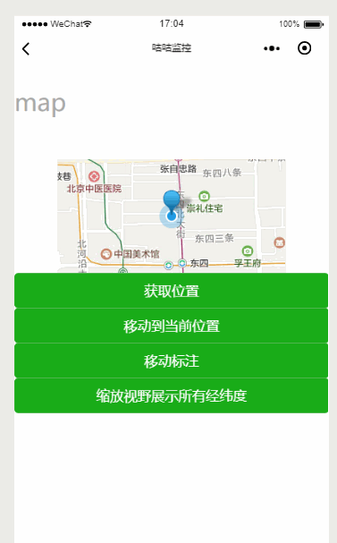

# 微信小程序 --- 地图

地图现在默认使用了 腾讯地图，有区别于之前的使用方式

## 使用流程

> 参数含义

- `show-location` 显示当前位置
- `latitude` 纬度
- `longitude` 经度
- `marker` 地图指示用的
- ...

> 示例

- `<map />`
  > wxml

```
<map
  id="map"
  show-location
  latitude="{{latitude}}"
  longitude="{{longitude}}"
  markers="{{markers}}"
/>

<button type="primary" bindtap="getCenterLocation">获取位置</button>
<button type="primary" bindtap="moveToLocation">移动到当前位置</button>
<button type="primary" bindtap="translateMarker">移动标注</button>
<button type="primary" bindtap="includePoints">缩放视野展示所有经纬度</button>
```

> js

```
Page({
  data: {
    latitude: 39.92855,
    longitude: 116.41636999999999,
    markers: [{
      id: 0,
      latitude: 39.92855,
      longitude: 116.41636999999999,
      name: 'Sinnet Cloud'
    }]
  },
  onReady(e) {
    /**
    * 获取map上下文
    */
    this.mapCtx = wx.createMapContext('map')
  },
  getCenterLocation() {
    this.mapCtx.getCenterLocation({
      success(res) {
        wx.showModal({
          title: '参数',
          content: `
          经度 longitude: ${res.longitude},
          维度 latitude: ${res.latitude}
          `,
          showCancel: false
        })
      }
    })
  },
  moveToLocation() {
    this.mapCtx.moveToLocation()
  },
  translateMarker() {
    this.mapCtx.translateMarker({
      markerId: 0,
      autoRotate: true,
      duration: 1000,
      destination: {
        latitude: 39.932630648370626,
        longitude: 116.40624197875975,
      },
      animationEnd() {
        wx.showToast({
          title: '移动完成'
        })
      }
    })
  },
  includePoints() {
    this.mapCtx.includePoints({
      padding: [10],
      points: [{
        latitude: 23.10229,
        longitude: 113.3345211,
      },
      {
        latitude: 23.10229,
        longitude: 113.3345211,
      }]
    })
  }
})
```

> 效果图



> 细节

- `markers` 需要在`data`中声明，不然报错
- `translateMarker`执行时，移动前后的经纬度尽量不要相差太大，不然无法执行
