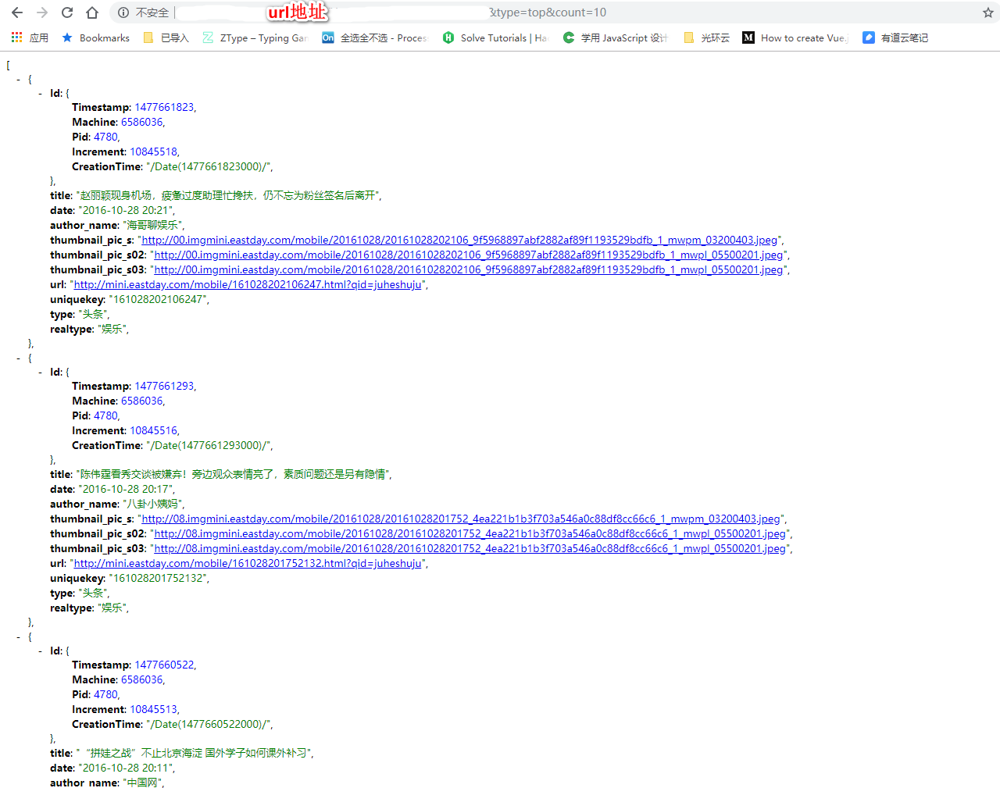
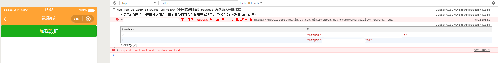
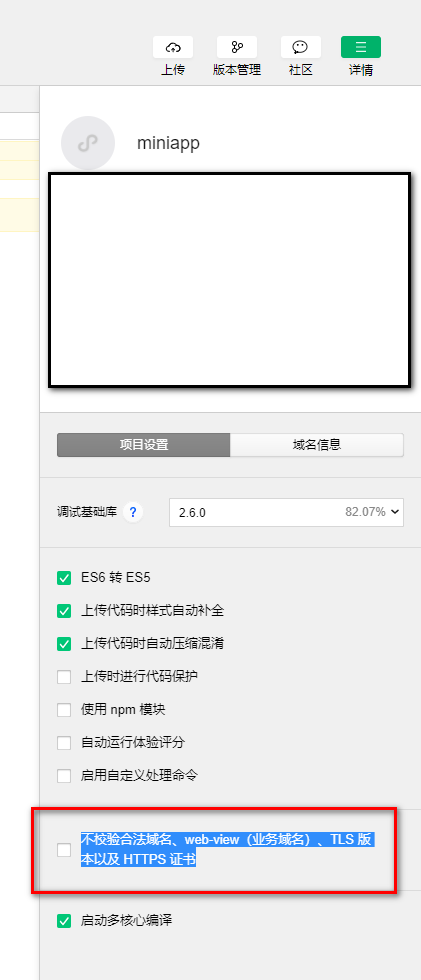

# 微信小程序 -- [数据请求](https://developers.weixin.qq.com/miniprogram/dev/api/wx.request.html)

微信小程序请求数据，并不是一个可以在 url 打开有数据就可以拿到数据那么简单

1. 浏览器地址输入 `可以获取参数的url`



2. 微信小程序中 代码展示
   > wxml

```
<view>
  <button type="primary" bindtap="getData">加载数据</button>
</view>
```

> js

```
getData () {
  wx.request({
    url: ' url地址 &type=top&count=10',
    data: {
      x: '',
      y: ''
    },
    header: {
      'content-type': 'application/json' // 默认值
    },
    success(res) {
      console.log(res.data)
    }
  })
}
```

微信小程序开发工具报错

```
如若已在管理后台更新域名配置，请刷新项目配置后重新编译项目，操作路径：“详情-域名信息” ...
```



## 解决办法

- 若是要上线，那必须按照规范来 [服务器配置](https://mp.weixin.qq.com/wxopen/devprofile?action=get_profile&token=571303259) **必须是`https`**
- 若是仅仅本地测试使用
  - 在 微信小程序开发工具中关闭 `项目设置` ===> `不校验合法域名、web-view（业务域名）、TLS 版本以及 HTTPS 证书` 勾选即可,便可以拿到数据了
    
