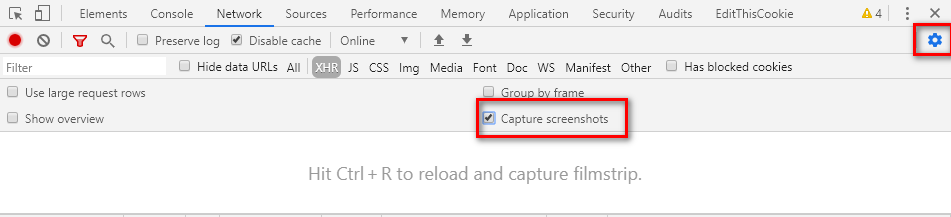
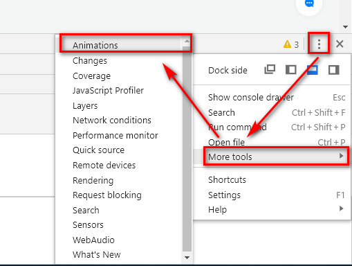
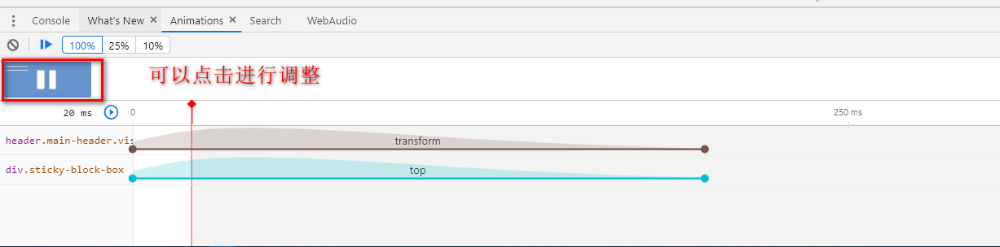
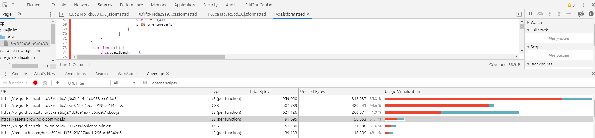
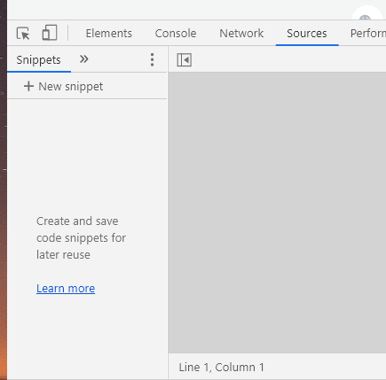
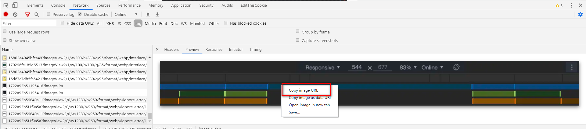

<!--
 * @LastEditors: Sinosaurus
 * @link: https://juejin.im/post/5ec338436fb9a0432d76e0c4#heading-15
--> 
# devtools 的一些使用技巧

## 命令菜单 `command`

mac

```sh
Cmd + Shift + p
```

windows

```sh
Ctrl + Shift + p
```

## 截图 `DOM` 元素显示

```sh
Ctrl + Shift + p

Screenshot
```

可以截取整个DOM等操作，只是并不能保证每个细节都会保留，同时清晰度有待考究

## 在控制台使用上次操作的之

```js
$_
```

## 重新发起 xhr 请求

找到需要请求的接口，右键找到 `Replay XHR` 

## 编辑页面上的任何文本

控制台上设置

```js
document.body.contentEditable="true"
```

或者

```js
document.designMode = 'on'
```

## Network 幻灯片模式



有点不适用，图太小，看不清楚

## 动画检查





## store global variable

控制台中

`copy()` window下无效

console中，选中需要的存为全局的数据，点击右键 选中 `store as global variable`
便会生成一个 `temp1`的变量可以使用 （temp开头）

## css/js 覆盖率

```sh
Ctrl + Shift + p
Show Coverage
```

+ 红色部分没有使用
+ 蓝色或绿色表示使用（mac，window颜色不同）



## 添加自定义代码片段 Snippets



这样可以保存以后使用

## 将图片复制为 数据URI



