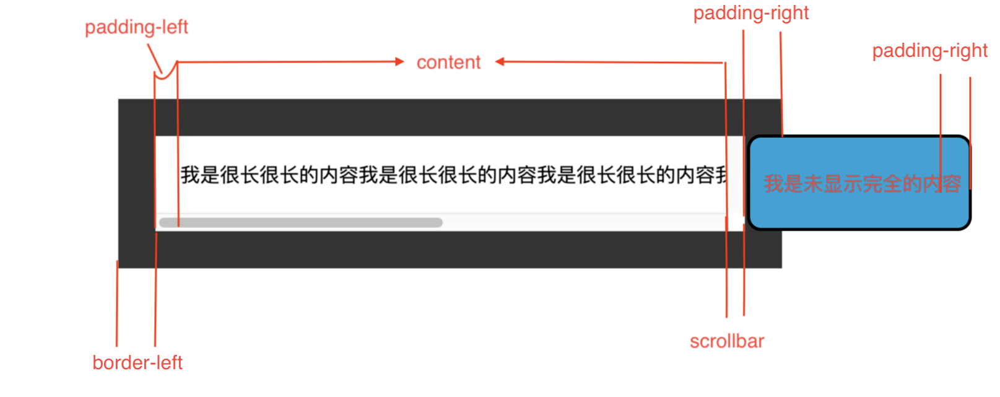

# 了解 offsetWidth clientWidth scrollWidth 的区别

最近需要清除区分开元素的 width，height 及相应的坐标等，当前这篇用来区分`offsetWidth` `clientWidth` `scrollWidth`的区别

## 各自的概念

假设有一个元素，width 有以下几个进行组合

- content
- padding-left
- padding-right
- scrollbar 垂直的滚动条宽度（假设有，没有便为 0）
- border-left
- border-right

> clientWidth = content + padding-left + padding-right

> offsetWidth = content + padding-left + padding-right + border-left + border-right + scrollbar

> scrollWidth = content + padding-left + padding-right + scrollbar + border-left + border-right +滚动进入不可见的内容

## 示例

> 在上述中，我们可以计算出 `scrollbar` 为

```
const scrollbar = el.offsetWidth - (border-left + border-right) - clientWidth
```



> html

```
<section class="client-xyz">
    <p>我是很长很长的内容我是很长很长的内容我是很长很长的内容我是很长很长的内容我是很长很长的内容我是很长很长的内容</p>
</section>
```

> css

```
p {
    margin: 20px;
    padding: 20px;
    /* border: 30px solid #333; */
    /* border: 10vw solid #333; */
    /* border: calc(100px - 70px) solid #333; */
    border: 30px solid #333;
    word-break: keep-all;
    overflow-y: scroll;
}
```

> js

```
const Box = document.querySelector('p')

let border = 0
// 获取元素的style信息
const style = window.getComputedStyle(Box, null)
// border不管设置的单位如何，最终都会转为 px
border = parseFloat(style['borderRightWidth'].replace('px', '')) + parseFloat(style['borderLeftWidth'].replace('px', ''))

const scollbar = Box.offsetWidth - Box.clientWidth - border
```

## 总结

- 知道了计算滚动条宽度，并不是简单的 `el.offsetWidth - el.clientWidth` 而是还需要减去`border`的宽度
- [clientWidth](https://developer.mozilla.org/zh-CN/docs/Web/API/Element/clientWidth),[offsetWidth](https://developer.mozilla.org/en-US/docs/Web/API/HTMLElement/offsetWidth),[scrollWidth](https://developer.mozilla.org/zh-CN/docs/Web/API/Element/scrollWidth)
