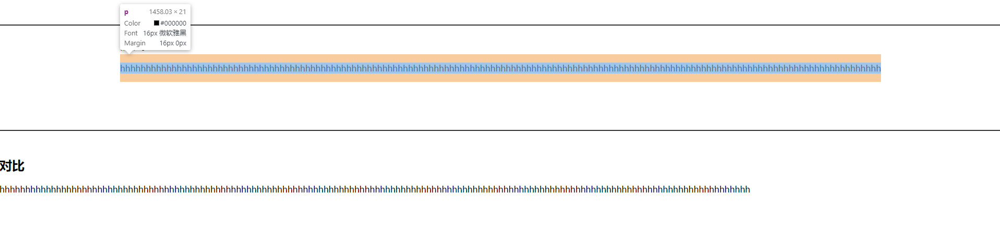
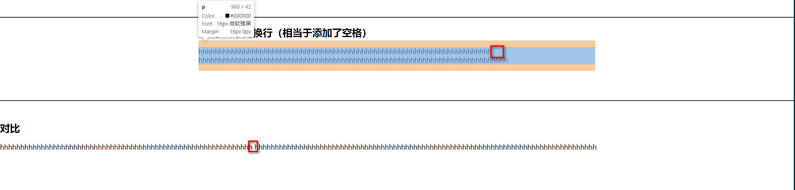
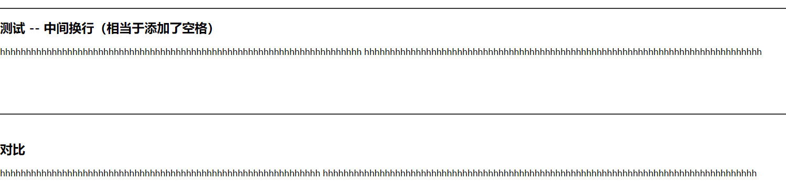

# 绝对定位 left:50% 隐式设置了宽度

不定宽高的盒子如何在父盒子中垂直居中，我们常做的一种方式便是

```
left: 50%;
top: 50%;
transform: translate(-50%, -50%);
```

> 那这个盒子是否隐式添加了宽度吗？

## 测试

> html

```
<body>
  <div class="container">
    <div class="box">
      <p>
        hhhhhhhhhhhhhhhhhhhhhhhhhhhhhhhhhhhhhhhhhhhhhhhhhhhhhhhhhhhhhhhhhhhhhhhhhhhhhhhhhhhhhhhhhhhhhhhhhhhhhhhhhhhhhhhhhhhhhhhhhhhhhhhhhhhhhhhhhhhhhhhhhhhh
      </p>
    </div>
  </div>
</body>
```

> css

```
body{
  margin: 0;
}
.container {
  height: 200px;
  position: relative;
  margin: 50px auto;
  border-top: 2px solid #333;
  border-bottom: 2px solid #333;
}

.box {
  position: absolute;
  left: 50%;
  transform: translateX(-50%);
}
```

> 页面样式
> 

这种很合理，并没有出现上述的问题

> 惊喜出现了，当在句中加个空格
> 

居然换行了，像是给了一个宽度似的，最后审查时，发现为`960px`(电脑是 1920 的屏，刚好一半) [网友](https://juejin.im/post/5d3eca78e51d4561cb5dde12#heading-7)

## 结论

- 上述问题，确实是对的，但是有前提，若是连续没有空格的句子，是不会出现的，要出现两种方式
  - 句子中间添加空格
  - 给 当前元素添加 `word-break: break-all`,强行换行
- 解决这类问题，便是不用这种方式进行居中形式，换另一种

  ```
    top: 0;
    left: 0;
    right: 0;
    bottom: 0
  ```

  

  如此便不会只有父元素的一半宽度了
