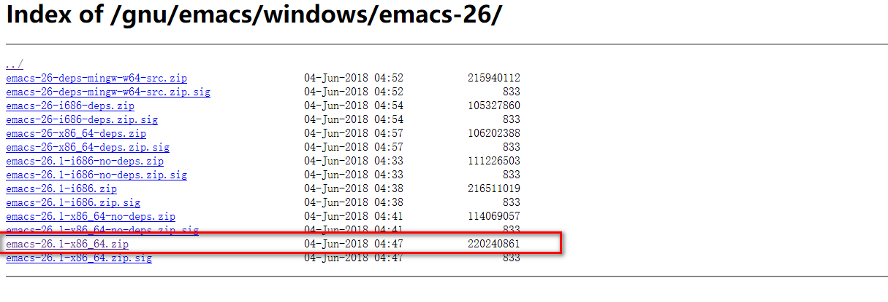

# 神之编辑器

> 最近电脑下了各种编辑器，主要各自总有不完全之处，而改动又不是那般容易。启动 vscode 后，终端经常卡顿，webstorm 太笨重，sublime 插件难找，。。。最后在**代码时间**里听到这个 emacs，决定尝试入坑，如下是学习资料，以便查阅

- emacs[wiki](https://www.emacswiki.org/emacs?interface=zh-cn)
- [emacs stack exchange](https://emacs.stackexchange.com/)
- [emacs](https://plus.google.com/communities/114815898697665598016) `google+`
- [emacs](https://www.cnblogs.com/blfshiye/p/4566900.html) `blog`
- [emacs](https://blog.csdn.net/redguardtoo/article/details/7222501) `blog`

## 下载[windows](http://mirrors.nju.edu.cn/gnu/emacs/windows/emacs-26/)

> 包好大啊，相对以前的，现在明显大了好几倍
> 

## 上手体验

> 什么鬼 学习学习
