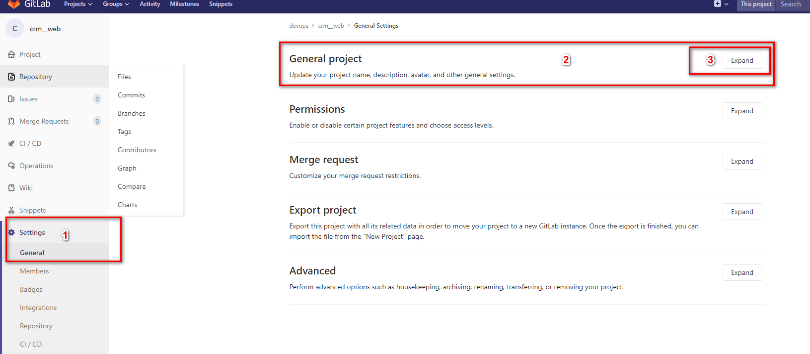

# git 常用命令

- git 创建分支，切换到新分支

```
/** 创建分支 dev1.0 **
git branch dev1.0
/** 切换到分支 dev1.0 **
git checkout dev1.0
```

> 更快捷的命令 合并上述两行命令为一条命令

```
git checkout -b dev1.0
```

- 远程仓库设置默认分支

  - `gitlab`
    由于远程分支默认显示在`dev1.0`上，现在需要修改为`master`上 [stackoverflow](https://stackoverflow.com/questions/30987216/change-default-branch-in-gitlab)
    
    
    

- 删除远端分支

* `git push -delete origin branch-name`
* `git push -d library-name branch-name`
* git branch -r -d branch-name

- 删除本地分支

* `git branch -d branch-name`

- git 刪除文件包括历史记录中的文件[可用](https://blog.kongfanjian.com/2015/03/02/%E6%B0%B8%E4%B9%85%E5%88%A0%E9%99%A4git%E4%BB%93%E5%BA%93%E4%B8%AD%E7%9A%84%E6%96%87%E4%BB%B6%E4%B8%8E%E5%8E%86%E5%8F%B2%E8%AE%B0%E5%BD%95/)

```
git filter-branch --force --index-filter 'git rm --cached --ignore-unmatch path-of-remove-file' --prune-empty --tag-name-filter cat -- --all
```

> `path-of-remove-fil`便是文件路径，可以写成 `*/**/.env*` 便会去查找其下的所有 `.env`文件，测试成功

```
git push origin master --force #强制覆盖
```

## git 开发

- [ryf](http://www.ruanyifeng.com/blog/2012/07/git.html)
- [lxf](https://www.liaoxuefeng.com/wiki/896043488029600/900005860592480)

- 日志 `git log --graph --pretty=oneline --abbrev-commit`


- `fatal: sha1 file '<stdout>' write error: Broken Pipe` 上传文件超过预定大小

  - [github](https://github.com/git-lfs/git-lfs/issues/2428)
  - [知乎](https://zhuanlan.zhihu.com/p/40634410)

  ```
    // 修改限制大小
    git config --global http.postBuffer 157286400
  ```

- `fatal: write error: No space left on device` git 服务器没有空间了

  - [link](https://blog.csdn.net/jia4525036/article/details/52094763)

  > 运维是删除了备份文件，解决的

## git tag

- 新建

```
git tag v1.0 -m '备注'
```

- 删除

```
git tag --delete v1.0
```

- 查看

```
git show v1.0
```

- 查看所有

```
  git tag -l -n
```

## 版本回退

- [廖雪峰](https://www.liaoxuefeng.com/wiki/896043488029600/897013573512192)
- [csdn](https://blog.csdn.net/Ronaldo_Carry/article/details/49453071)
