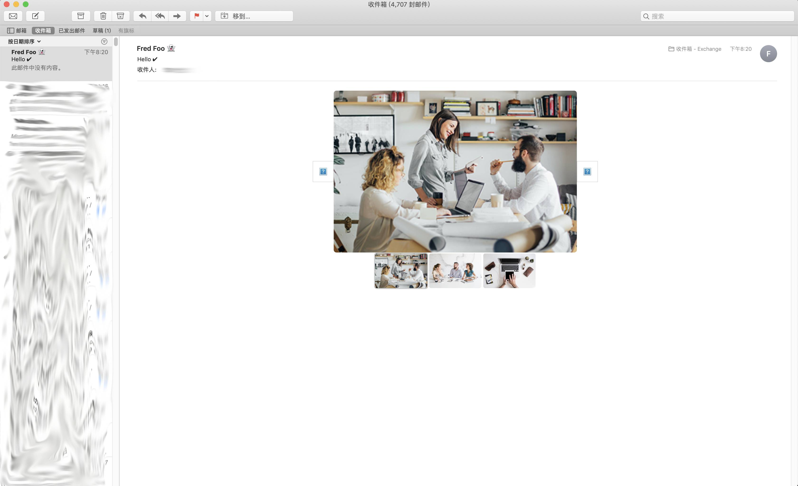
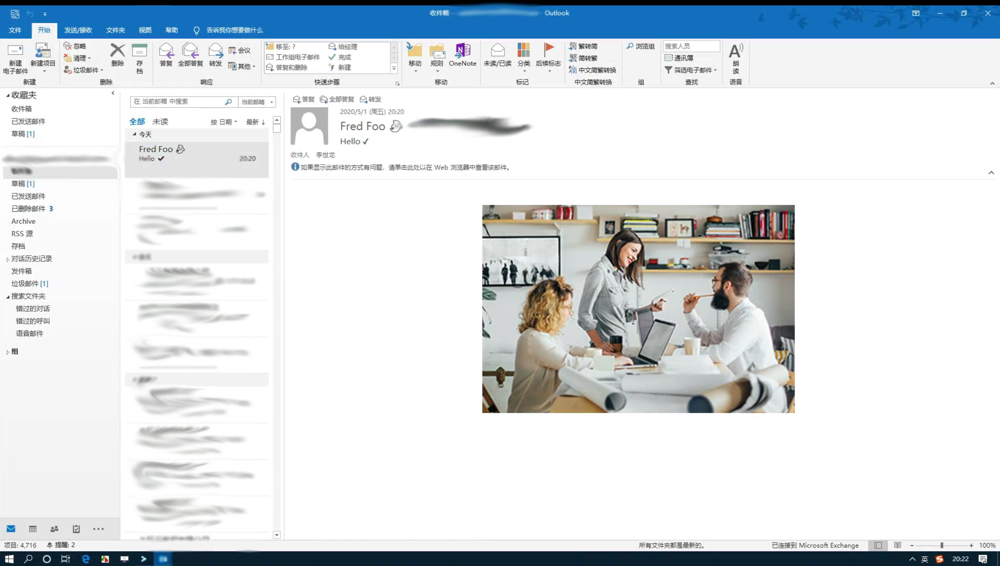
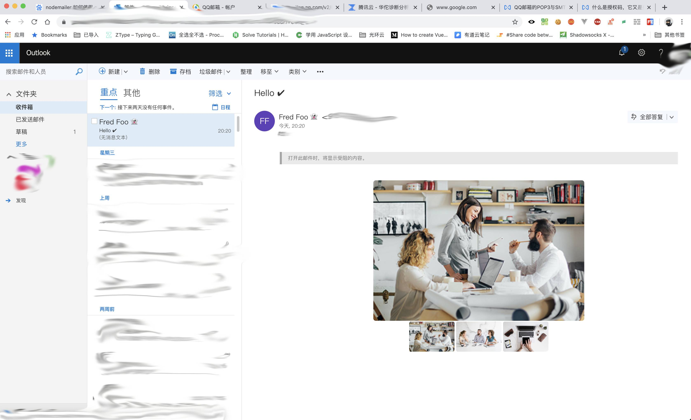

<!--
 * @LastEditors: Sinosaurus
 -->

# 邮件书写探讨

经常碰到要写邮件模板，但是在实际开发中，不断碰壁。新的 h5 属性标签样式都不能使用。而且还不得不使用很老的 `table` 标签，而这就很痛苦，为了实现一些基本的内容，都有写够呛。因而前前后后看了许多关于这块的资料，终于有点像样的东西出来。

## 邮件书写的一些要求

- Doctype

```html
<!DOCTYPE html PUBLIC "-//W3C//DTD XHTML 1.0 Transitional//EN" "http://www.w3.org/TR/xhtml1/DTD/xhtml1-transitional.dtd">
<html xmlns="http://www.w3.org/1999/xhtml">
  <head>
    <meta http-equiv="Content-Type" content="text/html; charset=UTF-8" />
    <title>Demystifying Email Design</title>
    <meta name="viewport" content="width=device-width, initial-scale=1.0" />
  </head>
</html>
```

- 尽可能使用 table 标签来处理
- HTML 邮件开发的黄金规则就是：如果有属性，就用 HTML 不用 CSS。
- 使用 16 进制颜色代码，因为如果只是 3 位的简写有时候会不工作。
  ```html
  <td style="color: #ffffff;">...</td>
  ```
- padding: 10px 10px 8px 5px;，但是如果你发现它有任何的问题，你可能需要使用最长的一种方式把完整的表达式写出来，例如： padding-top: 10px; padding-right: 10px; padding-bottom: 8px; padding-left: 5px;。
  ```html
  <td
    style="padding-top: 10px; padding-right: 10px; padding-bottom: 8px; padding-left: 5px;"
  >
    ...
  </td>
  ```
- padding 用在 td 标签上但不要用在 p 或者 div 上会更安全
- margin 不被支持，可以使用 `<td style="font-size: 0; line-height: 0;" width="20">&nbsp;</td>`这样的方式来进行替代
- img 需要添加

  - border="0"
  - display:block
  - 需要设置好宽高
  - 需要设置 alt 属性

  ```html
  
  ```

## email 框架

由于在上面的要求下，还是无法达到有效的样式。而且写一个邮件得不断地进行微调，很不方便。因而找了一写框架来辅助开发，这里着重介绍[`mjml`](https://github.com/mjmlio/mjml)，没办法，谁叫人家的 start 最多呢。使用过程中，感觉不错。现在的开发都趋向于组件化，这样也符合现在开发的趋势。

> 一个简单的 demo

```html
<mjml>
  <mj-body>
    <mj-section>
      <mj-column>
        <mj-carousel>
          <mj-carousel-image
            src="https://www.mailjet.com/wp-content/uploads/2016/11/ecommerce-guide.jpg"
          />
          <mj-carousel-image
            src="https://www.mailjet.com/wp-content/uploads/2016/09/3@1x.png"
          />
          <mj-carousel-image
            src="https://www.mailjet.com/wp-content/uploads/2016/09/1@1x.png"
          />
        </mj-carousel>
      </mj-column>
    </mj-section>
  </mj-body>
</mjml>
```

上面是一个类似 tab 切换的。说实话，这种效果，最初我以为直接是见光死的，感觉 email 都不会支持的。没想过有一些还算支持，意料中的意外吧。

> 效果图








虽然我在这里上了一个不是很好地案例，但是也从这里看到，这个得强大，写过邮件模板的内心都很清楚，连一些没有特效的静态页面兼容性都不理想，何况这种呢。而且还是响应式的，这个就更没话说了。同时也告诫自己，还是使用一些基本的效果，尽量不使用带一些特效的，这样可以避开一些兼容性。

> 在这个测试过程中，发现单纯打开浏览器复发送不显示了，因而又简单地研究了下 node 如何发送邮件

### [nodemailer](https://nodemailer.com/about/)

在这里使用了 qq 邮箱作为发送

> code

```js
'use strict'
const nodemailer = require('nodemailer')
const smtpTransport = require('nodemailer-smtp-transport')
const fs = require('fs')
async function main() {
  // create reusable transporter object using the default SMTP transport
  let transporter = nodemailer.createTransport(
    smtpTransport({
      host: 'smtp.qq.com',
      port: 465,
      secure: true, // true for 465, false for other ports
      auth: {
        user: '**********@qq.com', // generated ethereal user
        // 密码不是qq登录密码，而是进入qq邮箱生成的秘钥
        pass: '**********', // generated ethereal password
      },
    })
  )
  const html = await fs.readFileSync('../dist/input.html', 'utf-8')
  // send mail with defined transport object
  let info = await transporter.sendMail({
    from: '"Fred Foo 👻" <******@qq.com>', // sender address
    to: '******.cn', // list of receivers
    subject: 'Hello ✔', // Subject line
    text: 'Hello world?', // plain text body
    html, // html body
  })
  console.log('Message sent: %s', info.messageId)
}
main().catch(console.error)
```

## 总结

虽然开发邮件模板最大的困难依旧是 兼容性，但是相信会随着技术推进，也会越来越容易的。何况前端不断进步，难弄的都一个个作为组件化，慢慢地也就会一个个搞定的。

## 参考链接

- 邮件框架
  - [mjml](https://mjml.io/)
    - [documentation](https://mjml.io/documentation/#validating-mjml)
    - [mjml-cli](https://github.com/mjmlio/mjml/blob/master/packages/mjml-cli/README.md)
    - [html-minifier](https://github.com/kangax/html-minifier)
    - [拖拽生成](https://www.mailjet.com/demo/)
    - [兼容性](https://mjml.io/faq#email-clients)
  - [Email-Framework](https://github.com/g13nn/Email-Framework)
- 写法要求
  - [从头开始构建一个 HTML Email 模板](https://webdesign.tutsplus.com/zh-hans/articles/build-an-html-email-template-from-scratch--webdesign-12770)
  - [HTML Email 编写指南](http://www.ruanyifeng.com/blog/2013/06/html_email.html)
  - [Everything Developers Need to Know About Sending Transactional Email](https://webdesign.tutsplus.com/articles/everything-developers-need-to-know-about-sending-transactional-email--cms-31759)
- Email 检测
  - [Markup Validation Service](http://validator.w3.org/#validate_by_upload)
- 邮件发送
  - [nodemailer](https://nodemailer.com/about/)
  - [Node.js 使用 Nodemailer 发送邮件](https://mp.weixin.qq.com/s?__biz=MzU0OTE3MjE1Mw==&mid=2247483763&idx=1&sn=0166a93351c092aeb2c4efb8c0e0a4b3&chksm=fbb2a7a5ccc52eb3b241f32601a23be8a431e671ff493327ff61becc4f4ceb1da319ec6c8ea8#rd)
