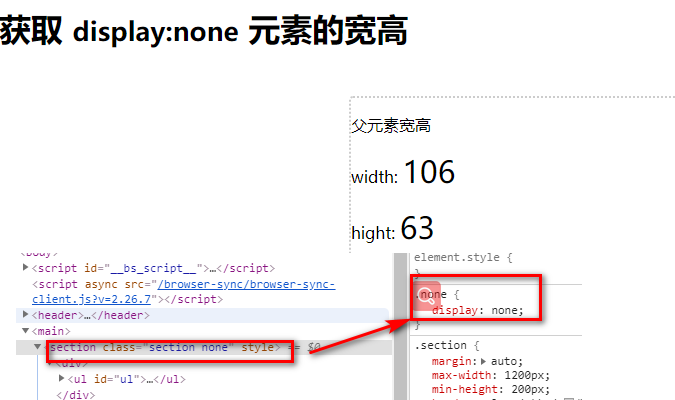

# 如何获取设置 display:none 元素及子元素的宽高

由于元素设置了`display:none`时，页面便不会对其渲染，导致无法获取其元素的宽高。目前一般的做法都是先对其设置`display:block`，拿到数据再设置其为`display:none`。如此便可以了

## 代码

如何获取 `id="ul"` 元素的宽高？？？

> html

```
<section class="section none">
  <div>
    <ul id="ul">
      <li>第 <span class="span">111</span>个</li>
      <li>第 <span class="span">222</span>个</li>
      <li>第 <span class="span">333</span>个</li>
    </ul>
  </div>
</section>
```

> js

- 判断元素是否隐藏

```
function isNone(el) {
  // 判断是否是元素节点
  if (el.nodeType != 1) return
  const {
    display
  } = window.getComputedStyle(el)
  return display === 'none'
}
```

- 设置样式

```
function setStyle(obj = {}, el) {
  for (let item in obj) {
    el.style[item] = obj[item]
  }
}
```

- 获取元素的宽高

```
function getNoneStyle (el) {
  // 获取隐藏元素
  let node = el
  while (node !== null && !isNone(node)) {
    node = node.parentNode
  }
  if (node === null) throw new Error('居然父元素都没有，这种情况，基本不会出现')

  setStyle({
    display: 'block',
    visibility: 'hidden',
    position: 'absolute'
  }, node)

  const {
    clientHeight,
    clientWidth
  } = el
  setStyle({
    display: '',
    visibility: '',
    position: ''
  }, node)

  return {
    width: clientWidth,
    height: clientHeight
  }

}
```

> 通过设置样式，基本都可以拿到元素的宽高，但是需要注意，理当先记录元素之前的样式，在获取数据后，再还回去，避免覆盖，导致样式发生变化



## 参考链接

- [link](http://www.foliotek.com/devblog/getting-the-width-of-a-hidden-element-with-jquery-using-width/)
