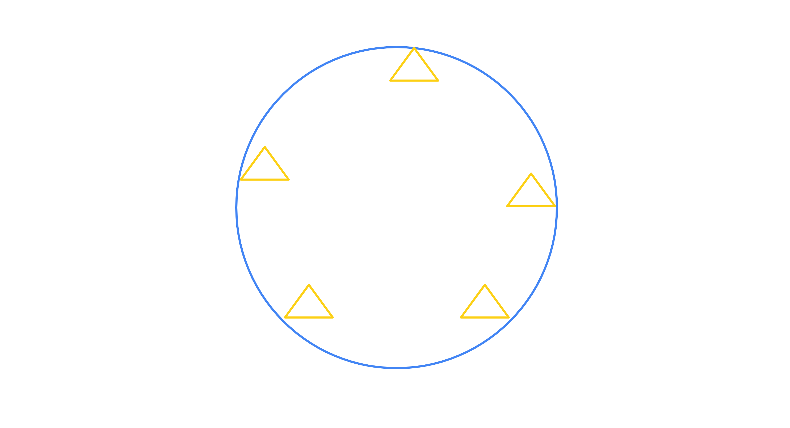
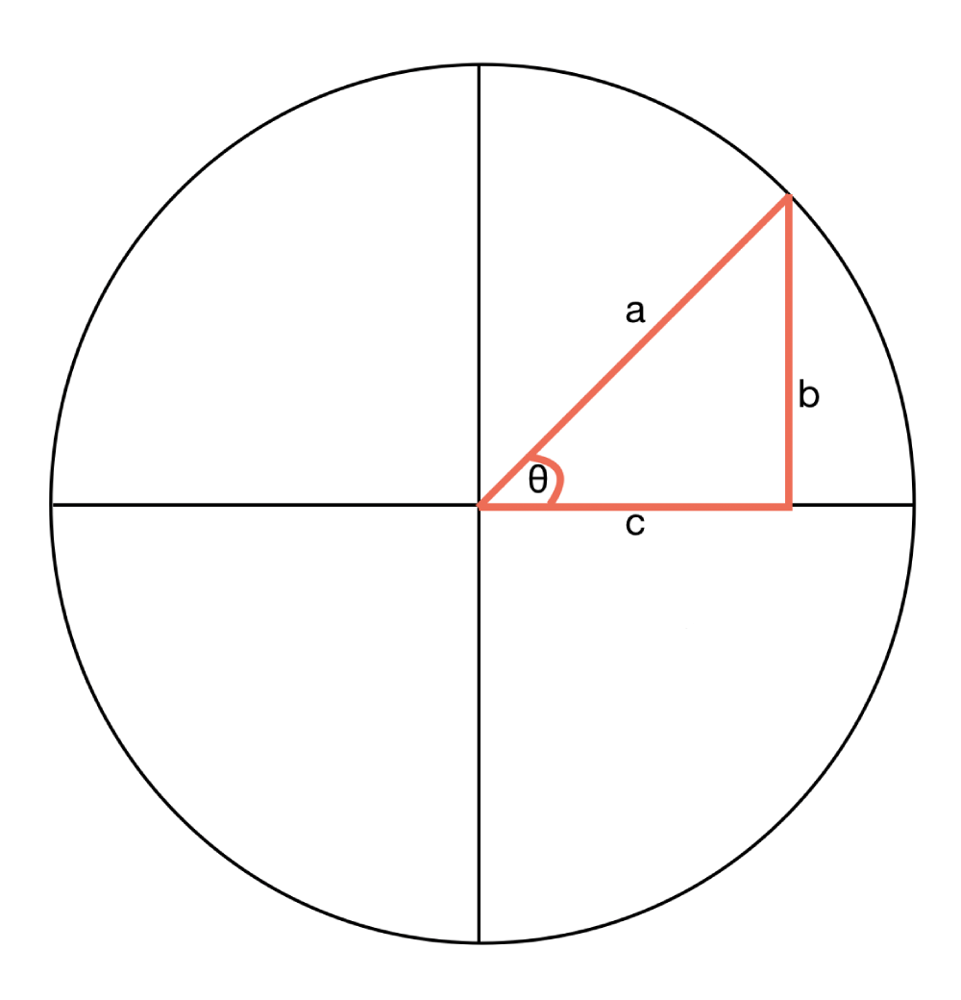
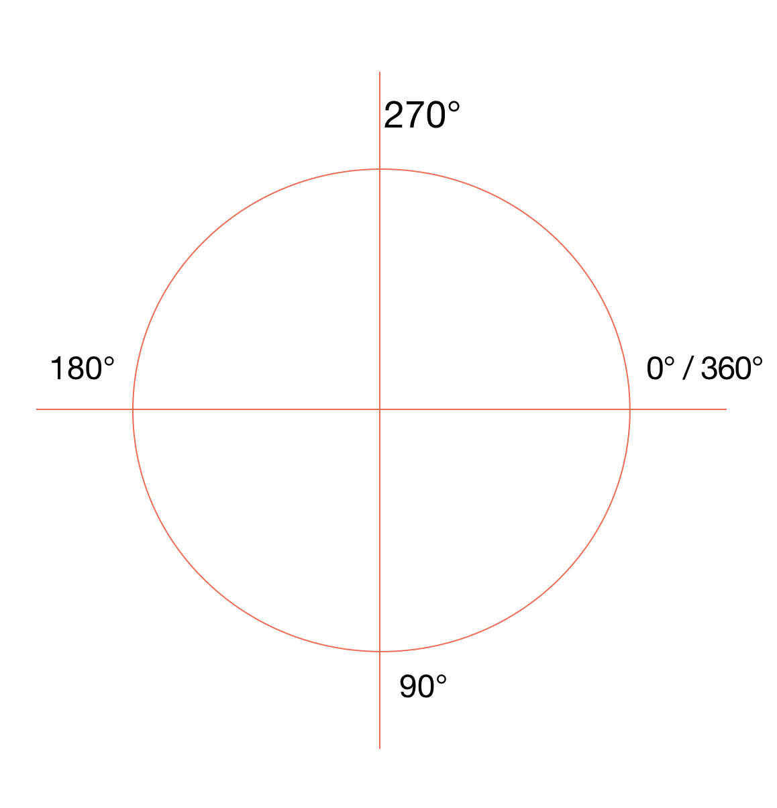
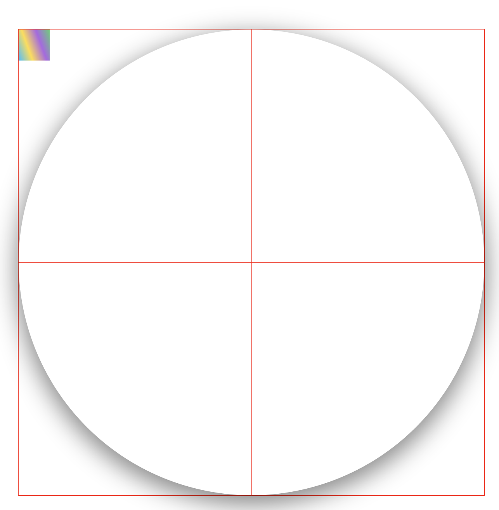
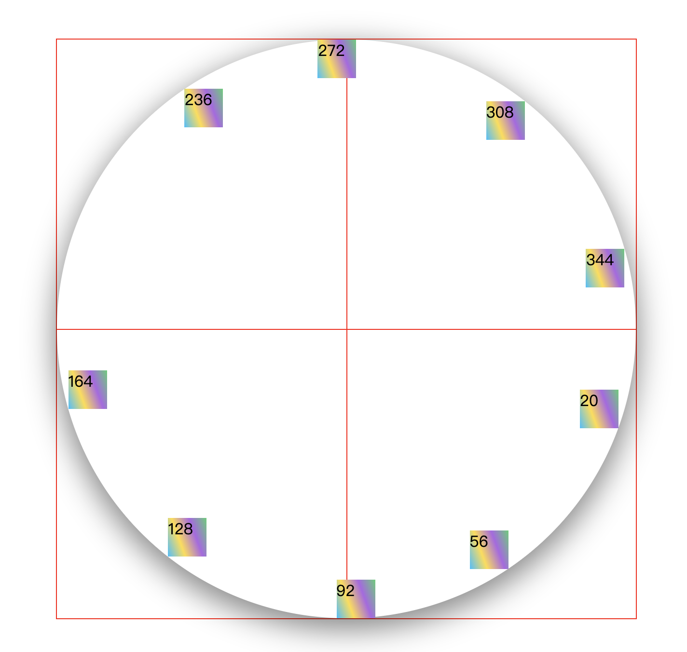

<!--
 * @LastEditors: Sinosaurus
-->

# 节点围绕圆排列

最近在做一个大屏，需要动态计算节点围绕圆依次有序排列。大致效果这样的


## 分析

每个三角都是一个独立`div`, 基于定位进行排序。现如今需要知道如何计算每个三角相对于圆的位置。需要设计到一些额外的基础数学知识

### 三角知识



- 正弦

```math
 sinθ = b / a
```

- 余弦

```math
 cosθ = c / a
```

- 正切

```math
 tanθ = b / c
```

- 弧度

  > 弧长等于半径的弧，其所对的圆心角为 1 弧度。(即两条射线从圆心向圆周射出，形成一个夹角和夹角正对的一段弧。当这段弧长正好等于圆的半径时，两条射线的夹角的弧度为 1)。[link](https://baike.baidu.com/item/%E5%BC%A7%E5%BA%A6)

  - `rad` 弧度
  - `Math.PI` π
  - `r` 半径
  - `n` 角度数

```math
 rad = n * Math.Pi * r / 180
```

**注意** 在使用 `Math.sin`等方法时，角度需要转为弧度才能计算使用

### 前端浏览器中的角度



前端的角度与数学上的角度开始位置不太一样，上图是前端下的角度

### coding

通过上述的基础知识，便可知晓最初的需求，_三角_ 的位置计算。

> `html`

```html
<div class="container">
  <div class="circle">
    <div class="circle__item"></div>
    <div class="circle__item"></div>
    <div class="circle__item"></div>
    <div class="circle__item"></div>
    <div class="circle__item"></div>
    <div class="circle__item"></div>
    <div class="circle__item"></div>
    <div class="circle__item"></div>
    <div class="circle__item"></div>
  </div>
</div>
```

> `css`

```css
.container {
  position: relative;
  width: 600px;
  height: 600px;
  margin: 50px auto;
  border: 1px solid red;
}
.container::before {
  content: '';
  position: absolute;
  left: 50%;
  height: 100%;
  border-right: 1px solid red;
}
.container::after {
  content: '';
  position: absolute;
  top: 50%;
  width: 100%;
  border-top: 1px solid red;
}
.circle {
  position: relative;
  width: 100%;
  height: 100%;
  border-radius: 50%;
  box-shadow: 0 9px 30px 3px rgba(0, 0, 0, 0.46);
}
.circle__item {
  position: absolute;
  width: 40px;
  height: 40px;
  background: linear-gradient(70deg, #0ebeff, #ffdd40, #ae63e4, #47cf73);
}
```

> 页面效果图



#### 计算位置

每个节点的`left` 及 `top` 位置

```js
// 伪代码
// n 角度
// r 半径
const left = r * Math.cos(n)
const top = r * Math.sin(n)
```

### 实际代码

在写前，需要知道几个固定参数

— 角度转弧度

```js
const transformToRadians = (degrees) => degrees * (Math.PI / 180)
```

- `r` 半径

  ```js
  const circleRadius = containerWidth / 2
  ```

- 圆心的横纵位置

  ```js
  const circlePointX = circleRadius
  const circlePointY = circleRadius
  ```

> `coding`

```js
/**
 * 目标：
 * 1. 围绕圆旋转
 * 2. 在圆的内部紧贴边缘
 * 3. 可以指定开始结束位置
 * 4. 依次均匀分开摆放
 */
const container = document.querySelector('.container')
const containerWidth = container.clientWidth
const circleList = Array.from(document.querySelectorAll('.circle__item'))
// 角度转弧度
const transformToRadians = (degrees) => degrees * (Math.PI / 180)
// 圆半径
const circleRadius = containerWidth / 2
// 圆心
const circlePointX = circleRadius
const circlePointY = circleRadius
// 划分多少等分
const count = circleList.length

/**
 * @description: 根据已知角度算出每个元素的具体位置
 * @param {number} angleStart 开始的角度
 * @param {number} circle 划分多大的圆
 */
let cache = {}
function changeItemAngle(
  options = {
    angleStart: 200,
    circle: 330,
  }
) {
  cache = {
    ...cache,
    ...options,
  }
  // 划分的角度
  const angle = Math.floor(cache.circle / count)

  circleList.forEach((item, index) => {
    // 转为 0 - 360 度
    const itemAngle = (angle * (index + 1) + cache.angleStart) % 360
    // 弧度
    const itemRadians = transformToRadians(itemAngle)
    const { clientWidth, clientHeight } = item

    let top = circleRadius * Math.sin(itemRadians) + circlePointY
    let left = circleRadius * Math.cos(itemRadians) + circlePointX

    // 为了让子节点紧贴圆内壁
    if (itemAngle < 90 && itemAngle >= 0) {
      top -= clientHeight
      left -= clientWidth
    } else if (itemAngle >= 90 && itemAngle < 180) {
      top -= clientHeight
    } else if (itemAngle >= 270 && itemAngle < 360) {
      left -= clientWidth
    }

    item.style.top = top + 'px'
    item.style.left = left + 'px'
    item.innerText = itemAngle
  })
}
```



- [效果界面](https://sinosaurus.github.io/example/js-cicle/)
- [github-code](https://github.com/Sinosaurus/example/blob/master/js-cicle/index.html)

## 后记

基本功能完成，也能正常使用，美中不足，需要控制子节点个数及大小，这块需要看项目具体需求了。

虽然一直在 coding，但在开发中，对一个的综合能力越来越考验，因而一直前行一直学习，才能对得起这日日 coding 啊
