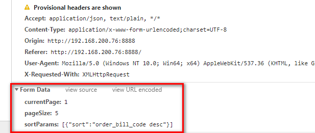
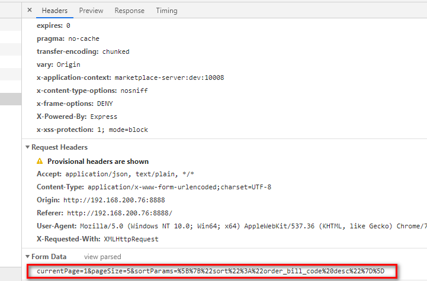

# 请求后台参数格式问题

当请求后台传递参数时，有多中类型，而每一种都需要前后台进行配合，而这有时候会很简单，有时候却十分困难，记录一下，以备后期深究

## 数据

> 后台需要的数据

- form 表单
- 嵌套数据，第二层后用字符串格式 `{obj: '{a: 1}'}`
  > 前台设置
- form 请求头 `'Content-Type': 'application/x-www-form-urlencoded;charset=UTF-8'`
- 参数设置`qs.stringify(params)`

> 上述借助了`qs`插件，看起来很美好，而且也很 ok，可惜死活后台接收不到`{obj: {a: 1}}`, obj 的具体参数，各种折腾依旧不行，各种折腾`qs`，可惜无解，仔细回味 后台一句话，_obj 的参数是 JSON 格式字符串_，何不手动改造，而不使用 `qs`呢

### 代码

> 请求参数结构

```
const params = {
  pageSize: 5,
  currentPage: 1,
  sortParams: [
    {
      sort: 'time desc'
    }
  ]
}
```

> 需要改造为




通过上图可以看出，第二层之后的结构保留字符串格式

> 改造

```
// 数据结构判断
function type (params) {
  // Symbol类型
  const typeofObje = typeof params
  if (typeofObje !== 'object') return typeofObje
  if (params === null) return 'null'
  const obj = {};
  `Boolean,Number,String,Function,Array,Date,RegExp,Object,Error,Set,Map`.split(',').forEach(e => {
    obj[`[object ${e}]`] = e.toLowerCase()
  })
  const res = Object.prototype.toString.call(params)
  return obj[res]
}
// 改造
const Data = JSON.parse(JSON.stringify(params))
for (let item in Data) {
  if (type(Data[item]) === 'object' || type(Data[item]) === 'array') {
    // 只要是object，array就进行转为JSON字符串
    Data[item] = JSON.stringify(Data[item])
  }
}
// 引入qs
import qs from 'qs'
payLoad = qs.stringify(Data) // 便可以了
```

## 总结

- 在使用过程中，`qs`的`stringify`有很多种配置，但是我没有找到适合我的，只能手动改造了
- 感觉难点在于，`qs`被我认为无所不能，导致没能意识到错误，其次后台其实并不是很清楚，前台到底是如何传参的，他也无法明确指出前台到底该如何传参，只能不断尝试了
