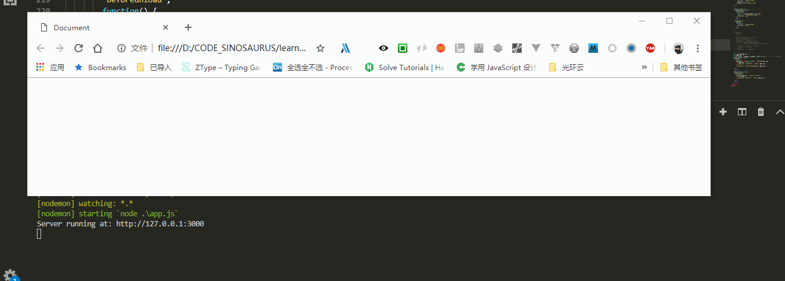

# 如何在浏览器关闭发送请求

有的，我们需要在页面关闭时，统计用户在该网站浏览时长；有时需要告知后台，该用户已离开...
遇到这样的情况并不少见。

> 只是在此之前，有两件很重要的事情需要区分开来:
+ 如何知道浏览器是 **关闭** 还是 **刷新**
+ 关闭时发送请求，使用哪种 **请求方式** 才好

## 页面的生命周期函数
当前有两种表示方式

+ [页面生命周期函数](https://zh.javascript.info/onload-ondomcontentloaded)
   + `DOMContentLoaded` —— 浏览器加载 HTML，并构建 DOM 树，但像  和样式这样的资源可能还没有加载。
   + `load` —— 浏览器加载所有资源（图像，样式等）。
   + `beforeunload/unload` —— 当用户离开页面时。

+ [Page Visibility API 教程](http://www.ruanyifeng.com/blog/2018/10/page_visibility_api.html),[Page Lifecycle API 教程](http://www.ruanyifeng.com/blog/2018/11/page_lifecycle_api.html)
  + **Active 阶段**   网页处于可见状态，且拥有输入焦点
  + **Passive 阶段**  只可能发生在桌面同时有多个窗口的情况。
  + **Hidden 阶段**  用户的桌面被其他窗口占据，网页不可见
  + **Terminated 阶段**  由于用户主动关闭窗口，或者在同一个窗口前往其他页面，导致当前页面开始被浏览器卸载并从内存中清除
  + **Frozen 阶段**  网页处于 Hidden 阶段的时间过久，用户又不关闭网页，浏览器就有可能冻结网页，使其进入 Frozen 阶段。不过，也有可能，处于可见状态的页面长时间没有操作，也会进入 Frozen 阶段
  + **Discarded 阶段**  处于 Frozen 阶段，用户又不唤醒页面，那么就会进入 Discarded 阶段，即浏览器自动卸载网页，清除该网页的内存占用。不过，Passive 阶段的网页如果长时间没有互动，也可能直接进入 Discarded 阶段


## 判断浏览器是 **关闭** 还是 **刷新**
用来判断用户是否离开

### 通过三种方式来进行判断

+ `beforeunload/unload`
+ `Terminated 阶段`
+ 两者结合判断

> 理论知识够了，开始进行尝试
`在此之前，由于页面关闭时，很多方法执行不了，只能通过连接后台进行判断，而且也很准确 `
```
var url = "http://127.0.0.1:3000/logout";
function getAajx(url) {
    var client = new XMLHttpRequest();
    client.open("get", url, false); // 第三个参数表明是同步的 xhr
    client.setRequestHeader("Content-Type", "text/plain;charset=UTF-8");
    client.send();
}
function postAajx(url, data) {
    var client = new XMLHttpRequest();
    client.open("post", url, false); // 第三个参数表明是同步的 xhr
    client.setRequestHeader(
        "Content-Type",
        "application/x-www-form-urlencoded"
    );
    client.send(data);
}
```

#### `beforeunload/unload`
当浏览器窗口关闭或者刷新时，会触发beforeunload事件。当前页面不会直接关闭，可以点击确定按钮关闭或刷新，也可以取消关闭或刷新

> 由于刷新和关闭都会执行这个方法，因而在`beforeunload/unload` 中无法进行区分，下面是网友们的各种思路

+ 鼠标的位置，由于需要点击关闭按钮，因而鼠标不会在窗口内
```
window.addEventListener('beforeunload', function () {
    var n = window.event.screenX - window.screenLeft;
    var b = n > document.documentElement.scrollWidth - 20;
    if ((b && window.event.clientY < 0) || window.event.altKey) {
        alert("是关闭而非刷新");
    window.event.returnValue = ""; //这里可以放置你想做的操作代码
    } else {
        alert("是刷新而非关闭");
    }
}, false)
```
可惜执行不了，主要利用**关闭**，**刷新**都会执行 `onbeforeunload`方法

+ 利用刷新跟关闭在不同浏览器中执行的方式不同[1](http://www.voidcn.com/article/p-xwypcmar-gb.html),[2](https://github.com/hstarorg/HstarDoc/blob/master/%E5%89%8D%E7%AB%AF%E7%9B%B8%E5%85%B3/%E6%B5%8F%E8%A7%88%E5%99%A8%E5%85%B3%E9%97%AD%E4%BA%8B%E4%BB%B6%E5%88%86%E6%9E%90.md)

```
var _beforeUnload_time = 0;
var _gap_time = 0;
var is_fireFox = navigator.userAgent.indexOf("Firefox") > -1; //是否是火狐浏览器
window.addEventListener(
    "unload",
    function() {
        _gap_time = new Date().getTime() - _beforeUnload_time;
        if (_gap_time <= 5) {
        postAajx(url, `msg=浏览器关闭&time=${_gap_time}`);
        } else {
        postAajx(url, `msg=浏览器刷新&time=${_gap_time}`);
        }
    },
    false
);
window.addEventListener(
    "beforeunload",
    function() {
        _beforeUnload_time = new Date().getTime();
        if (is_fireFox) {
        postAajx(url, `msg=火狐关闭&time=${_gap_time}`);
        }
    },
    false
);
```
  
  可以看出，确实是可行，刷新时长都超过 `5s`，关闭在 `5s`内。**基于Chrome浏览器**
> 需要更多地去验证每个浏览器的细微差别，若是随着浏览器的不断升级，将来标准统一，有可能就没有这样的细微区别，导致执行不了

#### `Terminated 阶段`

[todo](https://www.cnblogs.com/sunshq/p/10286283.html)