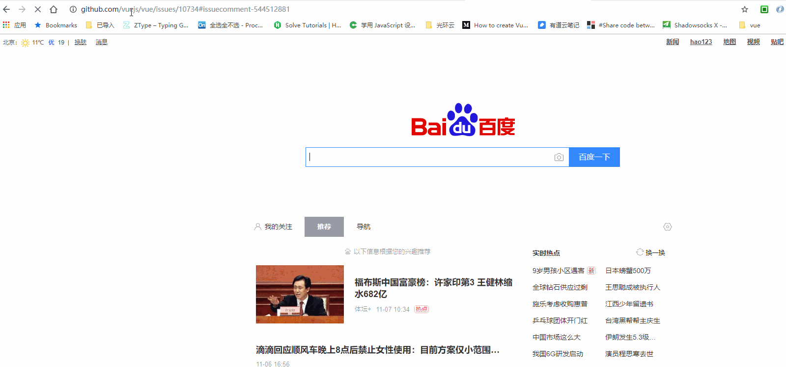
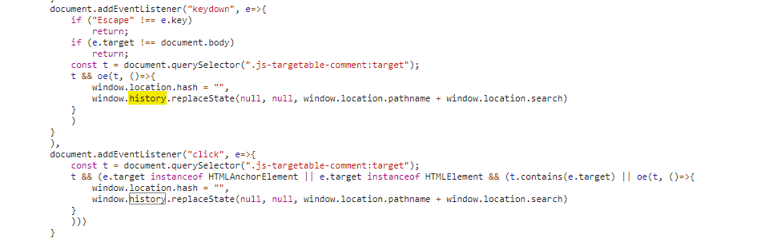
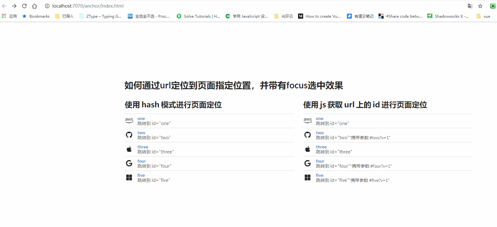
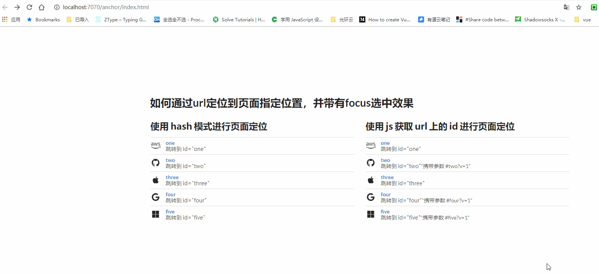

# 通过链接如何找到指定位置

现在有一个需求，就是通过链接调到指定页面的位置，不然就得不同链接不同页面，那样工作量大之外，还太浪费。于是决定在一个页面中，通过链接跳到指定位置。需要跟 github 的效果一样



> 通过上面的 github 图，可以看出几个基本需求

- 跳转时携带`id`，自动跳转到指定位置
- 被选中的元素具有 `focus` 效果
- 被选中的元素具体顶部有一段距离
- 点击 `document` 时，清除选中效果，同时路由上删除`id`
- 点击浏览器回退按钮，可以出现新进入时的效果

## 开启挖掘之旅

鉴于上面的需求，通过`hash`(锚点)是可以简单实现上面的要求，个人当然希望能用浏览器及 css 解决的，就尽量解决，若是不行只能通过 js 来尽可能模拟出想要的效果。

> 在此，我们需要恶补 2 个知识点

- [`:target`](https://developer.mozilla.org/zh-CN/docs/Web/CSS/:target)
- [锚点介绍](https://www.zhangxinxu.com/wordpress/2013/08/url-anchor-html-%E9%94%9A%E7%82%B9%E5%AE%9A%E4%BD%8D%E6%9C%BA%E5%88%B6-%E5%BA%94%E7%94%A8-%E9%97%AE%E9%A2%98/)
- [history](https://developer.mozilla.org/zh-CN/docs/Web/API/History_API)

#### [地址栏改变，页面不刷新不滚动](https://stackoverflow.com/questions/1397329/how-to-remove-the-hash-from-window-location-url-with-javascript-without-page-r/5298684#5298684) 介绍

通过 github 的效果，我们知道地址栏是改变了，但是视觉上确实没有感到有任何一样（除了 focus 效果消失）。

通过`history`的`replaceState`便可以实现上述效果

```javascript
// 记录第一次的值
const firstTop = document.scrollingElement.scrollTop
// 清空hash
window.location.hash = ''
// 地址栏刷新不跳转
window.history.replaceState(
  null,
  null,
  window.location.pathname + window.location.search
)
// 再回滚之前的位置
document.scrollingElement.scrollTop = firstTop
```

github 的代码 
鄙人的代码没有那么全面，但是原理是一样的

> 至此页面刷新不跳转便算完成了

### 利用 hash 进行定位

利用锚点进行定位

> html

```html
<a href="./base.html#two" class="header">two</a>

> base.html

<div class="wide segment" id="two">
  <h2>two</h2>
  <div class="sc">
    <div class="ui placeholder fluid active inverted">
      <div class="image header">
        <div class="line"></div>
        <div class="line"></div>
        <div class="line"></div>
        <div class="line"></div>
      </div>
    </div>
  </div>
</div>
```

> css

```css
.wide {
  padding: 20px;
  border: 1px solid #333;
}

.wide .sc {
  padding: 20px;
  border: 1px solid transparent;
}

.wide:target .sc {
  border: 1px solid red;
  box-shadow: 0 0 0 0.2em pink;
}
```

> js

```js
// 链接改变页面不刷新
const changeUrl = () => {
  const firstTop = document.scrollingElement.scrollTop
  window.location.hash = ''
  window.history.replaceState(
    null,
    null,
    window.location.pathname + window.location.search
  )
  document.scrollingElement.scrollTop = firstTop
}
/**
 * @description: 若是通过链接进入当前页面，最好使用 `one`
 * 如此事件只执行一次即可
 */
$(document).on('click', function () {
  changeUrl()
})
```

> 效果图
> 

> 通过上面的方式，便可以完成基本需求，但是有几点需要探讨一下

- 定位的盒子无法设置距离顶部多高，完全由锚点说的算了
- 如果携带了`?v=1`类似参数，锚点便完全失效了

### 针对上面遗留的问题，使用 js 进行改版

> 鉴于使用 js，那就需要完全按上面的需求，进行 js 定制化，需要一个一个完成方可。

- 滚动到指定位置
- 选中效果
- 浏览器回退时需要恢复`focus`效果
- 携带参数依旧有锚点效果

code 开启

> html

```html
<a href="./update.html#one" class="header">one</a>
// 携带参数
<a href="./update.html#two?v=1" class="header">two?v=1</a>

> update.html
<div class="wide " id="one">
  <h2>one</h2>
  <div class="sc">
    <div class="ui placeholder fluid">
      <div class="image header">
        <div class="line"></div>
        <div class="line"></div>
        <div class="line"></div>
        <div class="line"></div>
      </div>
    </div>
  </div>
</div>
<div class="wide " id="two">
  <h2>two</h2>
  <div class="sc">
    <div class="ui placeholder fluid">
      <div class="image header">
        <div class="line"></div>
        <div class="line"></div>
        <div class="line"></div>
        <div class="line"></div>
      </div>
    </div>
  </div>
</div>
```

> css

```css
.wide .sc {
  padding: 20px;
  border: 1px solid transparent;
}
.wide.target .sc,
.wide:target .sc {
  border: 1px solid red;
  box-shadow: 0 0 0 0.2em pink;
}
```

> js

```js
/**
 * @description: 通过url获取对应元素
 * @return: node
 */
const getEl = () => {
  const urlId = location.href.split('#')[1]
  if (!urlId) return null
  return document.getElementById(urlId.replace(/\?.*/, ''))
}

/**
 * @description: 初始进入页面跳转到指定位置，同时生成focus效果
 */
const elScroll = () => {
  const el = getEl()
  if (!el) return
  $(el).addClass('target')
  // 此处用来获取需要滚动的位置
  const scrollY =
    el.getBoundingClientRect().top + document.scrollingElement.scrollTop - 40
  $(document.scrollingElement).scrollTop(scrollY)
}

/**
 * @description: 监听地址栏hash值变化
 */
const listenHashChange = () => {
  window.addEventListener(
    'hashchange',
    () => {
      elScroll()
    },
    false
  )
}

/**
 * @description: 地址栏改变页面不刷新
 */
const changeUrl = () => {
  // 移除选中效果
  getEl() && $(getEl()).removeClass('target')
  const firstTop = document.scrollingElement.scrollTop
  window.location.hash = ''
  window.history.replaceState(
    null,
    null,
    window.location.pathname + window.location.search
  )
  document.scrollingElement.scrollTop = firstTop
}
```

> 效果图

- 不携带参数
  

- 携带参数
  

> 至此，基本完成想要的需求

## [效果页面链接](https://sinosaurus.github.io/example/anchor/)

## 总结

- 项目地址[link](https://github.com/Sinosaurus/example/tree/master/anchor)
- 谷歌浏览器会记住默认位置 [link](https://cloud.tencent.com/developer/ask/35926)，但使用了该方法

  ```javascript {highlight=2}
  if ('scrollRestoration' in history) {
    history.scrollRestoration = 'manual'
  }
  ```

  会与原始锚点方案有冲突

- 滚动到指定位置，可以通过[scrollIntoView](https://developer.mozilla.org/zh-CN/docs/Web/API/Element/scrollIntoView)来实现，只是依旧跟锚点存在同样的问题，无法设置距离顶部的位置
- 对于获取`scrollTop=0`值的想法，可以通过[`getBoundingClientRect`](https://developer.mozilla.org/zh-CN/docs/Web/API/Element/getBoundingClientRect)来进行处理

> 不足之处

- 使用 js 方案，前后的滚动可以看出来，而是用锚点模式较好，若是不考虑设置距离顶部的高度，个人更加偏向于两者进行处理（通过是否携带参数来进行判断）

> 参考链接

- [smoothscroll](https://github.com/iamdustan/smoothscroll)
- [scrollto-scrollby](https://www.zhangxinxu.com/wordpress/2019/07/js-scrollto-scrollby)
- [chrome 记录位置](https://developers.google.com/web/updates/2015/09/history-api-scroll-restoration)
- [chrome 记录位置 1](https://cloud.tencent.com/developer/ask/35926)
