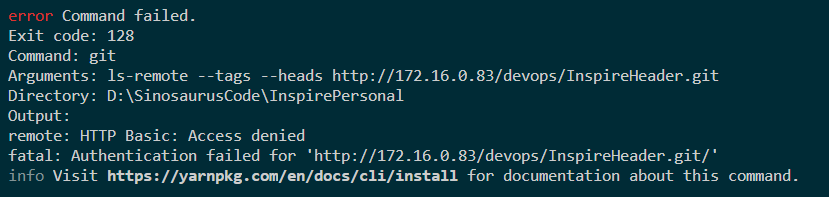

# npm 关联 git 包

由于现在项目越做越多，很多公共的部分相互公用，需要尽可能早地提炼出来，这样便可以在其他项目进行引用，而不是每次建一个项目就需要进行拷贝，这样太痛苦了，因而想通过类似 npm 包管理来进行处理

## npm 包

- 初始化一个项目
- 定义 `package.json`
  - version 版本（注意书写格式，若是报 invalid version， 便需要审查下了)
  - main 用来定义文件地址，用来对外公开的

## 其他项目关联包 [npm](https://docs.npmjs.com/about-packages-and-modules)

- package-name: git 地址
  - git 地址定位具体的分支或者标签 `# + 具体的分支/标签`

基本上就可以了

## 目前 github 推出了对应的包管理系统[link](https://help.github.com/cn/articles/configuring-npm-for-use-with-github-package-registry)

## 注意

使用 git 关联包，迭代不是很方便，需要通过分支或者 tag 来进行更新，若是只单纯地删除`node_modules`，依旧无法有效解决，需要删除本地包缓存，这样也可以，但是每次更新包，就太麻烦了

## 下载时 HTTP Basic: Access denied...

在`package.json`中添加了`git`包

```
common-header: "git+http://172.16.0.83/devops/InspireHeader.git#v1.0.3",
...
```

下载时一直提示


> 原因因为权限不够

## 解决之道

查了很多见解，最终得以解决

> 虽然`gitlab`提供了`ssh`和`http`两种下载方式，但是对`http`要求高些，下载时需要提供用户名和密码，因而才有网上常提供的

```
1. git config --system --unset credential.helper
git config --global--unset credential.helper
2. git config --global http.emptyAuth true
```

> 这几种方式，但是在 npm 下载时，是不会提供输入用户名和密码的，不得已将链接由`http`转为`ssh`才得以解决

```
common-header: "git+ssh:git@172.16.0.83:devops/InspireHeader.git#v1.0.3",
...
```

- 参考资料
  - [stackoverflow](https://stackoverflow.com/questions/47860772/gitlab-remote-http-basic-access-denied-and-fatal-authentication)
