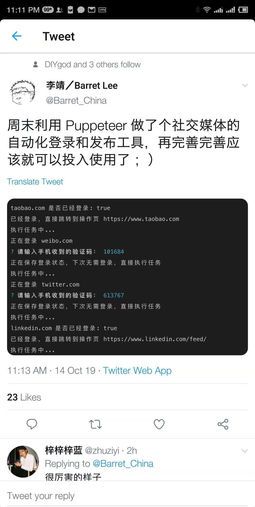

# puppeteer

## 实现的要求



## API

### page

```
const puppeteer = require('puppeteer')
puppeteer.launch().then(async browser => {
  // page
  const page = await browser.newPage()
})
```

#### 事件
可以调用 node原生事件[`EventEmitter`](https://nodejs.org/api/events.html#events_class_eventemitter)

+ `on`
  ```
    page.on('request', fn)
  ```
  > 事件列表
    `close, console, dialog, domcontentloaded, error, frameattached, framedetached, framenavigated, load, metrics, pageerror, request, requestfailed, requestfinished, response, workercreated, workerdestroyed`

+ `once`
  ```
    page.once('load', () => console.log('page loaded'))
  ```
  > 在使用`await`时，会导致`load`无法触发，`await page.goto(url)`，因为await已经有了load的效果
    
+ `removeListener` 注销事件
  ```
    page.removeListener('request', fn)
  ```    

#### 命名空间
+ coverage
+ keyboard
+ mouse
+ touchsreen
+ tracing


+ goto
+ waitForSelector
+ waitForNavigation({
    // 跳转页面，等待加载完
    waitUntil: 'load'
  })
+ content
+ evaluate

+ evaluate 相当于进入了dom上下文，可以在内部直接进行正常的 dom属性操作

+ click 点击
+ type 输入

##### $、$$、$evel、$$evel
```
  $ => querySelector
  $$ => qyuerSelectorAll
  $evel => selector.$evel(select, node => console.log('拿到当前元素'))
  $$evel => selector.$$evel(select, nodes => console.log('拿到当前元素,这是一个数组'))
```


### 注意事项
+ 如何实现 sso，特别是页面前后跳转了，属性（class类名）是否好拿，当前的page是否还是之前 `goto`的page
+ 滑块验证如何处理
  - 个人想通过截图拿到 图片传给后台，最后由后台返回结果进行处理
  - 网友的方法可以进行测试
+ 百度首页，为何点击无效，点击其他却可以，有必要 找找原因 


## 参考链接
+ [puppeteer初探](https://juejin.im/post/5b58a1a051882519790c9295?utm_source=gold_browser_extension)
+ [网友1](http://csbun.github.io/blog/2017/09/puppeteer/)
+ [网友2](https://juejin.im/entry/5a3aa0e86fb9a045076fd385)
+ [Chrome Puppeteer](https://developers.google.com/web/tools/puppeteer)
+ [api](https://github.com/GoogleChrome/puppeteer/blob/master/docs/api.md)
+ [github1](https://zhaoqize.github.io/puppeteer-api-zh_CN/#/)
+ [看云](https://www.kancloud.cn/luponu/puppeteer/870136)
+ [齐客谷](https://www.qikegu.com/docs/4539)
+ [cookie](https://juejin.im/post/5b5b15e9e51d4519202e3714)


## 如何使用当前浏览器的文件
> 鉴于目前各大网页都设置了防爬虫处理
  + 滑块（有一定逻辑，简单滑动还不生效） == csdn
  + 图片滑块（无法知道滑到哪个位置） == 百度
  + 类名不固定（同一个元素，刷新后，id可能会变化）== csdn
  + 滑块千奇百怪
    - 百度 颠倒图片
    - 知乎 找出颠倒的文字
  + 验证码（这种应该可以结合命令行进行处理）
若是想简单使用，最好是使用手机号登录，再结合命令行，或许是最直接的。奈何目前登录方式各样，有的使用 单点登录（包括第三方），导致页面无法一直锁定

> 不得已，转战思路，能否通过本地提前登录，然后在开启自动化时，便已经登录，这样便可以跳过前面一大堆各种验证问题，现在只需要判断是否登录（可以通过上面是否有对应的用户即可）

+ [查找 user_data_dir](https://chromium.googlesource.com/chromium/src/+/master/docs/user_data_dir.md)

使用 userDataDir 时，会跟 {headless: false}相冲突，导致程序卡死，只能去掉，方可正常流转
> 依旧不行，看选择的路径吧，原来是我的路径使用错误，利用 `chrome://version`可以查看到

+ [登录信息不能马上反映到data数据中](http://imhxl.com/post/puppeteer.html)
+ [看起来可以](https://guozh.net/puppeteer-cookie-login/)

https://www.cnblogs.com/tianfang/p/9027187.html


## args
+ [1](https://kapeli.com/cheat_sheets/Chromium_Command_Line_Switches.docset/Contents/Resources/Documents/index)
+ [2](https://peter.sh/experiments/chromium-command-line-switches/#load-extension)


## project
+ [图灵书](https://github.com/laispace/puppeteer-explore/blob/master/demo/download-ituring-books.js)
+ [typescript 编写](https://zhuanlan.zhihu.com/p/35758104)
+ [ts1](https://github.com/bWhirring/puppeteer-examples/blob/master/examples/cas.ts)
+ [autologin-facebook](https://github.com/aofdev/autologin-facebook)

## 谷歌插件 [puppeteer recorder](https://chrome.google.com/webstore/search/puppeteer?utm_source=chrome-ntp-icon)
> 可以快速生成选择的元素以及操作步骤


### write cookie
+ [1](https://github.com/GoogleChrome/puppeteer/issues/717)