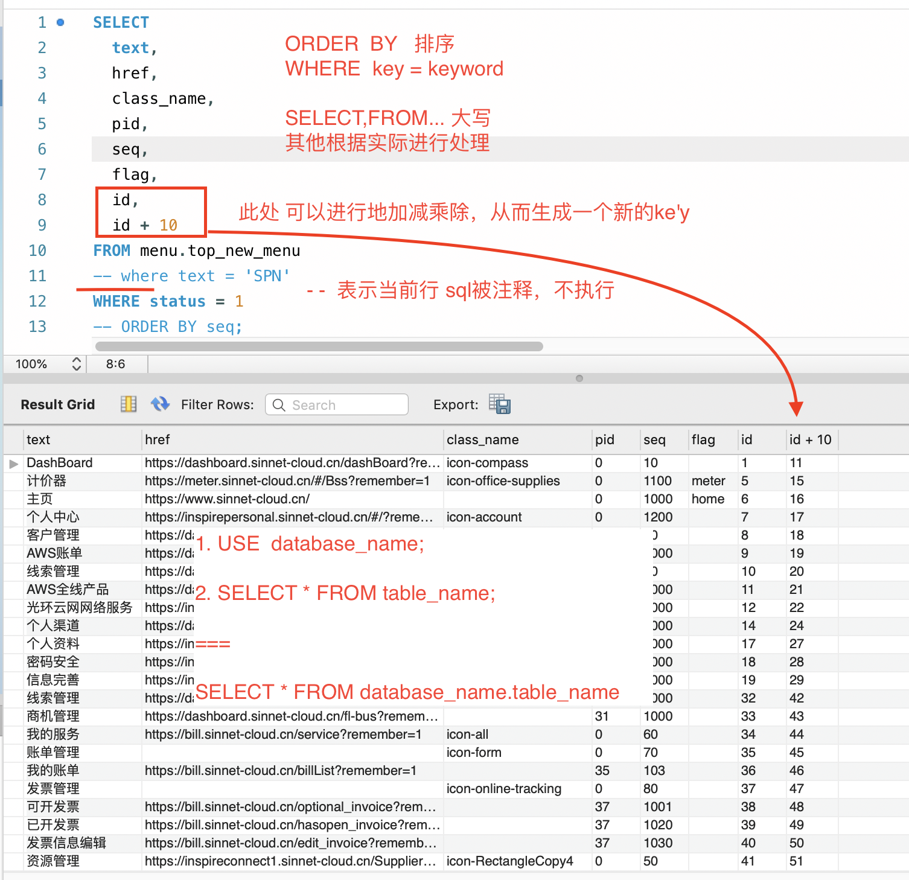
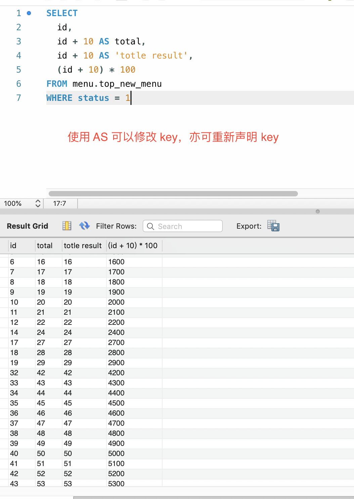
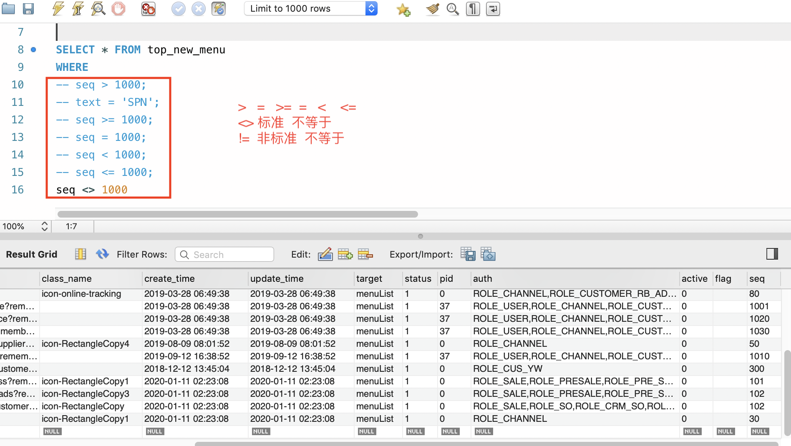
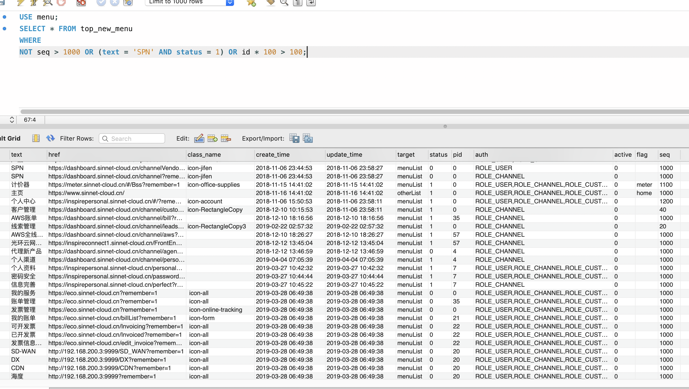
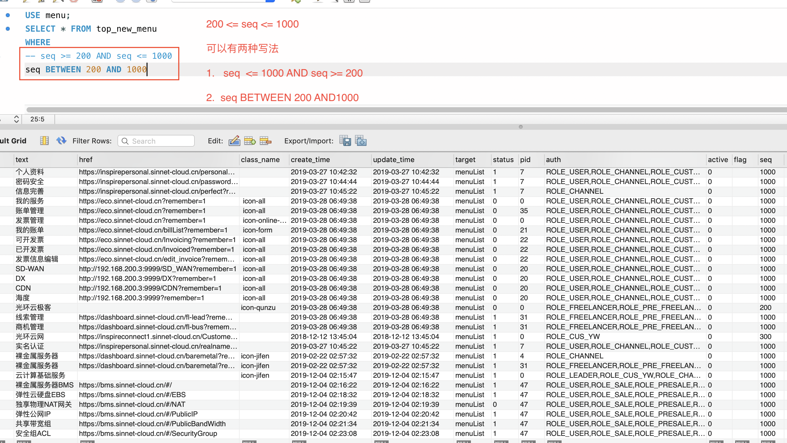
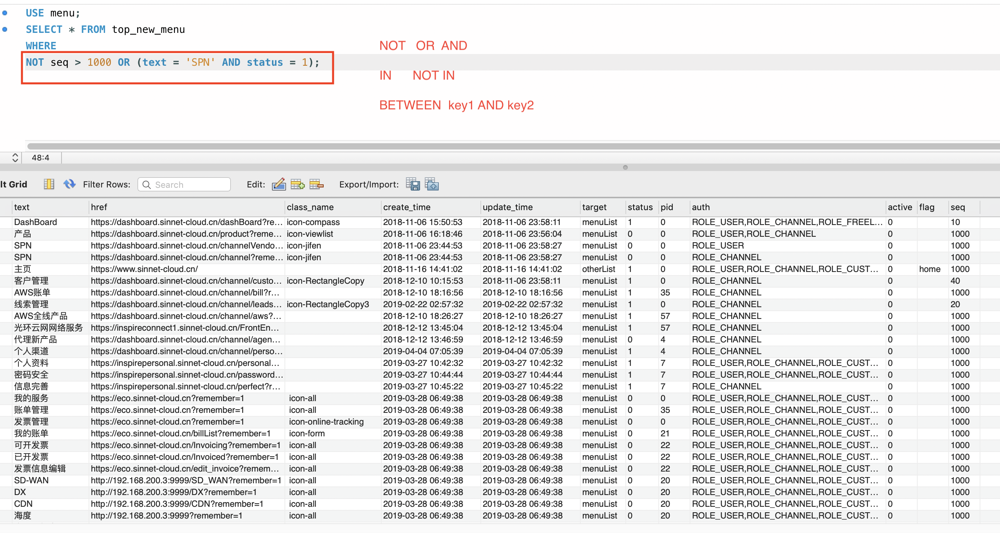
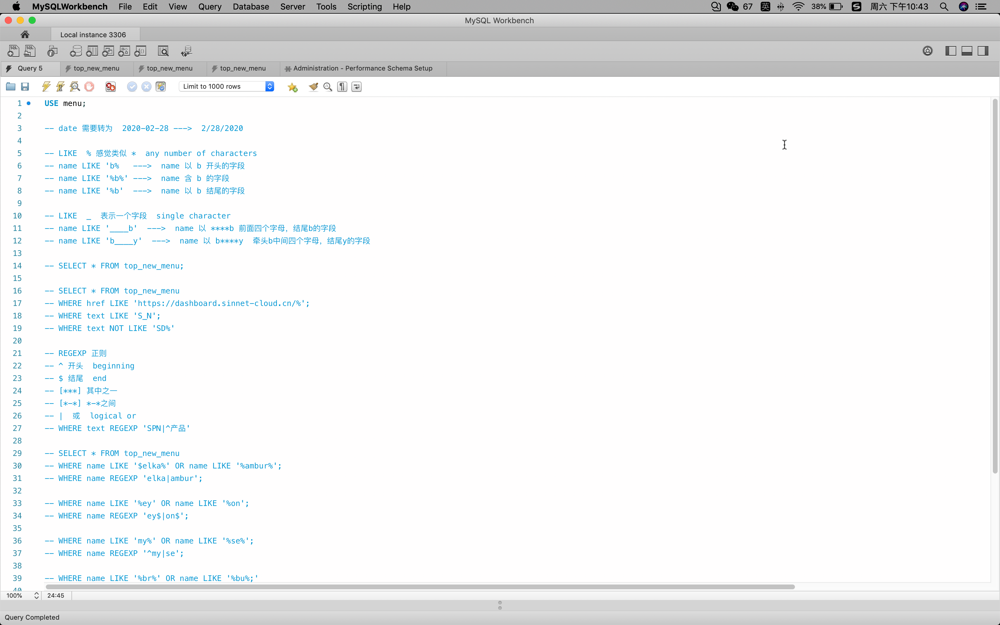
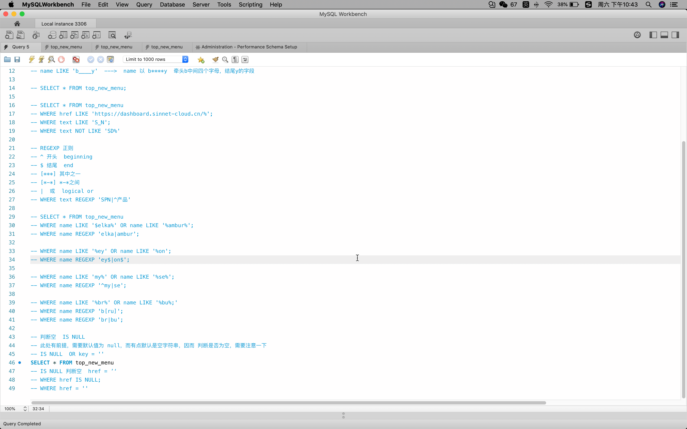

# mysql

数据库由 数据库（database）跟表（table）组成

## 命令

一般都是增删改查，因而这些主要的命令字母建议大写，被查询者建议小写

> 大写

`SELECT`,`FROM`,`AS`,`WHERE`,`ORDER BY`,`USE`......

> 小写

- database_name
- table_name
- key
- keyword

### sql 语句

- 选择数据库

  ```sql
  USE database_name
  ```

  

- 注释一段 sql `--`

  ```sql
  SELECT *
  FROM table_name
  -- WHERE id = 1;
  ```

- 查询

  - 查询整表

    ```sql
      SELECT * FROM database_name.table_name

      ===

      USE database_name;
      SELECT * FROM table_name;
    ```

  - 查询指定数据/重命名 key

    ```sql
      // 查询 key1，key2
      SELECT key1, kye2 FROM database_name.table_name;
      // 查询 key1，并重命名key2
      SELECT key1, key2 AS key3 FROM database_name.table_name;
    ```

    

  - `` 去重

    ```sql
      SELECT DISTINCT key = keyword FROM database_name.table_name
      -- 可以排除 key = keyword 有多个相同 keyword 的情况
    ```

- 条件

  查询列表时，总是会有各种判断条件加以筛选

  - 基础的条件

    ```sql
      >,  >=,  <,  <=,  =,  <>(!=)
    ```

    ```sql
      SELECT * FROM database_name.table_name WHERE  id > 10
    ```

    

  - 与或非

    ```sql
      AND,  OR,  NOT
    ```

    ```sql
      SELECT * FROM database_name.table_name WHERE id > 10 AND id <100 OR text = 'SPN' AND (price * 10 > 100)
    ```

    

* 其他

  ```sql
    IN,  NOT  IN,  BETWEEN AND
  ```

  ```sql
    -- IN
    SELECT * FROM database_name.table_name WHERE text IN ('SPN', 'BB')
    -- equal
    SELECT * FROM database_name.table_name WHERE text = 'SPN' OR text = 'BB'

    -- NOT IN
    SELECT * FROM database_name.table_name WHERE text IN ('SPN', 'BB')
    -- equal
    SELECT * FROM database_name.table_name WHERE text <> 'SPN' AND text <> 'BB'

    -- BETWEEN AND
    SELECT * FROM database_name.table_name WHERE id >= 100 AND id <= 200
    -- equal
    SELECT * FROM database_name.table_name WHERE id BETWEEN 100 AND 200
  ```

  

  

* `LIKE` ==> `%`， `_` 进行 匹配

  可以用来匹配一个字段是否包含部分需要的参数

  - `%` 有点类似正则的 \* any number of characters

    ```sql
      USE database_name;
      -- 查询name以end结尾的字段
      SELECT * FROM table_name WHERE name LIKE '%end';
      -- 查询name以begin开始的字段
      SELECT * FROM table_name WHERE name LIKE 'begin%';
      -- 查询name包含key的字段
      SELECT * FROM table_name WHERE name LIKE '%key%';
    ```

  - `_` 每一`_`表示一个 single character

    ```sql
      USE database_name;
      -- 查询name以 ****b 前有四个字节，结尾以b结尾的字段
      SELECT * FROM table_name WHERE name LIKE '____b';
      -- 查询name以b开始,e结尾，中间有四个字段的字段
      SELECT * FROM table_name WHERE name LIKE 'b____e';
      -- 查询name包含开头，后面有四个字节的字段
      SELECT * FROM table_name WHERE name LIKE 'b____';
    ```

* `REGEXP` 正则

  - ^ 开头 beginning
  - \$ 结尾 end
  - [*****] 其中之一
  - [*-*] *-*之间
    -- | 或 logical or

  ```sql
    USE database_name;
    SELECT * FROM table_name
    -- 含 a | b
    WHERE REGEXP 'a|b'
    -- 以a结尾，以b开头
    WHERE REGEXP '^a|b$'
    -- a或b连c
    WHERE REGEXP '[ab]c'
    -- a到z连c
    WHERE REGEXP '[a-z]c'
  ```

- IS NULL

  用来判断是否为`null`

  ```sql
    USE database_name;
    SELECT * FROM table_name WHERE name IS NULL;
  ```

  > 此处需要注意，使用 `IS NULL` 时，需要默认值设为 `NULL` ，对于有些默认值直接为 空字符串，因而不能单纯地判断这个，还需要需要是否等于空字符串

  ```sql
  SELECT * FROM database_name.table_name WHERE name IS NULL OR name = '';
  ```

  

  

- LIMIT

  - begin-number 从第几条开始的值
  - search-total 当前查询单总数

  ```sql
    SELECT * FROM database_name.table_name
    -- 从第一条开始，查询10条数据
    LIMIT 0, 10
  ```

* 多表联查

  - JOIN ON AND

  ```sql
   SELECT * FROM
   -- dt1 是 对 database1.table1 的简称
   database1.table1 dt1
   JOIN database2.table2 dt2
     ON dt1.id = dt2.id
     AND dt1.name = dt2.name
     -- 获取同一个database（分开的database)下，通过 JOIN 来进行关联，ON 加 判断条件，可以通过AND来进行条件累加
  ```

  >

## 注意事项

- 时间 `date` 需要写成数据库可以识别的格式

  ```sql
    2020-03-01
  ```

## 学习地址

- [YouTube](https://www.youtube.com/watch?v=7S_tz1z_5bA)

## 自己的

- 新增

  ```sql
   INSERT INTO database_name.table_name (colum1, colum2 ...) VALUES (value1, value2 ...)
  ```

- 修改

  ```sql
    UPDATE database_name.table_name SET colum = value, colum1 = value1 ... WHERE ...
  ```

  - CONCAT
  - REPLACE
