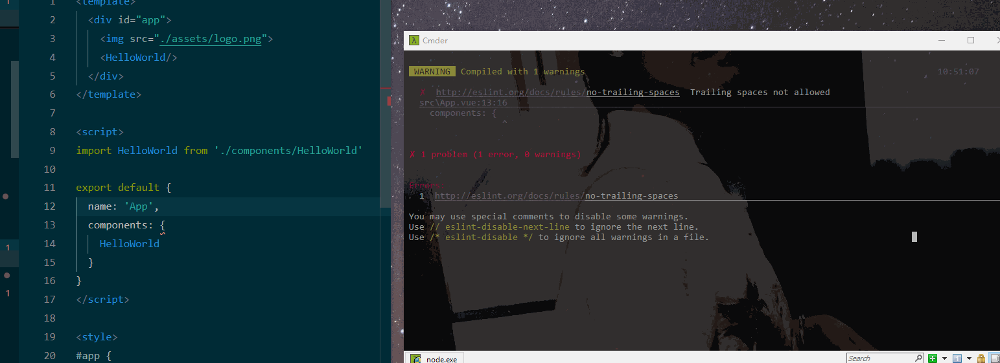

# vue eslint 规范配置

[](https://standardjs.com)

为了代码格式统一，避免一些低级或者不合理的错误，现强行使用[`eslint`](http://eslint.cn/docs/user-guide/configuring)的 [`standard`](https://standardjs.com/readme-zhcn.html)规范

## 项目配置

目前都是使用 vue 提供的脚手架进行开发的，虽然 [`vue-cli 3.0`](https://cli.vuejs.org/zh),但是公司因为配置了 OAuth 的缘故，暂时还是只能使用`vue-cli 2.0`,
因而当前配置会结合两个版本进行阐述

## 目的

可以通过编辑器（vscode）进行提示同时可以修复，如此便是最好的

### `vue-cli 2.0`

- 新建项目时选择 `standard`格式

  

- 测试 eslint （随便选个地方，打几个空格）

  

- 保存时可以自动修复 （或者代码格式化时修复）

  > 由于`vetur`使用的格式化是 `prettier`的方式，并不是我们想要的`standard`，目前两种操作方式

  

  - **方案 1**： 若是能将`prettier`改为我们想要的，这是最好的
  - **方案 2**： 不改变 `prettier`，而是在保存时再按照 `standard`的形式保存也不赖的

  针对上面描述，当前才用的是第二种方案（第一种方式还没找到解决办法）

  - 采用`方案2`,操作流程

    - 安装插件 `ESLint`
    - vscode `setting.json`添加配置

      ```
        // 开启
        "eslint.enable": true,
        // 保存
        "eslint.autoFixOnSave": true,
        "eslint.run": "onType",
        "eslint.options": {
            "extensions": [".js",".vue"]
        },
        "eslint.validate": [
            // 此处保存时，自动修复
            { "language": "vue", "autoFix": true },
            "javascript",
            "html",
            "vue-html"
        ]
      ```

    - 效果

    

### `vue-cli 3.0`操作相同（细微区别先不描述）

## eslint 简单描述

> eslint 目前有两个大的分支

- [standard](https://standardjs.com/readme-zhcn.html)
- [airbnb](https://github.com/airbnb/javascript)

> airbnb 比 standard 规则要求更加严格，这也是为何选择 standard 的缘故，由于规则并不是百分百符合每个公司，因而都会在此基础上，进行私人定制 [eslint-config-vue](https://github.com/vuejs/eslint-config-vue/blob/master/index.js) _具体规则描述见 eslint 官网_

> 某个特定关闭 eslint 校验 [网友](https://blog.csdn.net/u013362969/article/details/81215336)

## 总结

- 若是能在代码格式化时就可以进行修复，这才是最好的
- 如何定制自己的规则，这个有些难（众口难调）
- 后续再进行补充吧（点之间还是有些散）
