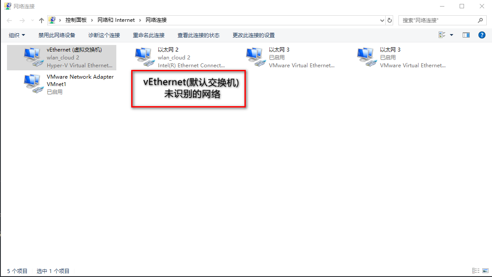
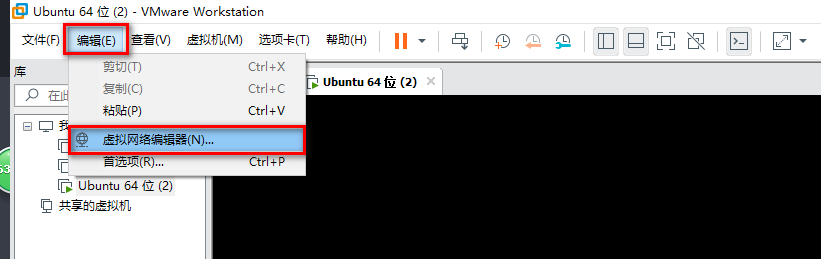
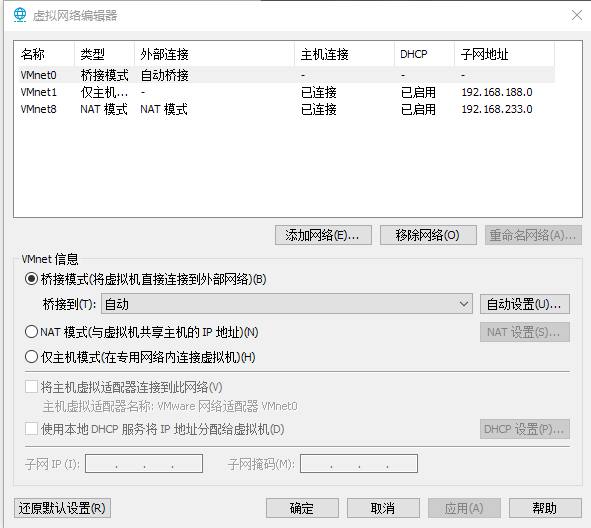
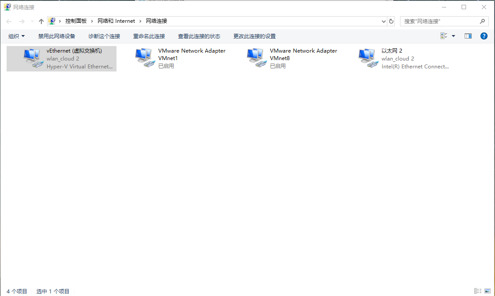
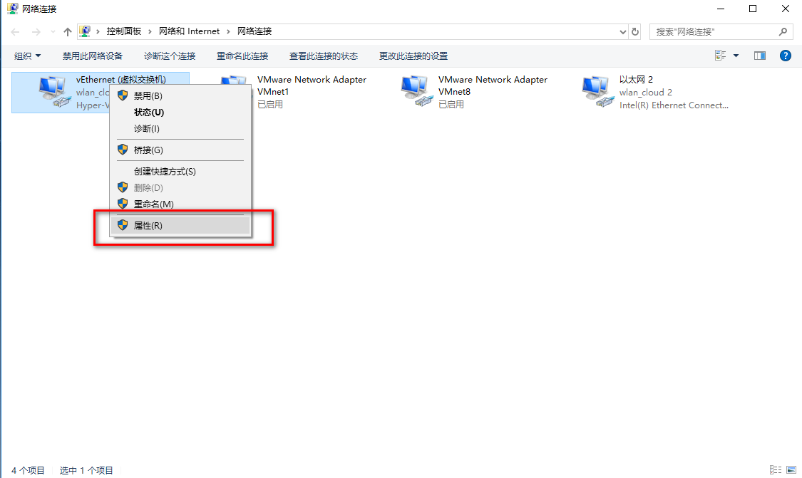
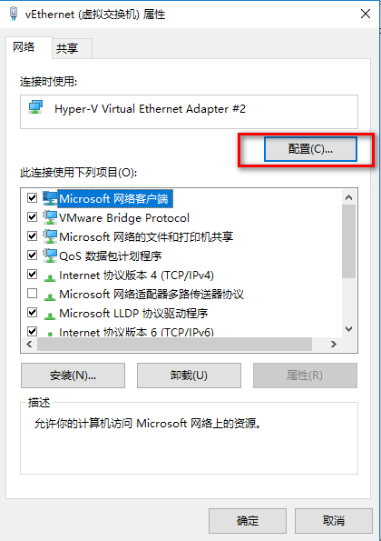
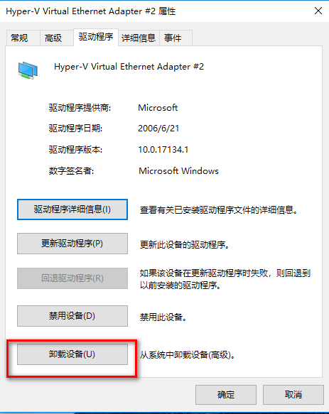
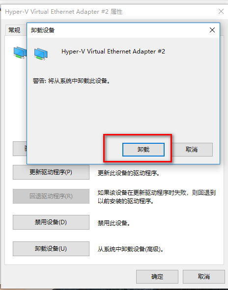

# VMware 开启虚拟机

最近公司由无线网转为有线时，我用`VMware Workstation Pro`装的几个系统，其中一个 `ubuntu`无法访问网页，在`ubuntu`运行`ifconfig -a` ，直接没有`ip`,
，在`win10`查看 `控制面板\网络和 Internet\网络连接` 发现 `vEthernet(默认交换机) 未识别的网络`，一顿无语

## 折腾之旅

> 因为错误肯定是由于无线转有线的缘故，但是对其进行各种修改，但还是不行，`ip` 等，网上各种方式都不能有效的解决，然后各种尝试，发现 `VMware Workstation Pro` 有个功能

- 
- 
  可惜依旧不管用，之后想是不是把那些全部删掉，然后重新初始化呢，于是一切迎刃而解了。
  > 解决 本地修改
- 
- 
- 
- 
- 
  至此便解决了

## 总结

- 果然还是自己努把力解决了才会更好
