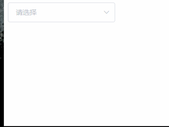
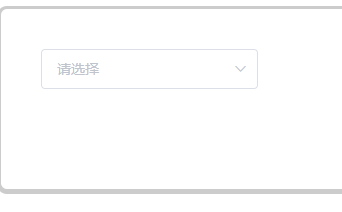

# element-ui select 下拉框位置错乱

由于使用 element-ui 的 `select` 组件时，下拉框的位置错乱了。



## 开始查找问题
通过各种问题查找，发现是 `css` 问题

> css 
```css
body {
  position: relative;
}
#app {
  margin-top: 70px;
}
```

> html
```html
<div id="app">
  <el-select v-model="value" placeholder="请选择">
    <el-option v-for="item in options" :key="item.code" :label="item.name" :value="item.name">
    </el-option>
  </el-select>
</div> 
```

最初是使用 `popper-append-to-body` 来解决，但是由于父元素使用了 `overflow: auto` (避免改变布局结构)，而导致下拉框在父元素内部。



## 总结
通过上面的方式，有两种方式进行解决

+ 父元素尽可能不使用 `margin-top` 换为 `padding-top`
+ 使用 `popper-append-to-body` 时，父元素不要使用 `overflow: auto`

> 通过查找element的源码时，发现是其引用 [popper.js](https://github.com/FezVrasta/popper.js/issues/618) 的缘故
