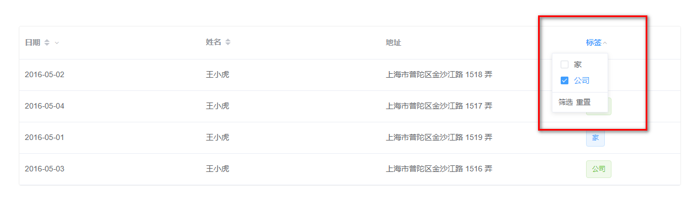
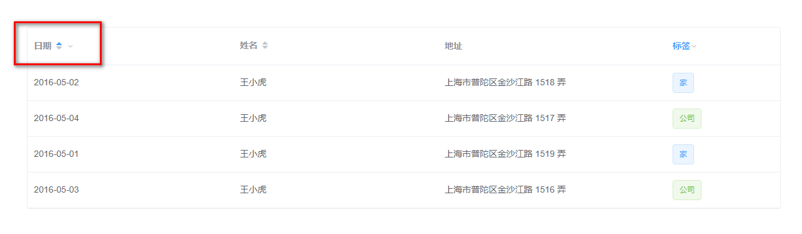
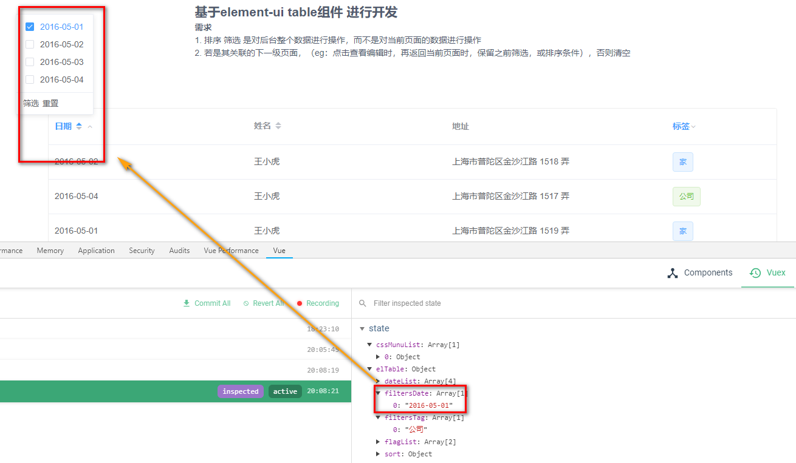
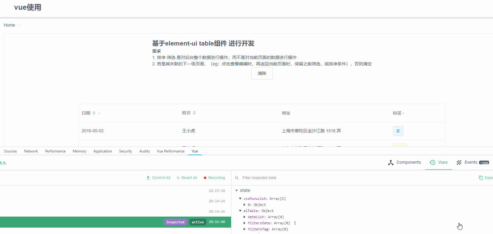

# elment-ui table组件 -- 远程筛选排序
基于 `elment-ui` **table组件** 开发，主要请求后台实现**筛选** **排序**的功能。

## 需求
  + 排序 筛选 是对后台整个数据进行操作，而不是对当前页面的数据进行操作
  + 若是其关联的下一级页面，（eg：点击查看编辑时，再返回当前页面时，保留之前筛选，或排序条件），否则清空

> 先上一份源码, 直接使用官网的（修改了一小部分参数，可以忽略）

```
<el-table
  :data="tableData"
  style="width: 100%"
>
  <el-table-column
    prop="date"
    label="日期"
    sortable="custom"
    min-width="180"
    :filters="dateList"
  >
  </el-table-column>
  <el-table-column
    sortable="custom"
    prop="name"
    label="姓名"
    min-width="180"
  >
  </el-table-column>
  <el-table-column
    prop="address"
    label="地址"
    min-width="200"
  >
  </el-table-column>
  <el-table-column
    prop="tag"
    label="标签"
    min-width="100"
    :filters="flagList"
  >
    <template slot-scope="scope">
      <el-tag
        :type="scope.row.tag === '家' ? 'primary' : 'success'"
        disable-transitions
      >{{scope.row.tag}}</el-tag>
    </template>
  </el-table-column>
</el-table>
```

## [知识点](http://element-cn.eleme.io/2.3/#/zh-CN/component/table)
+ **筛选**
  - 表头 （`el-table`）
    + `filter-change`
    ```添加@filter-change
    <el-table
      :data="tableData"
      style="width: 100%"
      @filter-change="handleFilter"
    >
    ```
  - 表格（`el-table-column`）
    + 针对需要排序的列添加 `:filters="Array[Object]"` ,此处注意 Object 的格式必须为 `{text: **, value: **}` 键必须如此，暂时没有找到可以修改的api
      ```
      <el-table-column
        prop="date"
        label="日期"
        sortable="custom"
        min-width="180"
        :filters="dateList"
      >
      </el-table-column>
      ```
  - 设置默认值
    +  `filtered-value` （作用在 `el-table-column`）
    ```
    <el-table-column
      prop="tag"
      label="标签"
      min-width="100"
      :filters="flagList"
      :filtered-value="['公司']"
    >
    ```

    显示效果如下

    

  + **排序**
    + 表头 (`el-table`)
      + `sort-change`
      ```
      <el-table
        :data="tableData"
        style="width: 100%"
        @filter-change="handleFilter"
        @sort-change="handleSort"
      >
      ```
  + tbody (`el-table-column`)    
    + `sortable` 设置为 `:sortable="'custom'"`
    ```
    <el-table-column
      prop="date"
      label="日期"
      :sortable="'custom'"
      min-width="180"
      :filters="dateList"
    >
    ```
  + 设置默认值
    + `default-sort` 参数 `{ order: **, prop: **}`， `prop指那一列，order 指升序还是倒序

  显示效果如下

  

至此，初步需求完成，现在就是具体细化了

## 细化
  + 将未知的值都存入 `vuex` 中，便于全局控制
    - `default-sort`, `filtered-value`, `filters`

    > **注** `default-sort`, `filtered-value` 不能写死，因为是动态的请求参数，因而得注意了
    ```
    // component
    computed: mapState('elTable', [
      'flagList',
      'dateList',
      'filters',
      'sort'
    ])
    // vuex
    filters: [],
    sort: {
      order: '',
      prop: ''
    }
    ```
  + 方法，进行调用修改
    + 筛选过程中，无法很好定位到具体哪一列， 给当前列添加  `column-key`
    ```
    // vuex
    filtersDate: [],
    filtersTag: [],
    sort: {
      order: '',
      prop: ''
    }
    },
    mutations: {
      setFilters_date (state, data = []) {
        state.filtersDate = data
      },
      setFilters_tag (state, data = []) {
        state.filtersTag = data
      },
      setSort (state, data = {}) {
        state.sort = data
      }
    }
    // component
    methods: {
      ...mapMutations('elTable', [
        'setFilters_date',
        'setSort',
        'setFilters_tag'
      ]),

       handleFilter (filter) {
         // 拿到 key
         /**
          * 命名技巧罢了，只是关联
          */
        const key = Object.keys(filter)[0]
        this['setFilters_' + key](filter[key])
       },
       handleSort (column, prop, order) {
         console.log(column, prop, order)
       }
    },
    computed: mapState('elTable', [
      'flagList',
      'dateList',
      'filtersDate',
      'filtersFlag',
      'sort'
    ])
    ```
    上面主要是如何将几者之间进行关联罢了

    

## 清除
  即要清除当前页面的数据，同时还要清除 `vuex` 里存的数据
   + `clearFilter`, `clearSort`
  ```
  // vuex
  clear (state) {
    state.filtersDate = []
    state.filtersTag = []
    state.sort = {
      order: '',
      prop: ''
    }
  }
  // component
  clearAll () {
   this.$refs.tb.clearFilter()
   this.$refs.tb.clearSort()
   this.clear()
 }
  ```
  

  + 是否是关联的页面
    ```
    created () {
        // 此处做判断，是否是其关联的页面，不是清除，是就不清除
        if (!isPage) return
        this.clearAll()
    }
    ```

## 总结
  + 可能还有些不完善，但是已经可以实现上述需求了
  + 有个问题， *筛选时，不点击筛选或重置，是无法在`vuex`中缓存*，其实也很合理，`vuex`里存请求的数据，没点击也就没必要存储了

2019-03-18补充

> 由于设置 `filtered-value`时，有默认值，便会导致有时使用 `clearFilter` 方法时无法清除该值，看了下源码，感觉需要将筛选组件激活下才能使用，而一进页面是没有的，特别页面间跳转，再回来清除，基本没指望了。

+ 思路
想了许久，既然方法不够用，那就让该组件重置即可，要不就刷新
  + 刷新 `window.location.reload()` 但是体验实在是不敢恭维，毕竟也面刷新，走的接口多，其次视觉效果也不是很好
  + 组件重置，这个才是我现在研究的对象
    + vue自带组件重置功能 `$forceUpdate` ，使用了却没有效果，因为不对子组件进行操作，所以排除
    + 人为重置，`v-if` 可以让组件重新渲染，在点击清除时`v-if=flase` 再给个几秒延迟设置`v-if=true` 便可以实现
    > 此处需要注意，使用`$nextTick`时，时间依旧不够，若是涉及到数据请求，放在数据请求回来时设置 `v-if=true`会更好

虽然这些方法还不是最好的，但是还需要一步步继续前行了    