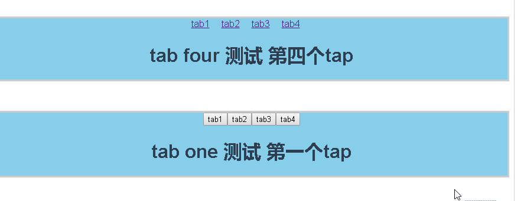
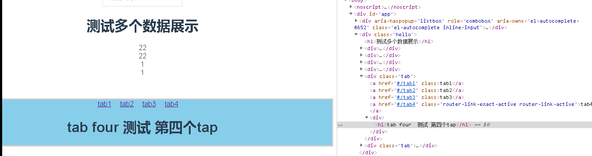
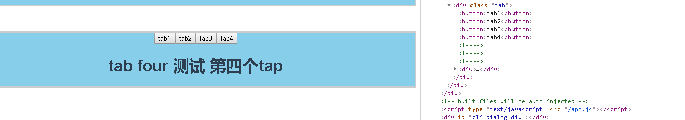

# vue-router 该如何使用

> 忽然碰到一个常见的问题，明明可以使用 v-if / v-show 可以的解决的问题，有没有必要是使用 vue-router来解决。 比如常见的 tab 切换。一时间，我有些犹豫了，有没有必要滥用 vue-router。那到底何时用才叫合理呢？

> 先上代码，用两种方式实现的效果

##### 使用vue-router

> `router`
```
import Tab1 from './components/tab/TabOne'
import Tab2 from './components/tab/TabTwo'
import Tab3 from './components/tab/TabThree'
import Tab4 from './components/tab/TabFour'
const routes = [
  {path: '/tab1', component: Tab1},
  {path: '/tab2', component: Tab2},
  {path: '/tab3', component: Tab3},
  {path: '/tab4', component: Tab4},
]
const router = new VueRouter({
  routes
})
```

> `.vue`文件中
```
 <div class="tab">
  <router-link to="/tab1">tab1</router-link>
  <router-link to="/tab2">tab2</router-link>
  <router-link to="/tab3">tab3</router-link>
  <router-link to="/tab4">tab4</router-link>
  <router-view></router-view>
</div>
```

##### 使用`v-if/v-show`
> `.vue`

```
<div class="tab">
  <button @click="handleTab(1)">tab1</button>
  <button @click="handleTab(2)">tab2</button>
  <button @click="handleTab(3)">tab3</button>
  <button @click="handleTab(4)">tab4</button>
  <div v-if="isShow === 1"><Tab1 /></div>
  <div v-if="isShow === 2"><Tab2 /></div>
  <div v-if="isShow === 3"><Tab3 /></div>
  <div v-if="isShow === 4"><Tab4 /></div>
</div>
/**
 * script
 */
 data () {
    return {
      isShow: 1
    }
  },
  methods: {
    handleTab (v) {
      this.isShow = v
    }
  }
```

> 效果如下



+ 上方为路由
+ 下方为v-if

> 目前看起来效果一致。那就从另一个角度考虑，页面结构。

+ `vue-router`


+ `v-if`



> 静态页面没区别，现在考虑传参，进行数据请求渲染

+ `vue-router`  进行参数传递
```
//修改上述代码

```

> 总结： 
+ 目前看起来，效果没有很大区别，代码量也没有减少
+ 使用原生，可能是用索引进行关联，在vue中推荐使用 数据进行驱动
+ 暂且记录一笔，以待后期继续研究
