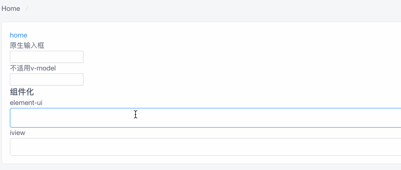

# vue中如何实时修改输入的值
经常看到需要对用户输入的值进行实时修改，有时是需要修改为指定的展示内容，有时候是用来校验，禁止用户输入非法数据，总之是一个常见的需求吧，只是自己一直没有特意去关注。思来想去还是有必要了解一下。

## 操作方法
一直听说各种方式，记得最深的便是利用`computed`的计算属性，通过`set` 和 `get` 来进行修改，其他的也有所见闻。先实现一种，再进行其他其他深究，以及使用好坏。

> [vue文档说明](https://cn.vuejs.org/v2/guide/forms.html) *对于需要使用输入法 (如中文、日文、韩文等) 的语言，你会发现 v-model 不会在输入法组合文字过程中得到更新。如果你也想处理这个过程，请使用 `input` 事件。*

> 需要分两种形式，一种是原生，一种是基于组件，假设需求为*输入数字，同时四位一个空格，类似输入银行卡号*

+ 原生
> 使用 v-model 进行数据绑定
```
// template
<input v-model="value" type="text" @input="setValue($event.target)">
// js
data () {
    return {
        value: ''
    }
}

setValue (target) {
    // 输入的数据进行初始化，将非数字的替换为空
    const val = target.value.toString().replace(/[^0-9]/ig,"")
    // 重新赋值
    this.value = v.replace(/(\d{4})(?=\d)/g, '$1 ')
}
```


> 不适用  v-model 进行数据绑定

```
// template
<input type="text" @input=""></input>
// js
data () {
    return {
        form {
            accout: ''
        }
    }
}
setValueNotWidthVModel (target) {
    const v = target.value.toString().replace(/[^0-9]/ig,"")
    // 此处是获取数据的地方
    this.form.accout = v.replace(/\s/g, '')
    // 此处是页面进行显示
    target.value = v.replace(/(\d{4})(?=\d)/g, '$1 ')
}
```


+ 组件方式
组件都是对原始`input`进行额外处理了一层

```
<!-- template -->
// element-ui
<el-input v-model="form.accout" @input="changeInputValue"></el-input>
// iview
<Input v-model="form.accout" @input="changeInputValue" />
<!-- js -->
data () {
    return {
        form: {
            account: '0'
        }
    }
}
// 由于是组件，返回值 v 直接是value ，无法传参，或者`$event`
changeInputValue (v) {
    const v = val.toString().replace(/[^0-9]/ig,"")
    // 需要延迟一下，对值进行设置 https://github.com/ElemeFE/element/blob/dev/packages/input/src/input.vue 可以看到设置原始值时，使用 this.$nextTick()
    this.$nextTick(() => {
        // https://segmentfault.com/q/1010000009840451/a-1020000010449110
        this.form.accout = v.replace(/(\d{4})(?=\d)/g, '$1 ')
    })
}
```



## 总结
+ 依旧不知道使用`computed`是如何实现的，上述方法，通过`input`时间，便可以一直拿到值，不用额外进行处理，因为`v-model`进行了绑定

### 2019-09-10
无意间看到[vue-admin-element作者的掘金文章](https://juejin.im/post/5c92ff94f265da6128275a85),参考之下，完成了`computed`进行修改输入的参数

> code
```
// template
<input type="text" v-model="computeValue">

// js
data () {
    return {
        form: {
            computeValue: ''
        }
    }
}
computed: {
    computeValue: {
      get () {
        return this.form.computeValue
      },
      set (val) {
        this.form.computeValue = val.replace(/[9]/g, 'a')
      }
    }
}
```

效果图

