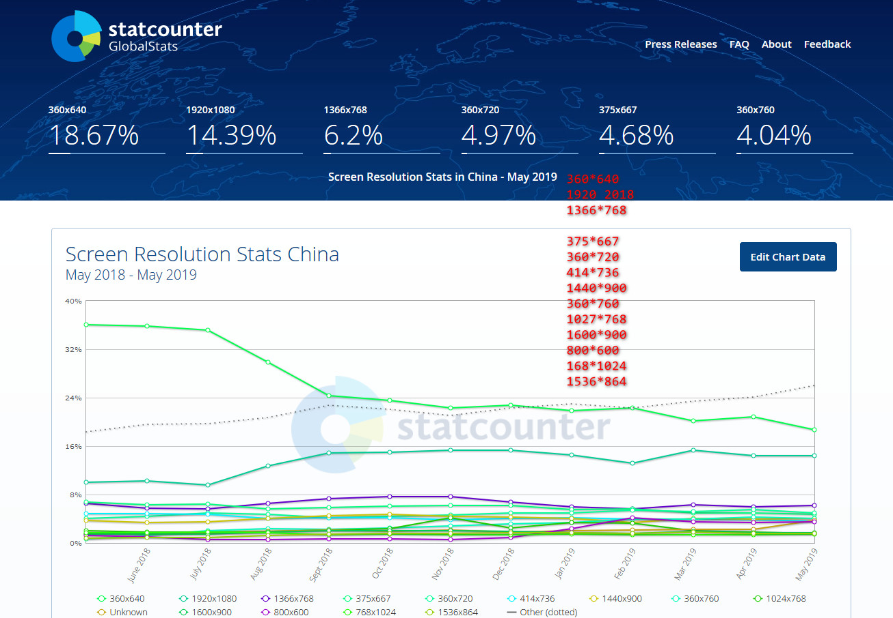
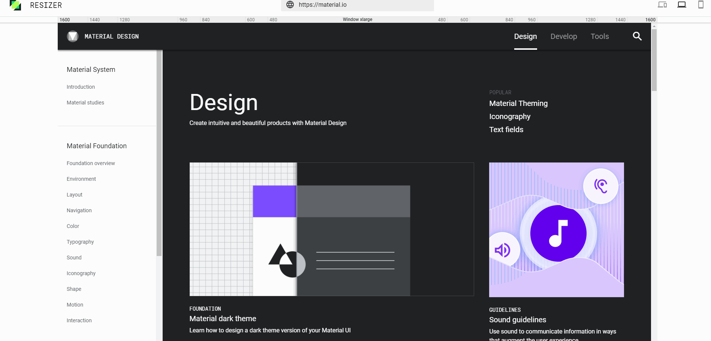

# vue 响应式布局 [1](https://www.mdui.org/design/layout/responsive-ui.html#responsive-ui-patterns)

可使网站在不同的设备（从桌面计算机显示器到移动电话或其他移动产品设备）上浏览时对应不同分辨率皆有适合的呈现，减少用户进行缩放、平移和滚动等操作行为

## 效果图

- [media](https://mediaqueri.es/)
- [material.io](https://material.io/tools/resizer/#device=window)
   [link1](http://www.liquidapsive.com/) [link2](<(https://mediaqueri.es/)>)

## 响应式布局的要求 （Responsive Web Design ＝ RWD， Adaptive Web Design ＝ AWD）

- 响应式界面的四个层次

  - 同一页面在不同大小和比例上看起来都应该是舒适的；
  - 同一页面在不同分辨率上看起来都应该是合理的；
  - 同一页面在不同操作方式（如鼠标和触屏）下，体验应该是统一的；
  - 同一页面在不同类型的设备（手机、平板、电脑）上，交互方式应该是符合习惯的

- 响应式界面的基本规则

  - 内容区块可伸缩：内容区块的在一定程度上能够自动调整，以确保填满整个页面

  
  <video controls width="100%">
  <source src="https://mdui-aliyun.cdn.w3cbus.com/design/static/media/layout/responsive-ui/layout_adaptiveUI_grid_01_hero.webm" type="video/webm">
  <source src="https://mdui-aliyun.cdn.w3cbus.com/design/static/media/layout/responsive-ui/layout_adaptiveUI_grid_01_hero.mp4" type="video/mp4">
  </video>

  - 内容区块可自由排布：当页面尺寸变动较大时，能够减少/增加排布的列数

  
  

  - 边距适应：到页面尺寸发生更大变化时，区块的边距也应该变化

  
  <video controls width="100%">
  <source src="https://mdui-aliyun.cdn.w3cbus.com/design/static/media/layout/responsive-ui/layout_adaptiveUI_grid_02_margins.webm" type="video/webm">
  <source src="https://mdui-aliyun.cdn.w3cbus.com/design/static/media/layout/responsive-ui/layout_adaptiveUI_grid_02_margins.mp4" type="video/mp4">
  </video>

  - 图片适应：对于常见的宽度调整，图片在隐去两侧部分时，依旧保持美观可用

  

  
  
  
  

  - 内容能够自动隐藏/部分显示：如在电脑上显示的的大段描述文本，在手机上就只能少量显示或全部隐藏

  

  - 导航和菜单能自动折叠：展开还是收起，应该根据页面尺寸来判断

  
  

  - 放弃使用像素作为尺寸单位(或者说是不同分辨率下 px 需要进行改变)

> 屏幕分割

 [link](http://gs.statcounter.com/screen-resolution-stats/all/china)

- [切割点 -- bootstrap](https://getbootstrap.com/docs/4.3/layout/overview/); [掘金](https://juejin.im/post/5caaa230e51d452b672f9703)
  - 576px 手机
  - 768px 平板
  - 992px 桌面
  - 1200px 大桌面
- [material desing](https://www.mdui.org/design/layout/responsive-ui.html#responsive-ui-breakpoints)
  
  - 480
  - 600
  - 840
  - 960
  - 1280
  - 1440
  - 1600
     [link](https://material.io/tools/resizer/)

> [张鑫旭](https://www.zhangxinxu.com/wordpress/2016/08/vw-viewport-responsive-layout-typography/)

## 细节

- 图标做成字体
- 响应式图片
  - [张鑫旭](https://www.zhangxinxu.com/wordpress/2015/11/anatomy-of-responsive-images/)
  - [MDN](https://developer.mozilla.org/zh-CN/docs/Learn/HTML/Multimedia_and_embedding/Responsive_images)
  - [efe](https://efe.baidu.com/blog/responsive-images-in-practice/)
  - [阮一峰](http://www.ruanyifeng.com/blog/2019/06/responsive-images.html)
  - [大漠](https://www.w3cplus.com/responsive/automating-art-direction-with-the-responsive-image-breakpoints-generator.html)

## 实现流程

- [阮一峰 2012](http://www.ruanyifeng.com/blog/2012/05/responsive_web_design.html)

## 工具

- [测试各个宽度下的样式](http://www.benjaminkeen.com/)
- [响应式图片生成器](https://cloudinary.com/blog/introducing_intelligent_responsive_image_breakpoints_solutions?utm_source=Smashing_Mag&utm_medium=Byline&utm_campaign=Art_direction_responsive_breakpoints)

## 优缺点 [1](https://huangxuan.me/2014/11/20/responsive-web-design/)

- 优点
  - 只存留单一的网站，对网站进行维护花费的时间就和精力就减轻了不少。一个单一的网站意味着所有设备只存在单一代码，当你需要做出改变的时候，你只做一次就足够了
  - SEO 排名，响应式网页设计也很有帮助，因为网站在所有平台和设备上都提供了一个唯一的 URL。
- 缺点
  - 对于那些日益复杂的网站来说，是一个巨大的挑战。这意味着你的设计团队将会花费大量的时间在桌面定制和集成各种 JavaScript 序列和 html5 / ccs3 代码，以在本地应用的触摸和桌面网站的感觉之间建立平衡。
  - 用户体验，但结果并非总是尽人如意。在某些情况下，用户发现自己在平板电脑上拥有更好的体验，而不是智能手机，而在其他情况下，却又会是相反的感受。

## 适合 vue 的 响应式框架

- [Vuetify](https://vuetifyjs.com)
- [quasar](https://quasar.dev/)
- [bootstrap-vue](https://bootstrap-vue.js.org/)
