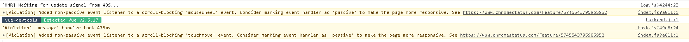

# 记录 vue 中一些有意思的坑

##### `'message' handler took 401ms`

> 在出现这个之前，我一直纠结于 是如何使用`vue-router`或者不使用它，通过类似的`v-if`来实现。结果却出现这个问题，吓得我赶紧使用`v-if`，结果问题依旧存在。心里拔凉拔凉的
> 

> 解决方案

- 在查看别人方案时，才发现是自己为了不使用他人插件，只单纯拿其数据，不曾想，数据源过大，导致编译过程时间过长，把其去掉就好了。然后我的`vue-router`被我都换掉了。不过也无所谓了，路由传参时，若不想在地址栏中显示，一刷新传过来的值都没有了，不如使用 vuex 实在。另外组件懒加载，也可以使用，不在意了。不过还是想使用路由，感觉简介，条例清晰些

##### vuex 中 actions 异步使用，结合 axios 数据请求

> 最近一直在考虑，有没有必要每次请求都要经过 vuex 的 actions，同时也发现一些痛点，就是有些过程是需要在当前页面进行请求更好，因为需要及时显示值，而这些值首次并不能是空，及时之后值请求到，方法无法再次调用，导致值无法及时显示。只能在当前页面请求较好，而且这个值只是当前这一个位置使用而已。
> 加上兄弟组件较多，涉及到不同组件同时请求一个接口，这个适合放在 vuex 中，因而个人建议，可以确定这个接口请求的数据只有这里使用，且有且仅有当前这个组件进行数据请求，不涉及到其他组件请求时，直接放在当前页面进行请求即可。 既可以减少 vuex 的负担，也可以 减少代码量，因为为了拿到请求后的数据，需要些许多不必要的代码。

##### 使用封装的 fetch.js 时，考虑更加灵活些

```
import axios from 'axios'
import { baseUrl } from './../apis/api.js'
import { Loading } from 'element-ui'
axios.defaults.baseURL = baseUrl
axios.defaults.headers = {'Content-Type': 'application/json', 'Accept': 'application/json'}
axios.defaults.timeout = 10000
/**
 * get 请求数据进行修改  默认以对象形式传参
 */
function getDataConfig (data = {}) {
  if (typeof data !== 'object') return data
  const arr = []
  for (let key in data) {
    let res = `${key}=${data[key]}`
    arr.push(res)
  }
  const str = arr.join('&')
  return str
}
axios.interceptors.request.use(config => {
  return config
}, error => {
  return Promise.reject(error)
})

axios.interceptors.response.use(response => {
  return response.data
}, error => {
  return Promise.reject(error)
})
const fetch = {
  post (url, request, code = 1000) {
    let loadingInstance = Loading.service({'background': 'rgba(0, 0, 0, .6)'})
    return new Promise((resolve, reject) => {
      axios({
        method: 'post',
        url,
        data: request
      }).then(response => {
        loadingInstance.close()
        const res = response.data
        if (res && response.code === code) {
          resolve(response)
        }
        reject(response)
      }).catch(error => {
        loadingInstance.close()
        reject(error)
      })
    })
  },
  get (url, request, code = 1000) {
    let loadingInstance = Loading.service({'background': 'rgba(0, 0, 0, .6)'})
    const data = getDataConfig(request)
    return new Promise((resolve, reject) => {
      axios({
        method: 'get',
        url: url + '?' + data
      }).then(response => {
        loadingInstance.close()
        const res = response.data
        if (res && response.code === code) {
          resolve(response)
        }
        reject(res)
      }).catch(error => {
        loadingInstance.close()
        reject(error)
      })
    })
  }
}
export default fetch
```

> 特别是现在需求实时变化，若是这样一成不变，很受被动

- 当后台不返回想要的参数时，就会因为封装不灵活，直接报错 `因为data这个属性都没有`
- 在使用 loading 时，要设计灵活，在有些请求地方，loading 是另外一种展现形式，有时页面请求，根本不需要都显示 loading，只是区域性显示，而这封装的便会影响体验

##### 使用 vuex 时的注意问题

> 在使用 vuex 时，老是发现，当前并没有值，确总是存在上一次保留的值，之前一直很莫名其妙，不得已在看`Vue.js devtools`中查看时，发现上次请求的数据依旧存在，导致下次请求数据时，直接拿里面的值了，这就是为何一进页面就有值（没有进行数据请求时），思来想去这个情况会经常存在，考虑若是其他页面不共用，同时数据也不许额外进行保留时，可以在组件进行销毁时`destroyed`时，再将值初始化即可，这样可以避免很多不必要的坑

##### form 表单问题

> 当 form 表单在 v-for 循环中出来时，使用 ref 进行绑定，及时这个值唯一，通过`refs`可以拿到设定的内容，但是却无法调用其**`submit`**方法，很是神奇，无奈只能使用 dom 操作，绑定 id 值进行解决了

##### 使用 setInterval 时，返回值居然是数字，导致无法使用 clearInterval 进行及时清除定时器

> 现实却是如此，能清除即可
