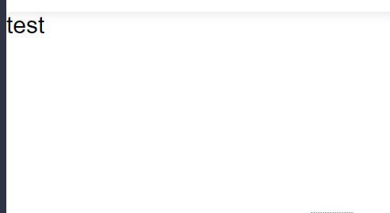
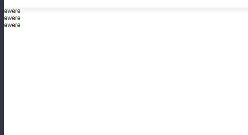
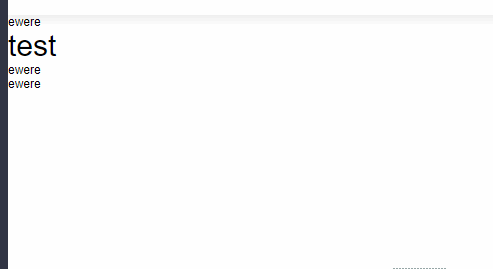
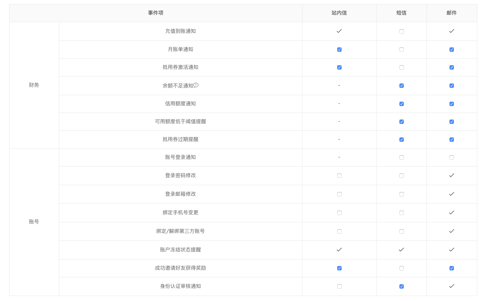

# 权限控制（vue）
经常会遇到，角色权限控制问题，若是页面控制，倒好说，可如果是当前页面部分可见不可见，这就有些麻烦，如果加上条件就更加苛刻。之前只是简单的`v-if`进行控制，如今想试试指令（网上一直有这些操作方式）

## 参考
参考了[vue-element-admin -- 指令](https://github.com/PanJiaChen/vue-element-admin/tree/master/src/directive/permission)

## 应用场景
+ 权限控制
  - dom隐藏（不推荐）
  - 直接从dom节点删除
+ 依据传入的数据动态进行修改

## 代码
需求：需要实现一个依据动态参数进行修改的模块

+ test.vue
  > template
  
  ```
  <div class="test-height">
    <!-- 指令调用，status是动态参数 -->
    <h1 v-permission="{ role: ['so'], status }">test</h1>
  </div>
  ```
  
  > js
  
  ```
    import permission from '@/directives/permission'
    export default {
      ...
      directives: { permission },
      data () {
        return {
          status: false
        }
      },
      mounted () {
        // 动态修改参数
        setTimeout(() => {
          this.status = !this.status
        }, 1000)
      }
    }
  ```


+ permission.js
  
  ```
    import store from '@/store'
    const permission = (el, binding, vnode, oldVnode) => {
      const { value, oldValue } = binding
      if (!value || (value.role && !Array.isArray(value.role))) {
        throw new Error(`need roles! Like v-permission="{ role: ['admin','editor'], [status 可传 boolean]}"`)
      }
      // 绑定的参数
      const status = value.hasOwnProperty('status') ? value.status : false
      const roles = store.getters && store.getters.roles
      const permissionRoles = value.role || []

      const hasPermission = roles.some(role => {
        return permissionRoles.includes(role)
      })

      if (!hasPermission || (hasPermission && status)) {
        /**
        * TODO:
        * 1. 给父元素添加唯一id
        * 2. 同时找到子元素当前父元素的第几个位置
        */
        const rid = getRandomId()
        const index = getChildInParentPosition(el)
        el.parentNode.setAttribute('id', rid)
        el.dataset.id = rid
        el.dataset.index = index
        el.parentNode && el.parentNode.removeChild(el)
      }
      // 判断条件
      if (oldValue && oldValue && oldValue.status === true && value.status === false) {
        // 此处会在 update时触发
        const { index, id } = el.dataset
        const parent = document.getElementById(id)
        // 根据index找到需要插入父节点的位置
        parent.insertBefore(el, Array.from(parent.children)[index])
      }
    }
    export default {
      // 此处父元素存在
      inserted: permission,
      // 此处数据更新
      update: permission
    }
  ```
 
  - 随机生成id
    ```
      function getRandomId () {
        var randomId = 'yxyxyxxyxyy'.replace(/[xy]/g, function (item) {
          var n = Math.random() * 12 | 0
          var v = item === 'x' ? n : (n & 0x3 | 0x8)
          v = item === 'y' ? 'abcdefghijklmnopqrstuvwsyz'.substr(Math.random() * 26 | 0, 1) : v
          return v.toString(16)
        })
        return randomId
      }
    ```
  - 找到子节点在父节点中的位置
    ```
      function getChildInParentPosition (node) {
        // 用来保留子元素 【cloneNode(true) 深度克隆】
        const Parent = node.parentNode.cloneNode(true)
        let key = -1
        Array.from(Parent.children).filter((item, index) => {
          // 判断子节点是否相同 【isEqualNode】
          if (item.isEqualNode(node)) {
            key = index
          }
        })
        return key
      }
    ```  

> 效果图
  + 默认不显示，数据回来显示
    - 单个元素

      

    - 多个元素

      

  + 默认显示，数据回来不显示
    - 单个元素

      

    - 多个元素

      


## 总结
+ 虽然可以解决基本需求，但是还是有问题，若是**兄弟元素**都有权限控制，恐怕回显时，会错位
+ 因而推荐还是使用`v-if`
+ 上述方式，只能是应付简单的，复杂的依旧有些吃力
+ 在指令执行时，提前拿到父节点和子节点的对应关系，然后在`update`时，进行全局获取，因而生成的`id`必须唯一
+ 若是想使用，适用于其他场景，需要给需要权限控制的添加一个父元素，同时保证子元素唯一即可

## 知识点
+ `cloneNode(true)` 使用深度克隆是由于父元素因为实时变化才是用的，可以保留子节点
+ `isEqualNode` 用来判断两个子节点是否相同（长知识了）
+ `update`时，需要将节点添加到父节点上，此时 `vnode, oldVnode` 的 `parent`都没有值

## 补充
目前权限最好做成下面这种，这样可以进行动态配置，方便维护。目前 confluence，七牛 ... 都是如此做的

