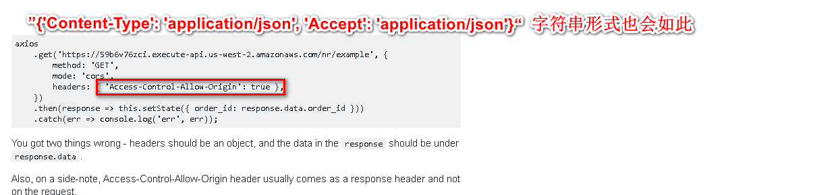
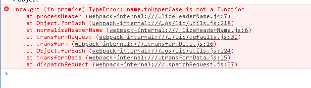

# 使用 axios 报 `name.toUpperCase is not a function`

> 可能是许久没有用 vue 了，有些生疏，加上尝试之前总结的思路，这次在项目上实现时，碰到的问题。让人有些懵，不知所措，还是需要项目来稳住我这漂浮的心

> 先抛出错误



> `name.toUpperCase is not a function`一般不外乎语法错误，或者没有这个值，结果我 debugger 等，都没能有效的找到原因所在，只能大量搜索，终于碰到一个可能跟我类似的问题



> 鄙人代码片段

```
axios.defaults.headers = `'Content-Type': 'application/json', 'Accept': 'application/json'`
```

> 我也不知道为何 我会写成这个，结果就出现上诉的错误，而自己一下子也没察觉出来，最后才发现怎么是字符串。修改如何

```
axios.defaults.headers = {'Content-Type': 'application/json', 'Accept': 'application/json'}
```

> 字符串改为 对象就好了

> 总结

- 问题解决简单，但是找到原因所在，确是百般困难，并不是一下子就出来了，总以为自己写的没错，不应该是小问题错误，想想就无言
- 所以鄙人一再告诫自己多看问题，先看看是不是配置等有问题，再去检索，如此更好
