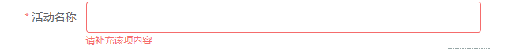

# 表单校验 一

> 最近使用elment-ui表单进行各种校验，心力交瘁，依旧不能很好地解决，先列出自己的归类，后期一个个攻破

+ 表单校验[史](https://developer.mozilla.org/zh-CN/docs/Learn/HTML/Forms/Data_form_validation)

> 表单校验准则

+ 参考资源
    - [1](https://www.smashingmagazine.com/web-form-design-showcases-and-solutions/)
    - [2](https://www.slideshare.net/jwegesin/forms-suck/17-GestaltGestalt_says_when_your_brain)
    - [3](https://wldragon.github.io/SMValidator/tutor/tutor4.html)
    - [4](https://www.zhihu.com/question/37099220)
    - [5](https://segmentfault.com/a/1190000007575302)

+ 第一种
    - 显示明确的错误消息。
    - 放宽输入格式。
    - 指出错误发生的位置（特别是在大型表单中）。

+ 第二种
    - short
    - friendly
    - easy

### 正常录入数据进行校验

> 校验时的几种类型

+ 输入时进行校验，主要用到`input`,也可以是键盘事件，但目前而已，**`input`**是最好的



+ 输入完校验，主要利用 鼠标`blur`事件
+ 后端校验， 检验完后，在前端返显即可

## 测试表单校验插件系列 （针对vue）
+ vue [form vaildation](https://cn.vuejs.org/v2/cookbook/form-validation.html)

+ [vuelidate](https://github.com/monterail/vuelidate)
+ [VeeValidate](https://baianat.github.io/vee-validate/)
+ [async-validator](https://github.com/yiminghe/async-validator) 组件开发时会被用到（element-ui， iView等在使用）

## 表单校验流程
> 表单校验默认流程

  + vue中 `v-model.trim` 去除两侧空格
  + 正则校验(基本可以解决一切)

> 表单校验太多，我准备分批探讨。这算是开篇，后期会给予自己做的element-ui进行一系列说明。


+ [^a] 排除a 的字符
> 全局校验 局部校验
```
this.$nextTick(() => {
  console.log(this.$refs)

  this.ruleForm = {
    name: '测试表单校验 从后台请求回的数据',
    // region: 'shanghai',
    delivery: true,
    resource: '线下场地免费',
    desc: '测试数据，发现表单校验被触发，但是显示的样式明显有问题， 如何处理较好'
  }
  this.$nextTick(() => {
    this.$refs.regio.clearValidate() // 局部清楚校验规则
  })      
  // this.$refs.ruleForm.clearValidate()

})
```

## vue element-ui表单校验

  由于现在使用`element-ui`进行form表单校验，因而使用其自带的校验规则进行校验，发现有些并不是那么好校验，或者说是校验起来很繁琐，因而一直在研究中

### 表单校验分类

> 前后端校验
+ 前端校验
+ 后端校验
这种目前一般是结合起来使用，很少单纯前端校验，或者单纯后端校验的

> 前端检验
+ 数据录入时校验
+ 数据回显时校验
+ 动态创建时校验
+ 数据是否必填时校验

接下来所谈论的校验都是基于前端进行校验，若是后天校验，只是统一校验规则而已，这样前后便可以统一了。其实这里并不是很简单，但是不得不细心，而已最好，前后台都要其校验规则，以及校验话术放在一个公共的地方，避免在每个具体文件内进行修改。若是能更好的话，类似 google email 那样，通过后台返回规则类型，以及对应前台的具体编号，进行显示即可（比如1： 不能为空， 2：校验规则不合...） 这样的好处，前台只认这个数字即可，不然后台返回什么，前台出什么错误，都是统一显示（这个扯远了），讲今天的重点

### 基于 `element-ui` 自带的 [表单校验](http://element-cn.eleme.io/2.3/#/zh-CN/component/form#biao-dan-yan-zheng)

+ 数据录入时校验
  

 > element-ui form validate
 + `el-form` 标签
   + 属性
     - model 对象**却只能是一维** { a: 1, b: 2 }, 不能是 { a: { b: 2 } }, 不然关联不到
     - rules 按照规则要求即可
     - ref   提交表单时触发
  + `el-form-item` 标签 必须使用这个进行包裹 表单框... 校验才会有效
    + 属性
      - prop 只有标识了这个才会进入校验

  ```code
  <template>
    <el-form
      :model="ruleForm"
      ref="ruleForm"
      label-width="100px"
      :rules="rules">
      <el-form-item
        label="活动名称"
        prop="name">
        <el-input v-model="ruleForm.name"></el-input>
      </el-form-item>
      <el-form-item>
        <el-button
          type="primary"
          @click="submitForm('ruleForm')">立即创建</el-button>
        <el-button @click="resetForm('ruleForm')">重置</el-button>
      </el-form-item>
    </el-form>  
  </template>

  <script>
    ...
    data () {
      const isNum = (rule, value, callback) => { // 参数顺序必须如
        let reg = /^[0-9]{5,20}$/;
        if (reg.test(value)) {
          callback()
        } else {
          callback(new Error("不是数据"))
        }
      }

      return {
        ruleForm: {
          name: ''
        },
        rules: {
          name: [
            {
              required: true,      // 用来设置是否必填
              message: '不能为空',  // 错误信息展示
              trigger: 'blur'      // 触发校验事件
            },
            {
              min: 3,  
              max: 5,
              message: '长度在 3 到 5 个字符',
              trigger: 'blur'
            },
            {
              validator: isNum,    // 自定义校验
              trigger: ['blur', 'change']  // 填写 blur change时，可以达到类似 input事件，实时进行校验
            }
          ]
        }
      }
    },
    methods: {
      /**
       * 表单提交
       */
      submitFomr (formName) {
        this.$refs[formName].validate(valid => {
          if (valid) {
            alert('success')
          } else {
            alert('error')
          }
        })
      },
      /** 
       * 重置表单
       */
      resetForm (formName) {
        this.$refs[formName].resetFields()
      }
    }
  </script>
  ```
  以上是一个正常表单的大致模型


+ 数据回显时校验
 

> 主要是数据返回时，要不要触发校验
 + 不触发 [github](https://github.com/aweiu/element-ui-verify/issues/25) 这里有一些解释，不是很好弄
 + 触发 （跟产品沟通过，倾向于这种）
 当前基于数据反显时就触发校验
 ```
 setFormData () {
  setTimeout(() => {
    this.ruleForm = {
      name: '测试项目',
      region: 2,
      type: [1, 2],
      resource: 1,
      desc: '测试数据回显时校验颜色变化问题'
    }

    this.$nextTick(() => {
      // 为了回显时，不只是el-select 校验被触发
      this.$refs.ruleForm.validate()
    })
  }, 1500)
 ```

+ 动态创建时校验
> 有时候需要动态创建一个输入框时，也需要检验，这时候就需要动态校验，不然一直卡着过不去
  
```
<el-row
  class="sc-row"
  :gutter="20"
  v-for="(t, i) in ruleForm.contactList"
  :key="t.id">
  <!-- ：key="i" 没问题； :key="t.id" 时，不会变亮  ==== 没必要在第一次赋值时给id，新增时再给即可-->
  <el-col :span="8">
    <el-form-item
      label="姓氏"
      :prop="'contactList.' + i +'.family_name'"
      :rules="[
            { required: true, message: '不能为空', trigger: ['blur', 'change']}
          ]">
      <el-input v-model="t.family_name"></el-input>
    </el-form-item>
  </el-col>
  <el-col :span="8">
    <el-form-item
      label="名字"
      :prop="'contactList.' + i +'.contact_name'"
      :rules="[
            {required: true, message: '不能为空', trigger: ['blur', 'change']}
          ]">
      <el-input v-model="t.contact_name"></el-input>
    </el-form-item>
  </el-col>
  <el-col :span="8">
    <el-button @click.prevent="deleteConcats(t)">删除</el-button>
  </el-col>
</el-row>
```
> 重点，切记切记
+ 循环 `v-for` == `v-for = '(item, i) in list' :key="item.id"`  **i**
+ `el-form-item` 属性 
  - **`:prop = "`contactList.${i}.contact_name` "`**
  - `:rules="[{{required: true, message: '不能为空', trigger: ['blur', 'change']}]"` 写相应的校验规则
+ 删除已添加的表单
  + v-for 绑定时，`:key="item.id"` 使用对应值的`id`,而不是对应的索引`i`
  ```
  addConcats () {
    this.ruleForm.contactList.push({
      family_name: '',
      contact_name: '',
      id: Date.now() //  还是需要使用，这样可以 避免校验触发时，删除后却没有变化
    })
  },
  deleteConcats (item) {
      const List = this.ruleForm.contactList
      const index = List.findIndex((val) => {
        return item === val
      })
      List.splice(index, 1)
    }
  }
  ```

+ 数据是否必填时校验
  

```
<el-form-item
  label="是不是必填"
  prop="isRequire"
  :rules="[
    {required: isRequire, message: '请填写', trigger: 'blur'}
  ]">
  <el-input v-model="ruleForm.isRequire"></el-input>
</el-form-item>
```
> 是否选填，个人建议直接以动态form表单形式进行展示，这样便可以通过 `{ reuired: isRequire }`，`isRequire` Boolean类型

## 总结
至此，大致的form表单校验就差不多了，虽然看起来很简单，但是也是我不断采坑过来的，在此，我更加推荐使用 [element-ui-verify](https://github.com/aweiu/element-ui-verify),里面有详细的文档，多多关注即可
+ 当前校验的缺点
  + 动态创建
  ```
  <el-row class="sc-row" :gutter="20" v-for="(t, i) in ruleForm.contactList" :key="t.id">
    <el-col :span="8">
      <el-form-item
        label="姓氏"
        :prop="'contactList.' + i +'.family_name'"
        :rules="[
          { required: true, message: '不能为空', trigger: ['blur', 'change']}
        ]">
        <el-input v-model="t.family_name"></el-input>
      </el-form-item>
    </el-col>
    <el-col :span="8">
      <el-form-item
        label="名字"
        :prop="'contactList.' + i +'.contact_name'"
        :rules="[
          {required: true, message: '不能为空', trigger: ['blur', 'change']}
        ]">
        <el-input v-model="t.contact_name"></el-input>
      </el-form-item>
    </el-col>
    <el-col :span="8">
      <el-button @click.prevent="deleteConcats(t)">删除</el-button>
    </el-col>
  </el-row>
  ```
  > 上面的 姓氏和名字 同为中文或英文时，很难进行判断 [element密码两次是否相同](http://element-cn.eleme.io/2.3/#/zh-CN/component/form#zi-ding-yi-xiao-yan-gui-ze),但是当前动态创建时，无法传递`索引`，自定义方法中无法进行传参，导致拿不到同一索引下的姓氏跟名字，也就无法进行匹配判断了
+ 其他注意细节
  + 在自定义验证里面每一个判断都要有`callback()`,就是要保证`callback()`一定会执行到，不然既不报错，也不提交代码，令人很是无语
  + [async-validator](https://zhuanlan.zhihu.com/p/32306570)

到此，算是一个给自己年末去心病吧，这个困惑我太久了，到现在想想都恐怖，算是简单补充下吧，后期再多多注意

> 在此抛出几个问题,留给自己思考
 + 大型表单时，哪儿错误，自动定位到哪儿，同时 `focus`
 + 统一错误信息，后台传给前台具体id，以供前台进行错误信息展示，这个前台统一管理
 + 考虑使用其他校验插件，多多扩充自己的脑容量


