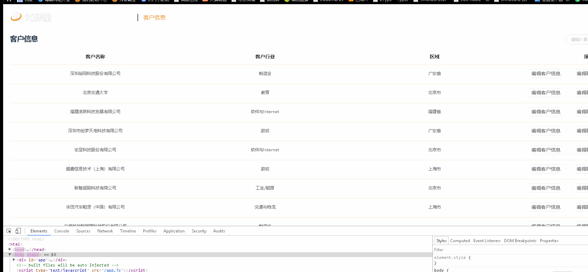
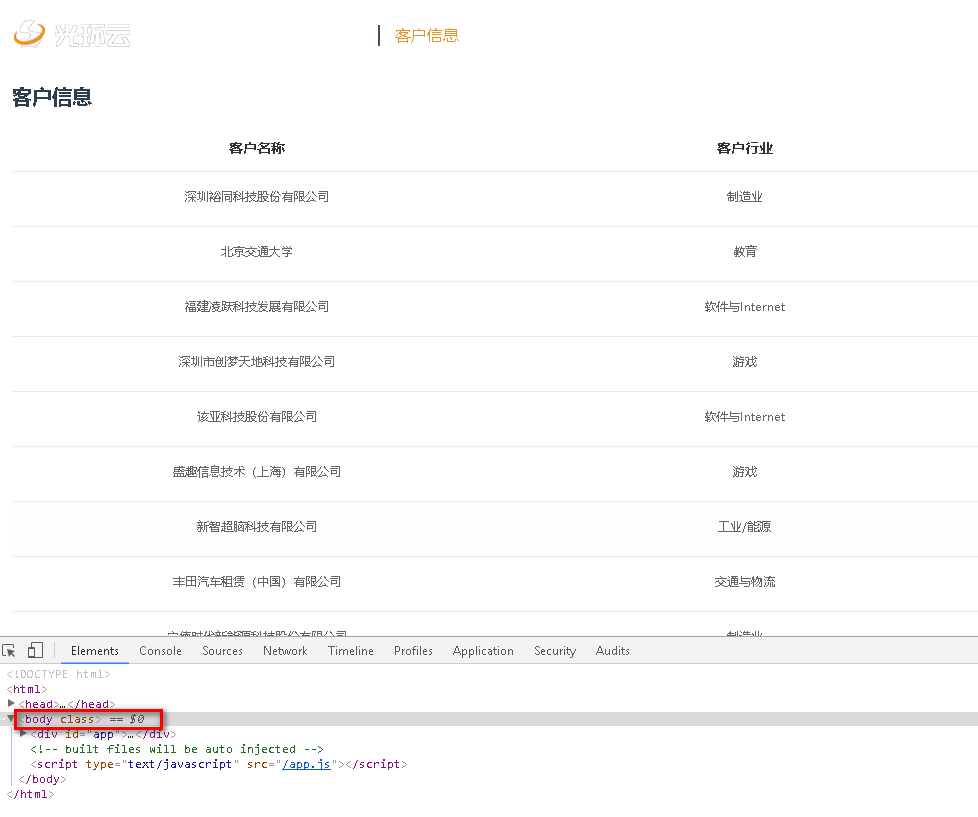

# 记录 vue 与 element-ui 的坑

- 猎豹浏览器（极速模式）

  > 添加 loading，追加在 `body`中，loading 消失时，页面背景色消失

- 显示原因
  
- 细节展示
  
  

> 当 body 中 class 类名被清除时，顺带的页面背景色也没有了，只好考虑如何脱离 body 就可以了，正好借助 loading 的 api，指定 target 到 #app 中就可以了

```
let loadingInstance = Loading.service({'background': 'rgba(0, 0, 0, .6)', target: '#app'})
```

> 这样就可以了，在其他浏览器都木有问题，唯独这个猎豹，甚是奇怪
> 续集

- 之后思量再三，直接用猎豹打开官网，居然没问题，审查元素时发现

```
html, body, #app {
  height: 100%;
  width: 100%;
}
```

> 这样就可以了，之后我重新尝试这个方法，居然好了，一脸懵逼, 有关系吗？这是什么逻辑？
