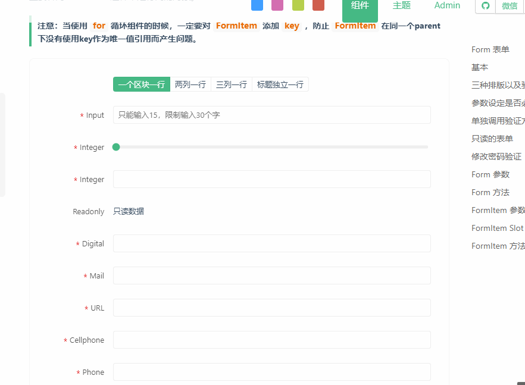
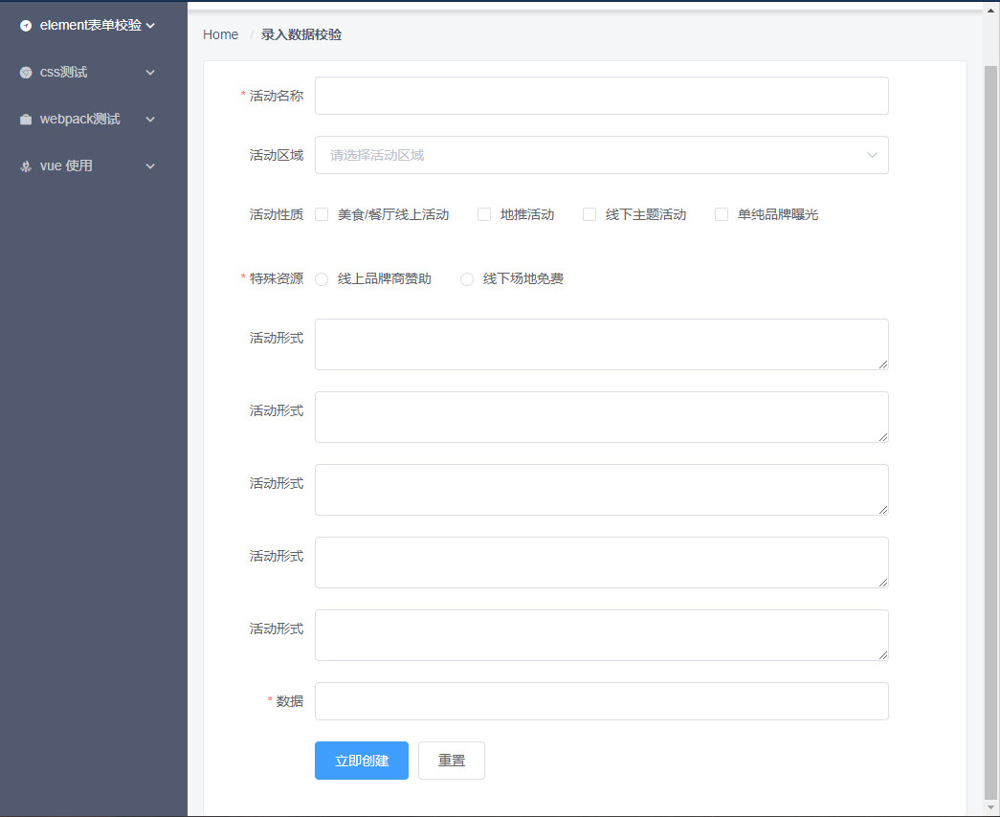
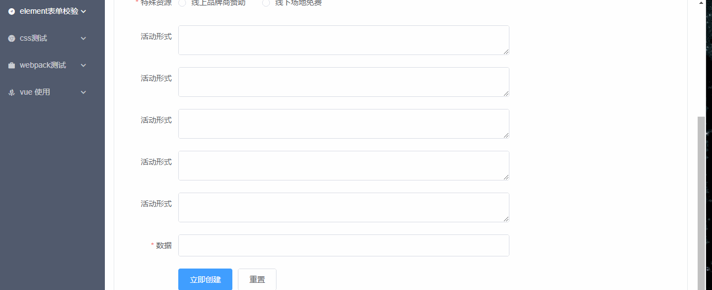
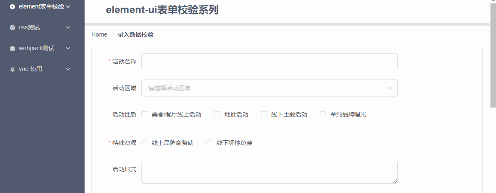

# vue表单校验（三）

每当看到[heyui](https://www.heyui.top/component/form/form)的这个表单校验，我就一直想将element的校验也做类似的功能，终于有了方式，虽然不是很完美，但是可以使用，能满足要求了


## 实现方式 *基于`element-ui`实现*

通过表单提交时，触发校验，未通过的表单会添加`is-error`,之后滚动到对应的错误位置即可

页面视图


> 实现逻辑

+ 触发条件

在提交时，若是未通过则开始进行判断，由于是依赖于`is-error`的class类名，因而需要等form表单错误的元素添加完`is-error`类名后再进行判断
```
submitForm1 () {
  this.$refs['ruleForm'].validate(valid => {
    if (valid) {
      // 通过
    } else {
      // 需要延迟一下
      this.$nextTick(() => {
        this.scrollToTop(this.$refs['ruleForm'].$el)
      })
    }
  })
}
```

> js逻辑
```
scrollToTop (node) {
  const ChildHasError = Array.from(node.querySelectorAll('.is-error'))
  if (!ChildHasError.length) throw new Error('有错误，但是找不到错误位置')
  // 找到第一个错误位置
  const FirstErrorNode = ChildHasError[0]

//  https://www.zhangxinxu.com/wordpress/2018/10/scroll-behavior-scrollintoview-%E5%B9%B3%E6%BB%91%E6%BB%9A%E5%8A%A8/
  FirstErrorNode.scrollIntoView({
    behavior: "smooth"
  })
}
```


上述方式借助了`scrollIntoView`，但是有个小问题，form表单错误信息都是紧贴顶部，不是很符合，因而开始自己写滚动

> 升级

滚动动画
```
const BackToTop = (rate = 2, num = 0) => {
  const doc = document.body.scrollTop ? document.body : document.documentElement
  // 距离顶部的值
  let scrollTop = doc.scrollTop
  const top = function () {
      scrollTop = scrollTop + (num - scrollTop) / (rate || 2);
      // 临界判断，终止动画
      if (scrollTop < (num + 1)) {
          doc.scrollTop = num;
          return;
      }
      doc.scrollTop = scrollTop;
      // 动画gogogo!
      requestAnimationFrame(top);
  };
  top();
}
```

js逻辑升级
```
 scrollToTop (node) {
  const ChildHasError = Array.from(node.querySelectorAll('.is-error'))
  if (!ChildHasError.length) throw new Error('有错误，但是找不到错误位置')
  const FirstErrorNode = ChildHasError[0]

  const Top = FirstErrorNode.getBoundingClientRect().top

  // 获取元素相对于页面顶部的位置， 同时设置相对40px
  const scrollToTop = Top + ( window.pageYOffset || document.documentElement.scrollTop ) - ( document.documentElement.clientTop || 0 ) - 40

  scrollTop(2, scrollToTop)
}
```


## 总结
+ 更多的是考虑是如何实现滚动效果
+ 还有更进一步的需要，若是使用了`el-scroll`的组件，方式有得再继续改变，这个后期再进行整理