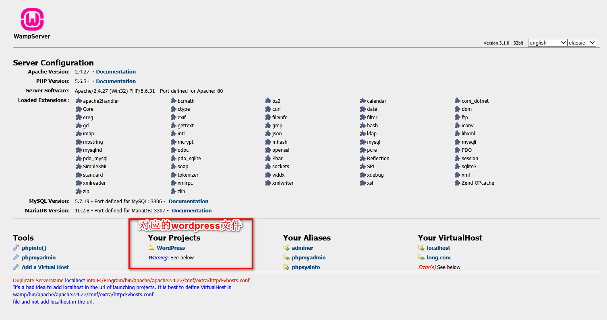
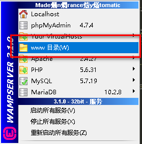
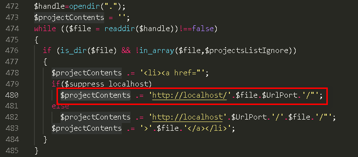
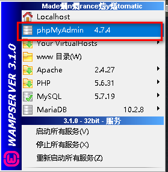
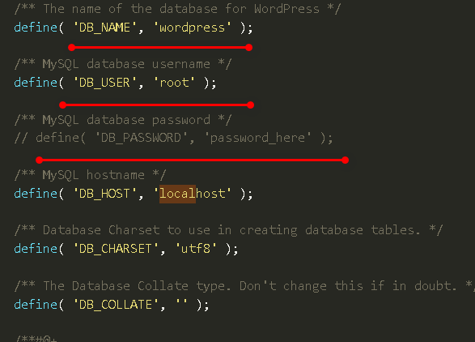
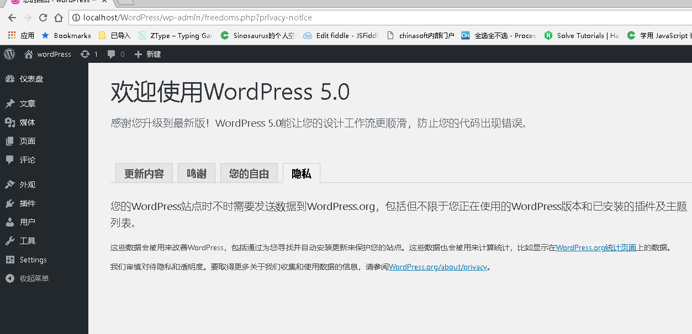

# wordpress启动
> 公司需要使用到wordpress 特意下载源码进行研究，才发现里面都是`.php`文件，需要运行php而不得不去配置运行环境

步骤如下
=======

+ [Wampserver32](http://baoku.360.cn/soft/show/appid/102015843)
> 使用的360安装的，第三方下载或多或少都有问题，无奈之下才发现360安装的甚好。 看到网上教程各种修改，各种整，而这里面确实变量，都是已经配置好的。直接开启`localhost`

> 第一步

> 第二部

> 无法进入时，需要修改 **www**目录下 `index.php`文件内容

找到 **`$projectContents`** 修改 `http://` 为 `http://localhost/`即可

> 到目前为止，服务器等一切都已经正常启动了

+ 开始进行注册登录 进入 wordpress了

> 第一步
  先启动 数据库可视化 工具 （可以自己下载一个） 这里我使用自带的 phpMyAdmin

  

  输入相应的 账户 （一般root）

> 第二步
  不知为何我直接按着操作流程一直不成功，只好参照他人方案，直接修改源文件，将库名，账号等录入进去。复制`wp-config-sample.php`一份改为 `wp-config.php`修改内容

  

  再次操作基本就可以进入了

  

> 总结
+ 在下载Wampserver32 时，我其实想用 phpStudy ，奈何想尝尝鲜，其实这个依旧有很多还是不会，我现在在想如何修改域名，这个还得花功夫
+ 可视化工具我用的 SQLyog ,但是自带了 phpMyAdmin 那就更加好了
+ 由于每期版本不同，网上的教程并不是很适用，只能不断采坑才好，毕竟东西都是死的，无非就是如何操作才可以跑起来，只是花时间找到有效的方法罢了
+ 其他也就没什么好说的，记录一笔，以备下次重复采坑只用
