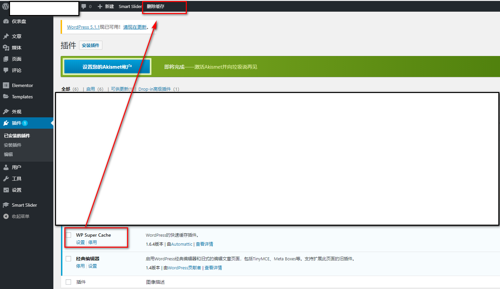
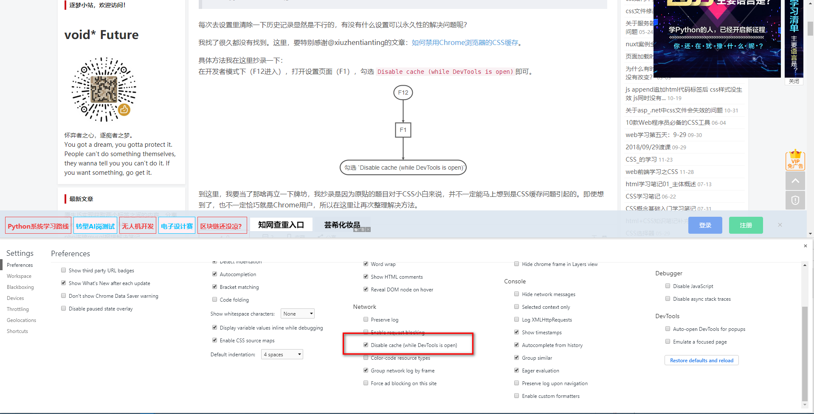

# wordpress 样式无法及时刷新
wordpress编写`style`样式时，无法及时刷新页面，因此特意记录一番如何处理较好，网友的建议[清除Chrome缓存](https://blog.csdn.net/dreamstone_xiaoqw/article/details/78122581)，[实时修改style携带的参数](https://www.breakyizhan.com/wpress/4333.html)

## 折腾之旅开启
+ 缓存

  由于缓存问题，会导致浏览器不再去请求css，而是直接拿缓存里的，因而只需要让浏览器一直以为是新的文件即可，添加后缀**时间戳**无疑是最好的
  ```
  // wordpress version 5.04
  **functions.php**
  wp_enqueue_style( 'twentynineteen-style', get_stylesheet_uri(), array(), wp_get_theme()->get( 'Version' ));
  <!-- 修改为 -->
  /**
   * strtotime('2019-04-15') 可以改为 time() 但是那样每次请求都会重新更新，若是到了正式环境，其实只要第一次请求最新，后期都用缓存就好，因而建议使用 strtotime
   */
  wp_enqueue_style( 'twentynineteen-style', get_stylesheet_uri(), array(), strtotime('2019-04-15'));
  ```
+  `WP Super Cache` 缓存插件

  有时候安装了该插件，导致大部分都缓存了，因而需要**删除缓存**就可以了

  

+ 清除浏览器缓存

  
  
> 使用上述问题都没有解决我的问题，才发现我的更本不是这类问题

## `issue` **less**
由于使用的是拿官方文档进行修改的，因而很多都是自己写的样式，由于`style.css`是唯一的，只有一个`css`,都是把其他样式进行合并在一起，这样可以减少请求，因而在使用`less`进行编写时就出了一个很意外的问题

> code

style.less
```
// normalize
@import './less/normalize.less';

// reset
@import './less/reset.less';

// globel
@import './less/globel.less';

// index
@import './less/index.less';
....
```
大致就是这样的，而我修改的是期中一个文件`globel.less`，每次更新都没有，及时在页面中显示想要的样式，才发现原来是用了`less`的缘故.`在使用less时，由于又引入其他less文件，导致在style.less无法监听其他less文件是否修改`，因而现在思考如何在`less`文件进行修改时，`style.less`也进行修改就可以了

+ 参考的资料
  - [watch api](https://stackoverflow.com/questions/13117647/refresh-less-css-which-has-other-imported-less-files-without-page-load/13118202#13118202)
  - [gulp](https://blog.csdn.net/weixin_36706903/article/details/80995954)
  - [问题与我相同](https://segmentfault.com/q/1010000007626956)
  - [gulp的使用](https://github.com/onface/gulp-book/blob/master/chapter7.md)
  - [gulp 报错处理](https://www.cnblogs.com/chris-oil/p/5387904.html)
  - [@import](http://kunkun12.com/2015/01/11/less-features/)
  - [less import](http://lesscss.cn/features/#import-directives-feature)
  - [less-watch-compiler](https://stackoverflow.com/questions/9421375/how-to-use-less-js-with-node-js-to-watch-less-files-in-a-folder)

## 探索之旅
前前后后整理了多种思路，坚持许久终于有了结果，虽然不是心中最好的，但好歹这条路通了，还是可以的

> 实现的大致三种方式
+ `nodemon` 来监听文件执行系统命令
+ `gulp` 利用对应的插件进行操作
+ `less-watch-compiler` less的一个插件（这个真是无心插柳柳成荫，却成了解决当前 问题的关键）

### [nodemon code]()