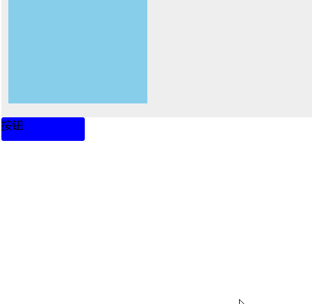
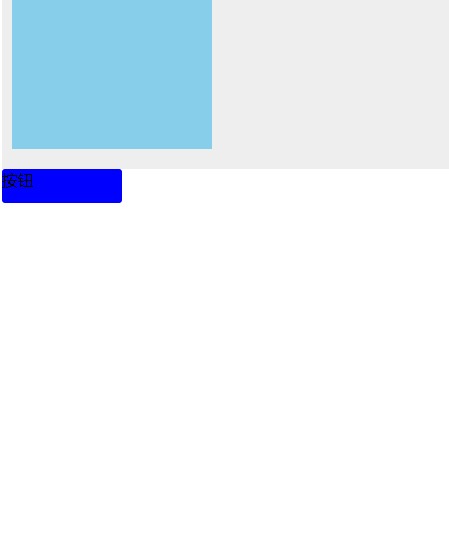

# 如何给新添加的 DOM 节点加动画效果

> 最近碰到项目中，在 DOM 节点中，添加新的 `html` 后 要有动画效果，一直没能很好地理解，尝试了各种方式，终于找出来了

- 简化版结构

> 代码如下 使用 jq1.9 以上版本
> css

```
.box {
		padding: 10px;
		background-color: #eee;
	}
	.dv {
		margin-bottom: 10px;
		width: 200px;
		height: 150px;
		background-color: skyblue;
	}
	.dv:nth-of-type(2n) {
		background-color: pink;
	}
	.btn {
		width: 120px;
		height: 34px;
		border-radius: 3px;
		background-color: blue;
	}
```

> html

```
<div class="box">
		<div class="dv"></div>
	</div>
	<div class="btn">按钮</div>
```

> js

```
$(function () {
		const templete = `<div class="dv"></div>`
		$('.btn').on('click', function () {
			$('.box').append(templete)
			$('.box').find('.dv:last-of-type').slideDown(100)
		})
	})
```

> 效果图
> 

> 结果一点动画效果都没有，对其父设置都无效，很是奇怪，明明已经找到这个元素却依旧无法实现，只能想想其他方法，看看文档，终于发现，执行动画需要**从无到有**，而我也一直以为 DOM 添加的节点本来就是从无到有，实际上却是 该 DOM 节点设置为`display: none`然后变为 `block`，这才是真正的从无到有，所以接着就迎刃而解了

> css

```
.none {
    display: none;
}
```

> js

```
$(function () {
    // 添加的 元素追加 none 默认不显示
		const templete = `<div class="dv none"></div>`
		$('.btn').on('click', function () {
			$('.box').append(templete)
			$('.box').find('.dv:last-of-type').slideDown(100)
		})
	})
```

> 效果
> 

# 总结

- 使用 jquery 时， 明明已经是 3 以上的版本，使用`:last-of-tyoe`无法实现，而当前这个例子却可以，实在是无语
- 动画效果本来不难，但是却没想到花费我这么长时间，一直都没想到是这个原因，终于找到了，记录一笔，避免下次再采坑
