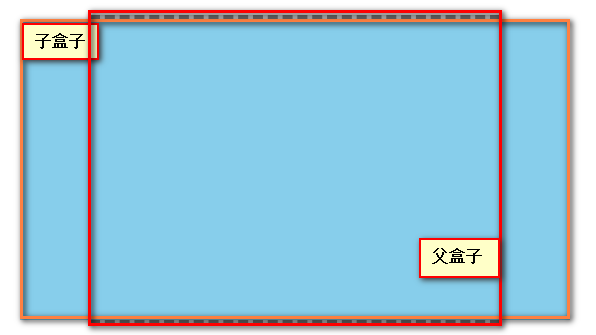
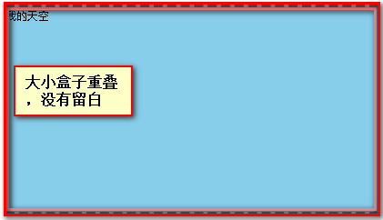

## 使用`scale`对表格进行缩放 出现大片空白问题

> 一直没有很好地重视这个问题，导致这次不得不面对，经过各种搜索，各种尝试，终于解决了这个留白问题

### 思路

> 大小盒子，小盒子进行缩放，大盒子依据缩放来进行动态更改高宽

```
//style 样式
.box {
    position: relative;
    margin: 20px auto;
    width: 400px;
    border: 5px dashed #777;
    background-color: #ccc;
}
.dv {
    position: relative; //子盒子也为相对定位 这样可以撑开父盒子 特别是动态渲染时
    left: 50%;
    transform: translateX(-50%);

    width: 550px;
    height: 300px;
    background-color: skyblue;
}
#btn {
    width: 150px;
    height: 50px;
    border: none;
    color: '#333';
    font-size: 16px;
    background-color: #0ff;

}

// html
<div class="box">
	<div class="dv"><span>我的天空</span></div>
</div>
<button id="btn">点击切换</button>

//js
function $(name) {
    return document.querySelector(name)
}


const boxWidth  = $('.box').offsetWidth,
        dvWidth   = $('.dv').offsetWidth,
        boxHeight = $('.box').offsetHeight,
        dvHeight  = $('.dv').offsetHeight

const scale = boxWidth / dvWidth

// 关键部位 高度缩放 对父盒子进行高度缩放，这样就不会有留白的
// dv缩放后实际的高度
const dvScaleHeight = dvHeight * scale

// 父盒子缩放的高度
const boxScale = dvScaleHeight / boxHeight


$('#btn').onclick = function() {
    $('.dv').style.transform = `scale(${scale}) translateX(-50%)`
    $('.dv').style.transformOrigin = `0 top`

    $('.box').style.height = boxHeight * boxScale + 'px'
}
```

## 效果图

> 未缩放前的原始效果



> 缩放后的效果 **没有空白**


