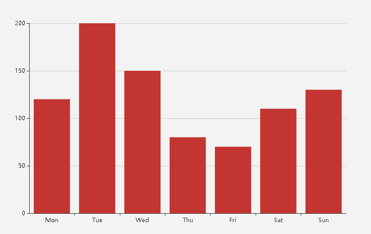
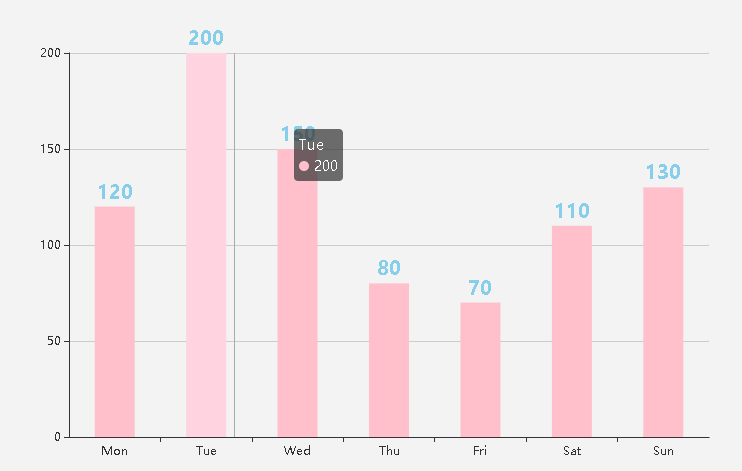
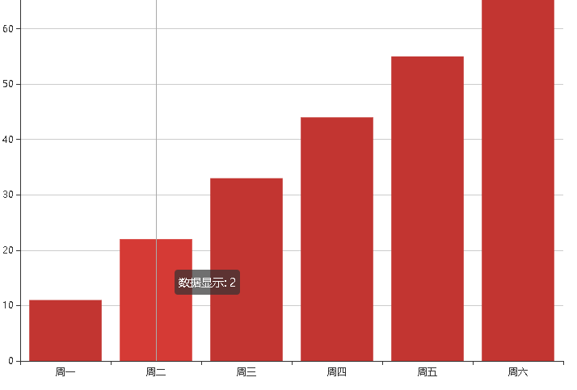

## `echarts`在`vue`中使用的感悟

> `echarts`作为图表展示的强大存在，每当使用后台系统，或多或少都会使用到，但是作为菜鸟的我，则是一路采坑，各种头大，比比皆是，为了避免下次再犯同样的错误，特意记录下来，与大家共勉之

### 阐述我的图表样式

- 柱状图

> 最原始的图形



> 更改后的样式



```
option = {
    tooltip: { //触发鼠标经过 弹窗
      show: true,
      trigger: 'axis'
    },
    xAxis: {
        type: 'category',
        data: ['Mon', 'Tue', 'Wed', 'Thu', 'Fri', 'Sat', 'Sun'],
    },
    yAxis: {
        type: 'value'
    },
    series: [{
        data: [120, 200, 150, 80, 70, 110, 130],
        type: 'bar',
        barWidth: '40', //柱形图宽度
        itemStyle: {
            normal: {
                color: 'pink', //背景色
                label: { // 在柱形图上显示具体数据
                    show: true,
                    position: 'top', // 所在的位置
                    textStyle: { // 数据展示的样式
                        fontSize: '20',
                        fontWeight: 'bold',
                        color: 'skyblue'
                    }
                },
            }
        }
    }]
};

```

> 通过修改后便可以达到相应的效果，但是官方文档太多，又没有明显的注释，指定那是哪，看起来很痛苦。原本这些不难，但是有些用法不能按自己的思维推，只能踩坑 ==> 看文档 ==> 踩坑

### 进入重点，谈谈 弹框 `tooltip`这点事

- `tooltip` 可以在多个状态下使用， 全局 ，局部数据 都可以 ，今天只提全局中数据展示这块，都大同小异,
- `tooltip`中的一个重要现实数据的属性`formatter`
  - 字符串类型， 可以通过尝试就可以试出来
  - 函数类型
    > 此时重点提提这个函数类型 `formatter(parmas, ticket, callback) {}`

* `params`可以直接打印出来看看，`series`里的数据
* `ticket`异步回调标识 ，只是不理解为什么加这个东西，之后了解到，作用类似`id`，起到指定这个回调函数跟这个是一起，指定唯一
* `callback`写业务逻辑，官方说话是 数据请求后获取，但是个人发现，显示的内容跟字符串方法显示结果一样，只是数据晚回来而已。 如果数据并不在`series`中呢，甚至没有多大关系，哪该怎么办？？？

> 问题抛出：如何做到弹窗数据跟`series`中不存在明显联系

- 为了这个问题，我已连续几日各种搜索，各种逛论坛，看原创作者视频，都没有找到有效路径，知道那天与同事沟通，他忽然提了一句，通过索引进行关联，瞬间前途一片光明

```
export default{
  data() {
    return {
        data: [ // 制造假数据
          {axisData: '周一', seriesData: 11, formatterData: 1},
          {axisData: '周二', seriesData: 22, formatterData: 2},
          {axisData: '周三', seriesData: 33, formatterData: 3},
          {axisData: '周四', seriesData: 44, formatterData: 4},
          {axisData: '周五', seriesData: 55, formatterData: 5},
          {axisData: '周六', seriesData: 66, formatterData: 6},
          {axisData: '周日', seriesData: 77, formatterData: 7}
        ],
        formatterDataList: [],
        myecharts: '', //实例
        option: {
            tooltip: { //触发鼠标经过 弹窗
            show: true,
            trigger: 'axis',
            formatter(params) {}
            },
            xAxis: {
                type: 'category',
                data: [],
            },
            yAxis: {
                type: 'value'
            },
            series: [{
              type: 'bar',
                data: [],
            }]
        }
    }
},
created() {
  this.getData()

},
mounted() {
  // 初始化
  this.myecharts = echarts.init(this.$refs.charts)
  this.myecharts.setOption(this.option)
  const that = this
  window.addEventListener('resize', function() {
    that.myecharts.resize()
  })


},

methods: {

   /**
    * 数据获取
    */
    getData() {
      const data = this.data
      let axisData      = [],
          seriesData    = [],
          formatterData = []

      for (let i = 0, leng = data.length ; i < leng - 1; i++ ) {
        let item = data[i]
        axisData.push(item.axisData)
        seriesData.push(item.seriesData)
        formatterData.push(item.formatterData)
      }

      this.option.xAxis.data     = axisData
      this.option.series[0].data = seriesData
      this.formatterDataList     = formatterData
      this.showData()
    },

    /**
     * 业务逻辑处理
     */
    showData() {
      const that = this
      this.option.tooltip.formatter = function(params) {
          // console.log(params)
          const index = params[0].dataIndex, // 因为索引唯一，正好通过这个进行关联
                data  = that.formatterDataList
          let res  = `数据显示: ${data[index]}`
          return res
      }
    }
  }
}

```

> 主要是如何找到数据之间的关联性，只要找到一切都好说了



## 总结

> 把我觉得可以文档视频放在这，大家可以参考哈

- http://echarts.baidu.com/index.html 3.0 以后的
- http://echarts.baidu.com/echarts2/doc/doc.html 2.0 之前的 （虽然 echarts 更新了，但是这个看的清晰点）
- https://study.163.com/course/courseMain.htm?courseId=1016007 原创作者讲的 挺好的，很详细
- https://www.w3cschool.cn/echarts_tutorial/echarts_tutorial-9m4j2c67.html 中国的 w3cscholl
- https://www.oschina.net/question/tag/echarts 开源中国

> 一下子想学好，确实难，得学会如何查找，如何尝试，大家一起加油
