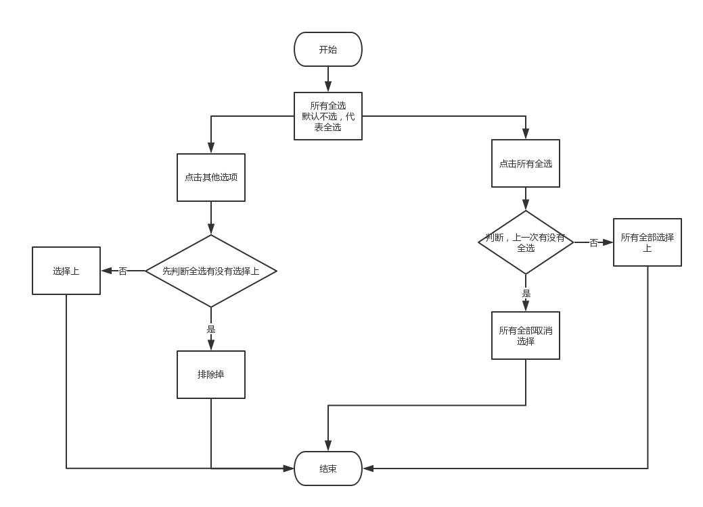
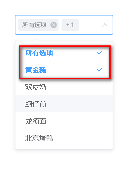
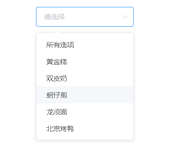

## 下拉列表多选 问题

> 通过操作 所有来进行全选 全不选问题

#### element-ui 中 select

> 记录下自己最近使用`element-ui` 中的 `select`多选问题
> 在 element 中默认是指单纯多选，但是公司要求，需要有一个控制选择多选的值。测试许久终于整出来，特意记录一下

#### 思路



- element 中的组件

```
<template>
  <el-select v-model="value5" collapse-tags multiple placeholder="请选择">
    <el-option
      v-for="item in options"
      :key="item.value"
      :label="item.label"
      :value="item.value">
    </el-option>
  </el-select>
</template>

//数据
data() {
 return {
    options: [{
        value: '选项1',
        label: '黄金糕'
    }, {
        value: '选项2',
        label: '双皮奶'
    }, {
        value: '选项3',
        label: '蚵仔煎'
    }, {
        value: '选项4',
        label: '龙须面'
    }, {
        value: '选项5',
        label: '北京烤鸭'
    }],
    value5: []
 }
}
```

- 默认是这样的
  

```
// template
给el-select 添加 change事件

//data 中添加
oldOptions // 用来储存上一次的数据

//methods
selectAll(val) {
    let allValues = []
    //保留所有值
    for (let item of this.options) {
        allValues.push(item.value)
    }

    // 用来储存上一次的值，可以进行对比
    const oldVal = this.oldOptions.length === 1 ? [] : this.oldOptions[1]

    // 若是全部选择
    if (val.includes('选项0')) this.value5 = allValues

    // 取消全部选中  上次有 当前没有 表示取消全选
    if (oldVal.includes('选项0') && !val.includes('选项0')) this.value5 = []

    // 点击非全部选中  需要排除全部选中 以及 当前点击的选项
    // 新老数据都有全部选中
    if (oldVal.includes('选项0') && val.includes('选项0')) {
        const index = val.indexOf('选项0')
        val.splice(index, 1) // 排除全选选项
        this.value5 = val
    }

    //全选未选 但是其他选项全部选上 则全选选上 上次和当前 都没有全选
    if (!oldVal.includes('选项0') && !val.includes('选项0')) {
        console.log(11)
        if (val.length === allValues.length - 1) this.value5 = ['选项0'].concat(val)
    }

    //储存当前最后的结果 作为下次的老数据
    this.oldOptions[1] = this.value5
}
```

- 最终效果


