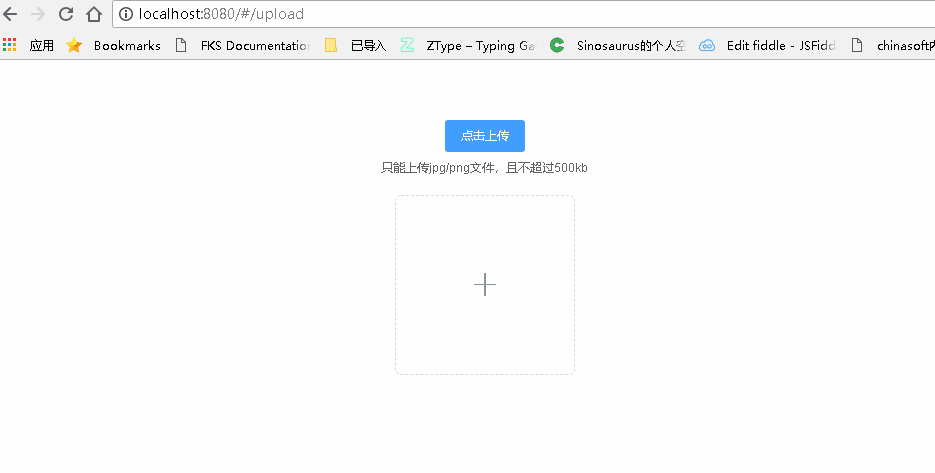
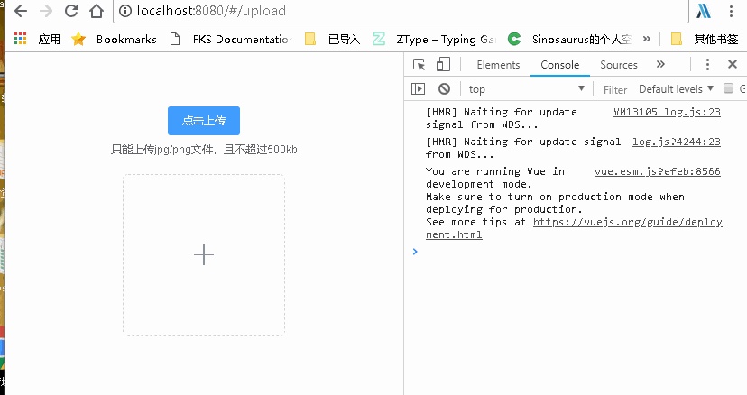
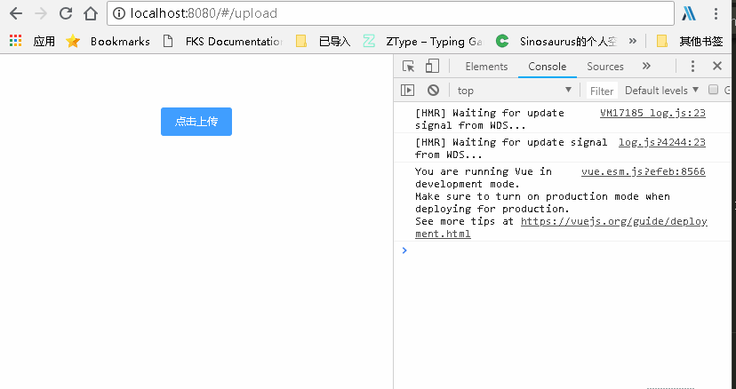
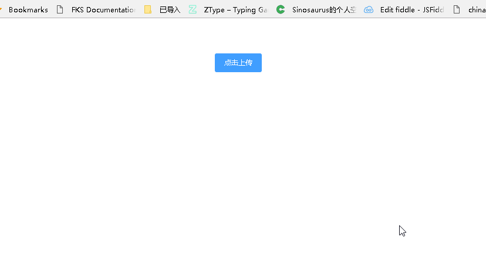
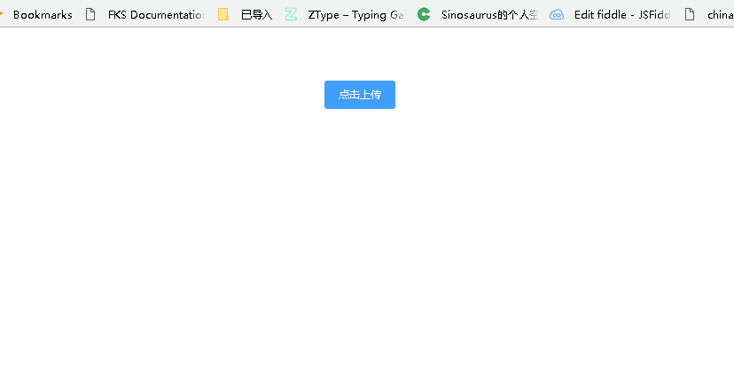

## element 的上传功能

> 最近有个需求，需要在上传文件前，可以进行弹窗控制是否上传[upload](http://element-cn.eleme.io/#/zh-CN/component/upload)
> 看完文档后，感觉有两种思路可以实现

- 基于`before-upload` :上传文件之前的钩子，参数为上传的文件，若返回 false 或者返回 Promise 且被 reject，则停止上传。
- 基于`auto-upload, on-change`手动上传来控制

## `before-upload`

> 初始代码

```
// template

<el-upload
    class="avatar-uploader"
    action="https://jsonplaceholder.typicode.com/posts/"
    :show-file-list="false"
    :on-success="handleAvatarSuccess"
    :before-upload="beforeAvatarUpload">

    
    <i v-else class="el-icon-plus avatar-uploader-icon"></i>
</el-upload>

// javscript

data() {
    return {
      imageUrl: ""
    };
  },
  methods: {
    handleAvatarSuccess(res, file) {
      this.imageUrl = URL.createObjectURL(file.raw);
    },
    beforeAvatarUpload(file) {
      // 文件类型进行判断
      const isJPG = file.type === "image/jpeg";
      const isLt2M = file.size / 1024 / 1024 < 2;

      if (!isJPG) {
        this.$message.error("上传头像图片只能是 JPG 格式!");
      }
      if (!isLt2M) {
        this.$message.error("上传头像图片大小不能超过 2MB!");
      }
      return isJPG && isLt2M;
    }
  }
```

> 初始效果图
> 

> 考虑在 before-upload 中进行弹窗后，`return false | reject()` 即可
> 修改代码

> 由于`this.$confirm`是异步操作，因而需要等待其结果才能进行下一步操作

```
async  beforeAvatarUpload(file) {
      const isSubmit = await this.$confirm('此操作将上传文件, 是否继续?', '提示', {
          confirmButtonText: '确定',
          cancelButtonText: '取消',
          type: 'warning'
        }).then(() => {
          return true
        }).catch(() => {
          return false
        });
        console.log(isSubmit)
      return isSubmit;
  }
```

> 确认提交和取消提交 ==> 结果却一样

- 确认提交
  
- 取消提交
  

> 结果却不可以，因而考虑另一种思路了,`before-upload`只是进行判断文件是否适合，从而是否上否上传到服务器，而不是用来等来用户进行操作使用的

## 手动上传

- `auto-upload`设置为文件导入后是否马上上传到服务器
- `on-change` 用来查看文件现在的转态

```
// template

<el-upload
  ref="upload"
  class="upload-demo"
  action="https://jsonplaceholder.typicode.com/posts/"
  :on-preview="handlePreview"
  :limit="1"
  :auto-upload="false"
  :on-change="handleChange"
  :show-file-list="true"
  :file-list="fileList"
  :on-error="handleError"
  :on-success="handleSuccess">

  <el-button size="small" type="primary">点击上传</el-button>
</el-upload>

// js

data() {
return {
    fileList: [
    ],
    bool: true
  }
},
methods: {
  handleRemove(file, fileList) {
    console.log(file, fileList);
  },
  handlePreview(file) {
    console.log(file);
  },
  handleError(err, file) {
      alert('失败')
      this.fileList = []
  },
  handleSuccess(res, file) {
    alert('成功')
    this.fileList = []
  },
  handleExceed(files, fileList) {},
  async handleChange() {
    const isSubmit = await this.$confirm('此操作将永久删除该文件, 是否继续?', '提示', {
      confirmButtonText: '确定',
      cancelButtonText: '取消',
      type: 'warning'
    }).then(() => {
      return false
    }).catch(() => {
      return true
    });

    if (isSubmit) {
      this.$refs.upload.submit()
    } else {
      this.fileList = []
    }
  }
}
```

- 确认提交
  
- 取消提交
  

> 此方法可行，现在就是控制因为文件状态改变而导致两次弹窗, 修改如下

- 文件状态变更 不是成功就是失败，因而在成功失败的函数进行控制即可

> 添加 flag 标识进行控制弹窗即可

```
data() {
  return {
    isConfirm: true
  }
}

async handleChange() {
  if (!this.isConfirm) {
    this.isConfirm = true
    return
  }

  const bo = await this.$confirm('此操作将永久删除该文件, 是否继续?', '提示', {
    confirmButtonText: '确定',
    cancelButtonText: '取消',
    type: 'warning'
  }).then(() => {
    return false
  }).catch(() => {
    return true
  })

  if (bo) {
    this.$refs.upload.submit()
    this.isConfirm = false
  } else {
    this.fileList = []
  }
}
```

> 修改后便可以了，只是注意 在 `on-error`和 `on-succes`中注意清空 `fileList = []`，这样还可以重新添加文件

- 确定上传
  
- 取消上传
  

#### 总结

> 截止目前任务算是完成，只是依旧有些扎心，只好继续笃定前行了
> 没事的时候，还是多看文档，这样才能避免不要的坑，以及可以有更多的思路
