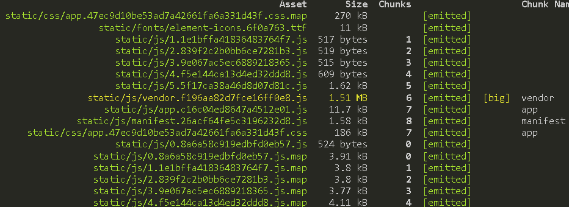
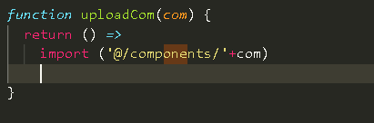
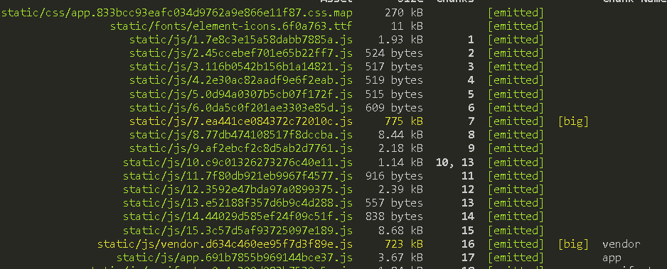
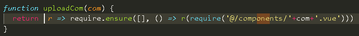
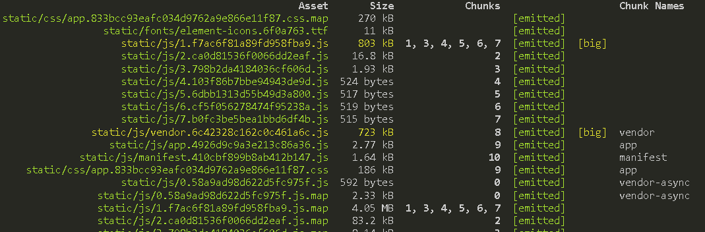

# webpack 与 vue

> 在使用 vue 开发时，遇到打包后单个文件太大，因而需要分包，不然加载时间太久。虽然尽可能减少请求次数，但是单个包太大也不是好事

## 思路

- 组件按需加载
- vue-router 的懒加载
- 第三方包分离
- 代码分割时，

### 组件按需加载

- 现在 ui 库大多都是以组件的形式进行处理，因而不用将整个库都导入，只需导入想要的即可
- 根据对应库的文档进行操作即可，现在每个库都有对应的使用流程，及相关配置，并不是很难
- 只是在导入*css*样式时依旧需要全部导入（目前都是这样，公共样式只能如此）

### vue-router 懒加载

- 利用 promise 异步功能，进行相关配置后，页面点击时，会根据相应的进行页面加载，而不是一次性加载完，毕竟有些页面也许根本就不会进入
- 语法： `componet: () => import('**/*')` 如果是大量的，最后提取进行封装成函数，这样调用就好了

### 第三方包分离

- 经常会引入第三方库，但是这些感觉没有必要也混入到一个文件中
- `CommonsChunkPlugin`通过将公共模块拆出来，最终合成的文件能够在最开始的时候加载一次，便存到缓存中供后续使用

```
entry: {
  // 分离第三方包
  vendor: ["jquery", "other-lib"],
  app: "./entry"
},
```

### [代码分割](https://webpack.js.org/guides/code-splitting/)

- 使用 promise 作为分割点
- 需要使用相应的插件`LimitChunkCountPlugin` ==== 会注意到有一些很小的 chunk - 这产生了大量 HTTP 请求开销。幸运的是，此插件可以通过合并的方式，后处理你的 chunk，以减少请求数。

### 开启 Gzip 进行压缩

- 这个需要服务器配合才可以

### 首屏加载慢

- [组件按需加载](https://blog.csdn.net/qq_27626333/article/details/76228578)
- [require.ensuse](https://webpack.docschina.org/api/module-methods/#require-ensure)

```
vue-router
// prev
const component1 = () => import('@/components/**')

//now 利用webpack   require.ensure
comst component2 = r => require.ensure([], () => r(require('@/components/+'**'+.vue')))
```

## test

> 经过测试 使用路由懒加载的 `import` 反而比 `require.ensuse`更好

> 原始，没有启用的结果
> 

> 使用 `import`方式

- 源码
  
- 打包的结果
  

> 使用 `require.ensuse`方式

- 源码
  
- 打包后的结果
  

> 总结

- 以后就直接使用 `import` 进行懒加载了
- 若是[多页面](https://webpack.docschina.org/concepts/entry-points/)，（现在开发的都是 SPA），可以在入口进行处理，

> 路漫漫其修远兮，吾将继续前行，苦修
