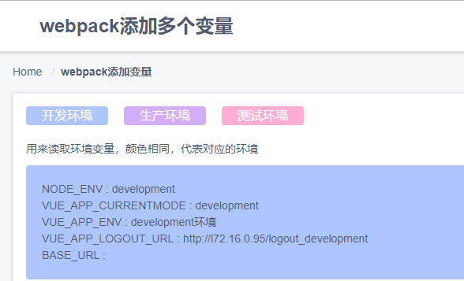
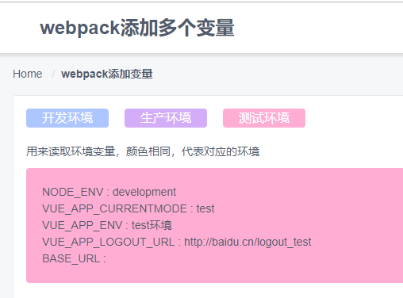
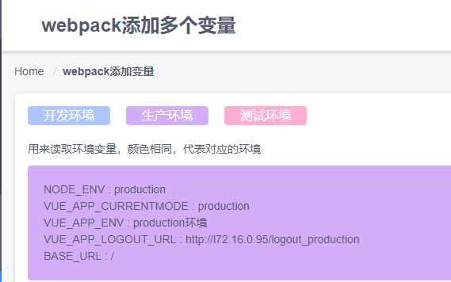
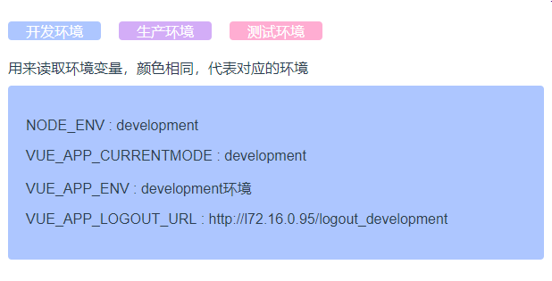
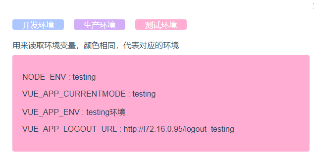
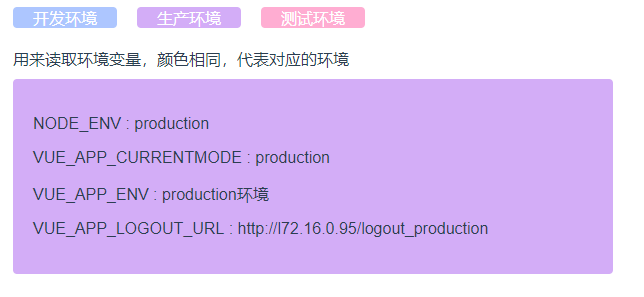

# 需要研究的问题

- wewbpack (vue-cli) 如何添加三种变量
  > 目前 webpack 打包有两种变量，`development`, `productor`, 如何添加一个 `test`的测试环境呢

### vue-cli 3.0

> vue-cli3.0 简化了业务需求，没有那么多额外的配置，目前想改变环境变量，官方[默认如此](https://cli.vuejs.org/zh/guide/mode-and-env.html#%E6%A8%A1%E5%BC%8F), 网友[1](https://segmentfault.com/a/1190000015133974)

> 官方默认两种类型 `develpoment` `production`,而我们实际开发过程中，会有本地开发，测试环境，正式环境等等，因而这两种环境变量是不够的，因而需要第三种乃至多种变量环境

## 基于 vue-cli3.0 进行配置

You can specify env variables by placing the following files in your project root:

```
.env                # loaded in all cases
.env.local          # loaded in all cases, ignored by git
.env.[mode]         # only loaded in specified mode
.env.[mode].local   # only loaded in specified mode, ignored by git
```

An env file simply contains key=value pairs of environment variables:

```
FOO=bar
VUE_APP_SECRET=secre
```

> 上面所述，在根目录配置 `.env`,`.env.[mode]`...的文件，其次需要以`VUE_APP`开头进行变量申明

## 搭建项目进行测试

```
...
.env.development
.env.production
.env.test
package.json
...
```

> 每个文件的具体内容

> .env.development

```
/* VUE_APP_CURRENTMODE 当前环境变量 */
VUE_APP_CURRENTMODE = 'development'
VUE_APP_ENV = 'development环境'
VUE_APP_LOGOUT_URL = 'http://l72.16.0.95/logout_development'
```

> .env.production

```
VUE_APP_CURRENTMODE = 'production'
VUE_APP_ENV = 'production环境'
VUE_APP_LOGOUT_URL = 'http://l72.16.0.95/logout_production'
```

> .env.test

```
/* NODE_ENV 目的用于指定是一开发还是生产形式进行操作 */
NODE_ENV = 'development'
VUE_APP_CURRENTMODE = 'test'
VUE_APP_ENV = 'test环境'
VUE_APP_LOGOUT_URL = 'http://baidu.cn/logout_test'
```

> package.json

```
...
 "scripts": {
    "serve": "vue-cli-service serve",
    "build": "vue-cli-service build",
    "lint": "vue-cli-service lint",
    /* --mode test 用来传递参数 */
    "test-serve": "vue-cli-service serve --mode test"
  },
 ...
```

> `NODE_ENV`, `VUE_APP_*` ...需要多注意一下

通过上面配置，`VUE_APP_LOGOUT_URL` 在不同环境变量生成不同的对应退出链接，
一下便是具体展示效果

> `yarn serve` // 开发环境
> 

> `yarn test-serve` // 测试环境
> 

> `yarn build` // 生产环境
> 

## 通过这样配置，只用通过命令行便可以生成不同环境下的项目，如此便可以不用每次都要去改动具体的变量了

## vue-cli2 配置

> 现在 vue-cli2 的文档被 vue-cli3 替代了，只能用这种最 low 但却最简单的办法来解决问题

```项目结构
...
webpack.base.conf.js
webpack.dev.conf.js
webpack.dev.conf.test.js
webpack.prod.conf.js
...
```

> `build`文件夹下 新增一个需要的环境 `webpack.dev.conf.test.js`直接复制 `webpack.dev.conf.js`即可，
> `config`文件夹下，添加一个`dev.env.test.js`

> webpack.dev.conf.test.js

```
...
plugins: [
  new webpack.DefinePlugin({
  // 环境变量  改为自己设定的变量即可
  'process.env': require('../config/dev.env.test')
})
...
```

> dev.env.test.js 依旧复制对应 dev.env.js

```
'use strict'
const merge = require('webpack-merge')
const prodEnv = require('./prod.env')

module.exports = merge(prodEnv, {
  NODE_ENV: '"testing"',
  VUE_APP_CURRENTMODE: '"testing"',
  VUE_APP_ENV: '"testing环境"',
  VUE_APP_LOGOUT_URL: '"http://l72.16.0.95/logout_testing"'
})
```

此处注意申明的变量 都需要 `'"var"'`这样定义，不然拿不到值

> 最后在`package.json`
> 中添加 `"test-dev": "webpack-dev-server --inline --progress --config build/webpack.dev.conf.test.js",`即可

> 最后各种效果图

1. `npm run dev`
   

2. `npm run test-dev`
   

3. `npm run build`
   

## 总结

- 开发环境依旧是两种 `development` `production`,只是在这两种基础上进行具体指定不同变量罢了，因而所谓的测试环境只是在生产环境中，另外列出一种变量，这样用于区分生产与测试的不同而已
- 目前 vue-cli2 和 vue-cli3 就都可以使用了，细节肯定都需要更多优化

* 寻找替代 `vue-along`的插件

  > 目前使用这个插件，会缓存所有的 vuex，使用了其 api 进行具体值缓存，但是依旧没有效果

* 研究 slot 以及父子（多层）如何处理

  > 使用 slot，主要便于一些大的组件相同，但是具体细节却不好控制，因为想看看如何使用 slot 会好，关键是传值，方法调用这块
  > 父子传值，会有多种方式，但是对于兄弟组件以及深层父子传值却很麻烦

* video 的使用，以及视频压缩等

  > 发现对视频格式要求很高，需要多多研究一下

* 函数柯里化
