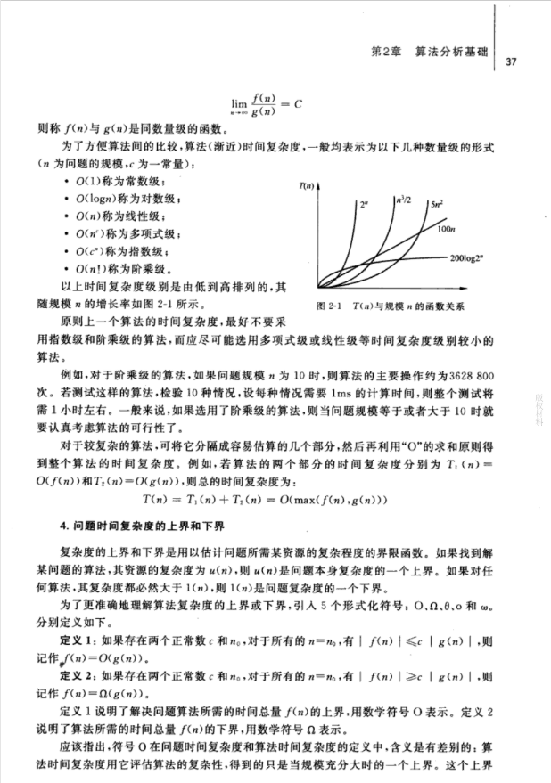

> 需要了解的

- 常数级别
- 对数级别
- 线性级别
- 线性对数级别
- 平方级别
- 指数级别




## 参考

- [csdn](https://blog.csdn.net/zolalad/article/details/11848739)
- [wiki](https://zh.wikipedia.org/wiki/%E6%97%B6%E9%97%B4%E5%A4%8D%E6%9D%82%E5%BA%A6)
- [zhihu](https://www.zhihu.com/question/21387264)
- [时间复杂度+空间复杂度](https://juejin.im/post/5cc6cf975188255e341c4466)
- [掘金](https://juejin.im/post/5c2a1d9d6fb9a04a0f654581)

- 常数级别 O(1)

```执行10次
let x = 1
while(x < 10) {
  x++
}
```

- 对数级别 O(n^2)

```
for (let i = 0; i < n; i ++) {
  for (let j = 0; j < n; j ++) {

  }
}
```
